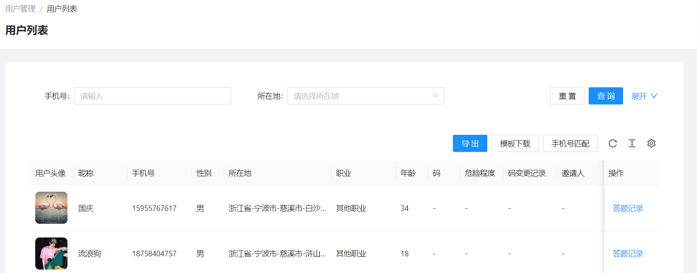
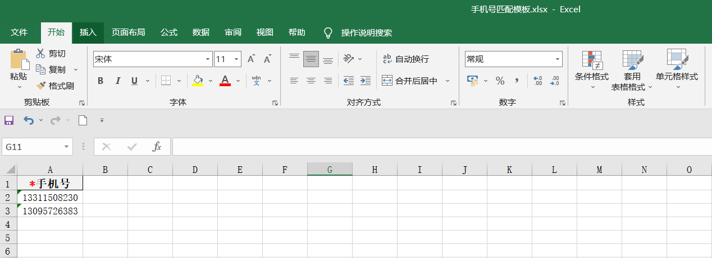

<!--第一页 start-->

<h1>刑侦反骗码用户后台</h1>
<h4>用户手册</h4>

                           

浙江政安信息安全研究中心
`https://www.gov-security.com/`

  

<!--第一页 end-->

<!--第二页 start-->
  

Copyright © 2020-2022 浙江政安信息安全中心有限公司及其许可者 版权所有，保留一切权利。
未经本公司书面许可，任何单位和个人不得擅自摘抄、复制本书内容的部分或全部，并不得以任何形式传播。
除政安信息安全中心有限公司的商标外，本手册中出现的其它公司的商标、产品标识及商品名称，由各自权利人拥有。
由于产品版本升级或其他原因，本手册内容有可能变更。政安保留在没有任何通知或者提示的情况下对本手册的内容进行修改的权利。本手册仅作为使用指导，政安 尽全力在本手册中提供准确的信息，但是 政安 并不确保手册内容完全没有错误，本手册中的所有陈述、信息和建议也不构成任何明示或暗示的担保。

                         
<!--第二页 end-->

<h2>目录</h2>

[toc]

# 1. 报表管理

## 1.1. 反骗码类型

查看当前账号地区下得反骗码注册信息

### 1.1.1. 查看反骗码类型列表

### 1.1.2. 查询反骗码类型列表

### 1.1.3. 导出反骗码列表

根据查询条件导出列表，不添加任何查询条件导出所有

## 1.2. 小程序管理员推广统计

### 1.2.1. 查看小程序管理员推广统计

### 1.2.2. 查询小程序管理员推广统计

# 2. 用户管理

## 2.1. 用户列表

查看当前账号地区下的反骗码用户

### 2.1.1. 查看用户列表

### 2.1.2. 查询用户

根据条件筛选用户

### 2.1.3. 导出用户列表

根据查询条件导出用户列表

**注意： 不添加查询条件，将会导出所有用户，数据量过大时可能会导致导出失败**

1. 点击【导出】按钮，弹出导出确认框

2. 弹出框中点【确定】，导出excel

### 2.1.4. 手机号匹配

已有一批手机号，判断是否在系统中

1. 点击【模板下载】按钮，下载excel模板

2. 在下载的模板中填写需要匹配的手机号

3. 点击【手机号匹配】按钮，上传刚刚下载的模板进行匹配

1. 自动下载匹配上的用的列表excel

## 2.2. 反诈app用户列表

查看当前账号地区下的反诈app用户

### 2.2.1. 查看反诈app用户列表

### 2.2.2. 搜索反诈app用户

根据条件筛选用户

### 2.2.3. 导出反诈app用户列表

根据搜索条件导出反诈app用户列表

**注意：不添加搜索条件，将会导出所有用户，数据量过大时可能会导致导出失败**

1. 点击【导出】按钮，弹出导出确认框

2. 弹出框中点【确定】，导出excel

# 3. 资讯管理

## 3.1. 资讯列表

<!-- ### 资讯列表简介
 -->

### 3.1.1. 查看资讯列表

* 资讯列表
  * 审核通过
  * 待提交
  * 待审核
  * 审核拒绝

**点击不同标签页，查看不同状态的资讯列表**

### 3.1.2. 查询资讯列表

### 3.1.3. 新增资讯

1. 点击页面【新增资讯】按钮，跳转新增页面

2. 填写资讯信息

3. 填写资讯内容
   *  填写公众号链接
    
   * 填写自定义内容
    
4. 保存和提交资讯
   * 点击页面右下角【保存】按钮，保存资讯
   * 点击页面右下角【提交】按钮，提交资讯

**注意：点击【保存】按钮，在待提交列表下查看当前资讯**
**注意：点击【提交】按钮， 如果该商户开启了资料审核，则在待审核列表下查看此资讯。没有没有开启资料审核，则直接在审核通过列表下查看当前资讯**

### 3.1.4. 资讯操作

* 查看资讯
  在**审核通过** **待审核** **审核拒绝**标签下点击列表右侧【查看】按钮，查看资讯内容
* 删除资讯
  在**审核通过** **待审核** **审核拒绝**标签下点击列表右侧【查看】按钮，删除资讯
* 提交资讯
  在**待提交**标签下点击列表右侧【提交】按钮，提交资讯到**待审核**或**审核通过**
* 编辑资讯
  在**待提交**标签下点击列表右侧【编辑】按钮，编辑资讯内容
* 撤回资讯
  在**待审核**标签下点击列表右侧【撤回】按钮，撤回资讯到**待提交**
* 再次发起资讯
  当资讯被审核拒绝后，在**审核拒绝**标签下点击列表右侧【再次提交】按钮，跳转新增资讯页面，带入当前资讯内容，可以重新编辑提交

## 3.2. 我审核的

### 3.2.1. 查看我审核的资讯列表

### 3.2.2. 查询我审核的资讯

### 3.2.3. 资讯操作

* 审核资讯
  1. 在**待审核**标签下点击列表右侧【审核】按钮，跳转审核详情页面
    
  2. 选择审核是否通过，再点击页面右下角【审核】按钮，完成审核
    
* 查看资讯

## 3.3. 上传排名

### 查看上传排名列表

### 查询上传排名列表

### 上传排名操作

* 导出
  点击页面【导出】按钮，导出当前条件下的上传排名信息excel
  

# 4. 活动管理

## 4.1. 组织者列表

### 查看组织者列表

### 查询组织者

### 组织者操作

* 导出组织者列表
  点击页面【导出】按钮，导出组织者列表
  
* 编辑组织者信息
  点击组织者列表右侧【编辑】按钮，编辑组织者信息
* 编辑组织者打款信息
  点击组织者列表右侧【打款信息】按钮，编辑组织者打款信息
  

## 4.2. 组织者初审

### 查看组织者初审列表

* 组织者初审
  * 待初审
  * 初审通过
  * 初审拒绝

**点击不同标签页，查看不同状态的组织者列表**

### 查询组织者初审

### 组织者初审操作

* 审核
  在**待初审**标签下，点击列表右侧【审核】按钮，初审组织者
  

## 4.3. 组织者终审

## 4.4. 活动列表

## 4.5. 活动审核

## 4.6. 打卡初审

## 4.7. 打卡终审

## 4.8. 评价列表

## 4.9. 奖励统计

## 4.10. 活动配置

# 积分管理

## 券码类目

## 券码列表

## 积分发放码

## 兑换列表

## 积分商户
