<!--第一页 start-->

<div align=right>
<h1>刑侦反骗码用户后台</h1>
<h4>用户手册</h4>
</div>


<br/><br/><br/><br/><br/><br/><br/><br/><br/><br/><br/><br/><br/><br/><br/><br/><br/><br/><br/><br/><br/><br/><br/><br/><br/><br/><br/><br/>


浙江政安信息安全研究中心
`https://www.gov-security.com/`
平台版本：1.0.10


<!--第一页 end-->


<!--第二页 start-->

Copyright © 2020-2022 浙江政安信息安全中心有限公司及其许可者 版权所有，保留一切权利。
未经本公司书面许可，任何单位和个人不得擅自摘抄、复制本书内容的部分或全部，并不得以任何形式传播。
除政安信息安全中心有限公司的商标外，本手册中出现的其它公司的商标、产品标识及商品名称，由各自权利人拥有。
由于产品版本升级或其他原因，本手册内容有可能变更。政安保留在没有任何通知或者提示的情况下对本手册的内容进行修改的权利。本手册仅作为使用指导，政安 尽全力在本手册中提供准确的信息，但是 政安 并不确保手册内容完全没有错误，本手册中的所有陈述、信息和建议也不构成任何明示或暗示的担保。

<br/><br/><br/><br/><br/><br/><br/><br/><br/><br/><br/><br/><br/><br/><br/><br/><br/><br/><br/><br/><br/><br/><br/><br/><br/><br/><br/>
<!--第二页 end-->

<center><h2>目录</h2></center>

[toc]


# 1. 系统登录

## 1.1. 登录地址

使用浏览器打开以下地址
https://mage.gov-security.com/mage/management/merchant/user/login


## 1.2. 登录界面

### 1.2.1. 登录

1. 在登录页输入用户名和密码
2. 点击按钮智能认证
3. 点击【登录】按钮，登录系统
4. 登录过期或者登录ip改变则需要短信验证
  


### 1.2.2. 忘记密码

1. 点击登录页面的【忘记密码】按钮，跳转修改密码页面
   
2. 输入手机号码，点击获取验证码
   
3. 弹出智能验证框，点击按钮，发送短信
   
4. 输入验证码，并输入新密码
   
5. 点击按钮智能认证
6. 点击【确认修改】按钮，完成密码修改
  

# 2. 报表管理

## 2.1. 反骗码类型

查看当前商户地区下的反骗码注册用户

### 2.1.1. 查看反骗码类型列表

点击**反骗码类型**标签页，可以查看当前商户地区下的反骗码类型统计

* 反骗码类型
  * 绿码：注册反骗码小程序，并答题成为绿码
  * 黄码：注册反骗码小程序，并答题成为黄码
  * 红码：注册反骗码小程序，并答题成为红码 或 触网变红码
    * 红码轻危
    * 红码低危
    * 红码中危
    * 红码高危
  * 无码：注册反骗码小程序，但是没有答题
<br/>
* 列表字段释义： 
  * 注册用户/比率：此地区注册反骗码的用户占总人口比例
  * 绿码用户/比率：此地区绿码用户数占注册用户数的比例
  * 黄码用户/比率：此地区黄码用户数占注册用户数的比例
  * 红码总用户/比率：此地区红码用户数占注册用户数的比例
  * 红码(轻危)用户/比率：此地区红码(轻危)用户数占注册用户数的比例

红码(轻危)用户/比率，红码(低危)用户/比率，红码(中危)用户/比率，红码(高危)用户/比率 总和为 **红码总用户/比率**


### 2.1.2. 查询反骗码类型列表

1. 在查询框中 选择地区，注册时间
2. 点击页面【查询】按钮，以上述条件查询反骗码类型列表


### 2.1.3. 导出反骗码列表

根据查询条件导出列表，不添加任何查询条件导出所有

1. 添加查询条件，查询列表 **(可选)**
2. 点击页面【导出】按钮，弹出提示框
3. 点击弹出框右下角【确定】按钮，导出反骗码类型列表excel


## 2.2. 小程序管理员推广统计

### 2.2.1. 查看小程序管理员推广统计

点击**小程序管理员推广统计**标签页，可以查看当前商户地区下的小程序管理员推广统计列表


当用户通过扫码 **邀请码** 进入小程序并注册，则生成此邀请码的用户 **(小程序管理员)** 邀请人数加一

邀请人数增加的情况
* 当邀请人为群众时：
  * 新用户通过扫描此群众生成的邀请码进入反骗码小程序并注册
* 当邀请人为警员时：
  * 新用户通过扫描此警员生成的邀请码进入反骗码小程序并注册
  * 新用户通过扫描群众生成的邀请码进入反骗码小程序并注册，但是此群众邀请链最开始是此警员
  **例1：警员a 邀请 群众b，群众b 邀请 群众c，群众c邀请群众d注册，则群众c和警员a都会在小程序管理员推广中加一**
  **例2：群众a 邀请 群众b，群众b 邀请群众c注册，则群众b会在小程序管理员推广中加一**


**注意：此列表只展示警员(小程序管理员)的推广统计**

### 2.2.2. 查询小程序管理员推广统计

1. 在查询框填写 商户名称，注册时间以及领码时间
2. 点击页面【查询】按钮，以选择框中的条件查询小程序管理员推广统计列表


# 3. 用户管理

## 3.1. 用户列表

查看当前商户地区下的反骗码用户

### 3.1.1. 查看用户列表

点击**用户列表**标签页，可以查看当前商户地区下的用户列表

* 列表字段释义：
  * 码
    * 绿码
    * 黄码
    * 红码
  * 危险程度
    * 轻危：黄码轻危用户 或 红码轻危用户
    * 低危：红码低危用户
    * 中危：红码中危用户
    * 高危：红码高危用户
  * 邀请人：邀请本用户的群众
  * 推荐人：邀请本用户的警员
  * 邀请数：当前用户的邀请数
  * 注册时间：注册反骗码小程序的时间
  * 首次领码：第一次在反骗码小程序完成答题领码的时间


### 3.1.2. 查询用户

根据条件筛选用户

1. 在查询框中选择条件，可以选择多个条件
2. 点击页面【查询】按钮，以选择框中的条件查询反骗码用户


### 3.1.3. 导出用户列表

支持全量或根据查询条件导出用户列表数据

1. 添加查询条件，查询列表 **(可选)**
2. 点击【导出】按钮，弹出导出确认框
  
3. 弹出框中点【确定】，导出excel
  

**注意： 不添加查询条件，将会导出所有用户，数据量过大时可能会导致导出失败**

### 3.1.4. 手机号匹配

通过导入手机号的方式，进行用户匹配，查询用户是否注册反骗码小程序

1. 点击【模板下载】按钮，下载excel模板
  
2. 在下载的模板中填写需要匹配的手机号
  
3. 点击【手机号匹配】按钮，上传刚刚下载的模板进行匹配
  
4. 自动下载匹配上的用户列表excel


## 3.2. 反诈app用户列表

查看当前商户地区下的反诈app用户

### 3.2.1. 查看反诈app用户列表

点击**反诈app用户列表**标签页，可以查看当前商户地区下的反诈app用户列表


### 3.2.2. 查询反诈app用户

1. 在查询框中选择条件，可以选择多个条件
2. 点击页面【查询】按钮，以选择框中的条件查询反诈app用户


### 3.2.3. 导出反诈app用户列表

支持全量或根据查询条件导出反诈app用户列表数据

1. 添加查询条件，查询列表 **(可选)**
2. 点击【导出】按钮，弹出导出确认框
  
3. 弹出框中点【确定】，导出excel
  

**注意：不添加搜索条件，将会导出所有用户，数据量过大时可能会导致导出失败**

# 4. 资讯管理

## 4.1. 资讯列表

* 开启资料审核：需在运营后台该商户下开启资料审核功能，并且指定审核商户
  
  流程如下
  ```mermaid
  graph LR
    1[新增资讯] -- 保存 --> 2[待提交] -- 提交 --> 3[待审核]
    1[新增资讯] -- 提交 --> 3[待审核]
    3[待审核] -- 审核 --> 4[审核通过]
    3[待审核] -- 审核 --> 5[审核拒绝]
  ```

* 关闭资讯审核：需在运营后台该商户下关闭资料审核功能
  
  流程如下
  ```mermaid
  graph LR
    1[新增资讯] -- 保存 --> 2[待提交] -- 提交 --> 3[审核通过]
    1[新增资讯] -- 提交 --> 3[审核通过]
  ```

### 4.1.1. 查看资讯列表


点击不同标签页，查看不同状态的资讯列表


### 4.1.2. 查询资讯列表

1. 在查询框中选择条件，可以选择多个条件
2. 点击页面【查询】按钮，以选择框中的条件查询资讯


### 4.1.3. 新增资讯


1. 点击页面【新增资讯】按钮，跳转新增页面

2. 填写资讯信息
   * 栏目：相当于资讯分类，**(可在运营后台设置)**
   * 权限：
     * 公开：小程序端群众和警员都可以查看此资讯
     * 不公开：小程序端只有警员可以查看此资讯
    
3. 填写资讯内容
   *  填写公众号链接
    
   * 填写自定义内容
      * 填写自定义文章
      
      * 上传百度网盘链接：输入文件名，然后直接复制百度网盘链接，普通版和企业版分别选择
      
      
      * 上传文件
      
    
4. 保存和提交资讯
   * 点击页面右下角【保存】按钮，保存资讯
   * 点击页面右下角【提交】按钮，提交资讯


**注意：点击【保存】按钮，在待提交列表下查看当前资讯**
**注意：点击【提交】按钮， 如果该商户开启了资料审核，则在待审核列表下查看此资讯。没有开启资料审核，则直接在审核通过列表下查看当前资讯**


### 4.1.4. 资讯操作

* 查看资讯
  在**审核通过** **待审核** **审核拒绝**标签下点击列表右侧【查看】按钮，查看资讯内容
* 删除资讯
  在**审核通过** **待审核** **审核拒绝**标签下点击列表右侧【查看】按钮，删除资讯
* 提交资讯
  在**待提交**标签下点击列表右侧【提交】按钮，提交资讯到**待审核**或**审核通过**
* 编辑资讯
  在**待提交**标签下点击列表右侧【编辑】按钮，编辑资讯内容
* 撤回资讯
  在**待审核**标签下点击列表右侧【撤回】按钮，撤回资讯到**待提交**
* 再次发起资讯
  当资讯被审核拒绝后，在**审核拒绝**标签下点击列表右侧【再次提交】按钮，跳转新增资讯页面，带入当前资讯内容，可以重新编辑提交


## 4.2. 我审核的

当此商户需要审核其他商户的资讯时，在此标签页下操作

### 4.2.1. 查看我审核的资讯列表

点击不同标签页，查看不同状态的资讯审核列表


### 4.2.2. 查询我审核的资讯

1. 在查询框中输入资讯标题名称
2. 点击页面【查询】按钮，以选择框中的条件查询资讯


### 4.2.3. 资讯操作

* 审核资讯
  1. 在**待审核**标签下点击列表右侧【审核】按钮，跳转审核详情页面
    
  2. 查看资讯信息 和 资讯内容
  3. 选择审核是否通过，再点击页面右下角【审核】按钮，完成审核
    
* 查看资讯
  点击资讯列表右侧【查看】按钮，查看资讯详情
  

## 4.3. 上传排名

### 4.3.1. 查看上传排名列表


### 4.3.2. 查询上传排名列表

1. 在查询框中选择开始时间和结束时间
2. 点击页面【查询】按钮，以选择框中的条件查询上传排名


### 4.3.3. 上传排名操作

* 导出
  1. 在查询框中选择日期
  2. 点击页面【查询】按钮，以选择框中的条件查询上传排名
  3. 点击页面【导出】按钮，导出当前条件下的上传排名excel
  

# 5. 活动管理

## 5.1. 组织者列表

组织者为小程序群众端志愿者认证用户

开启此功能需要在运营后台此商户下开启【自愿者管理】功能


组织者初审流程：

组织者终审流程：

**注意：终审权限可以直接终审待初审的组织者**
**注意：终审待初审组织者后，待初审权限将看不到此组织者的信息**

### 5.1.1. 查看组织者列表

点击**组织者列表**标签页，可以查看当前商户地区下的

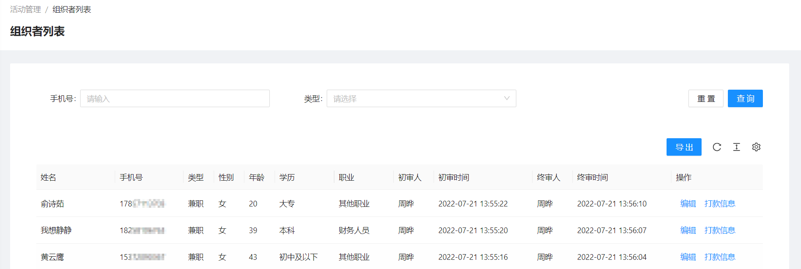

### 5.1.2. 查询组织者

1. 在查询框中输入手机号和选择类型
2. 点击页面【查询】按钮，以查询框中的条件查询组织者


### 5.1.3. 组织者操作

* 导出组织者列表
  点击页面【导出】按钮，导出组织者列表
  
* 编辑组织者信息
  点击组织者列表右侧【编辑】按钮，编辑组织者信息
* 编辑组织者打款信息
  点击组织者列表右侧【打款信息】按钮，编辑组织者打款信息
  

## 5.2. 组织者初审

### 5.2.1. 查看组织者初审列表

点击不同标签页，查看不同状态的组织者列表

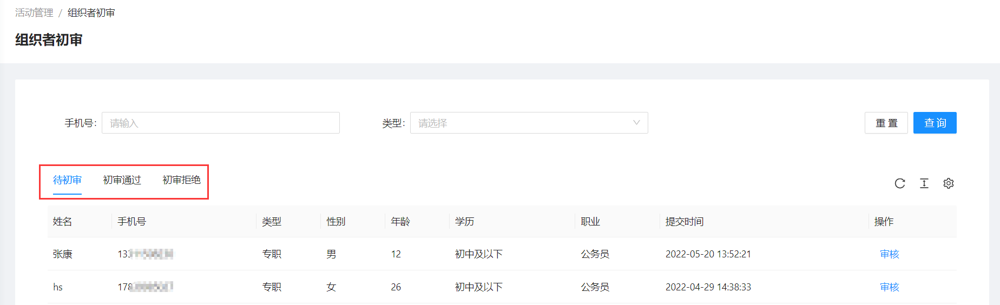

### 5.2.2. 查询组织者初审

1. 在查询框中输入手机号和选择类型
2. 点击页面【查询】按钮，以查询框中的条件查询组织者初审列表


### 5.2.3. 组织者初审操作

* 组织者审核
  在**待初审**标签下，点击列表右侧【审核】按钮，初审组织者
  

  **审核通过在 审核通过标签页下查看**
  **审核拒绝在 审核拒绝标签页下查看**


## 5.3. 组织者终审

### 5.3.1. 查看组织者审核列表

点击不同标签页，查看不同状态的组织者列表


### 5.3.2. 查询组织者审核

1. 在查询框中输入手机号和选择类型
2. 点击页面【查询】按钮，以查询框中的条件查询组织者终审列表


### 5.3.3. 组织者审核操作

* 组织者审核
  在**待初审**或**待终审**标签下，点击列表右侧【审核】按钮，直接终审组织者

  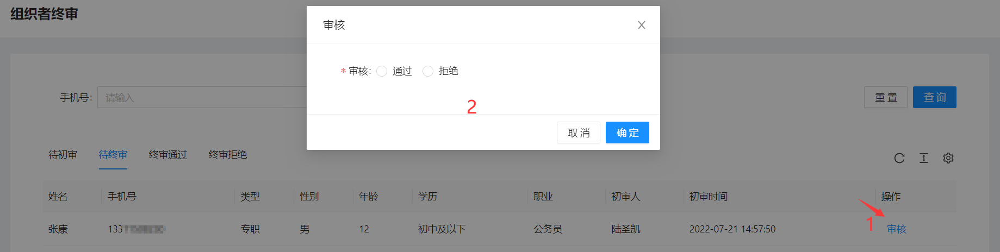

## 5.4. 活动列表

活动创建流程：


活动开始流程：


### 5.4.1. 查看活动列表

点击不同标签页，查看不同状态的活动列表


### 5.4.2. 查询活动

1. 在查询框中输入活动名称 或 选择报名状态
2. 点击页面【查询】按钮，以查询框中的条件查询活动


### 5.4.3. 活动新增

1. 点击页面【创建】按钮，跳转新增活动页面
   
2. 填写活动基本信息
   * 活动类型
     * 集中授课：志愿者把群众集中到某个地方一起宣传反诈知识
     * 面对面宣教：志愿者一个个上门给群众宣传反诈知识
   * 负责人：此活动的责任人
   * 活动地区：此活动所在地区，此地区下的志愿者才能在群众端小程序查看活动，并且报名
   * 是否公开
     * 公开：当活动处于报名状态时，群众端小程序，符合条件的志愿者可以报名
     * 不公开：群众端小程序，志愿者无法报名，只能通过后台手动添加活动组织者(志愿者)
   
3. 详细地址：填写活动地址，也可以在地图上选择，此地址指活动得具体地点
   
4. 报名设置：当活动为公开时，需要设置报名规则
   * 报名人数：此活动最多能报名多少志愿者，此设置只限制报名人数不能超过此值
   * 志愿者类型
     * 专职：只有专职志愿者才能报名此活动
     * 兼职：只有兼职志愿者才能报名此活动
   * 报名时间：志愿者在群众端小程序报名此活动的时间，报名结束时间要早于活动开始时间
   * 志愿者等级
     * 初级：所有志愿者都能报名此活动
     * 中级：中级及以上志愿者才能报名此活动
     * 高级：高级及以上志愿者才能报名此活动
     * 特级：只有高级志愿者才能报名此活动
   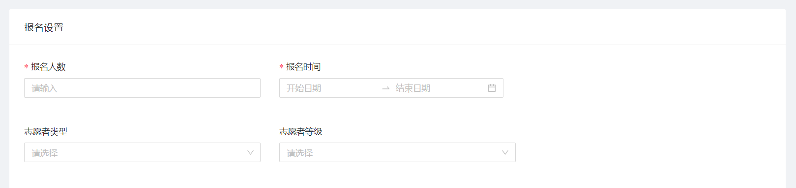
5. 后台添加组织者 **(可选)**
   
6. 填写活动详细
   
7. 点击页面右下角【确定】按钮


**注意：如果活动选择不公开，则只能通过后台添加组织者**


### 5.4.4. 活动操作

* 活动查看
  点击活动列表右侧【查看】按钮，查看活动详情
* 活动编辑
  在**待提交**标签下，点击活动列表右侧【编辑】按钮，编辑活动内容
* 活动提交
  在**待提交**标签下，点击活动列表右侧【提交】按钮，提交活动至审核
* 活动撤回
  在**待审核**标签下，点击活动列表右侧【撤回】按钮，撤回活动至**待提交**
* 活动取消
  在**审核通过**标签下，点击活动列表右侧【取消】按钮，取消活动
* 活动删除
  在**待提交**和**审核拒绝**标签下，点击活动列表右侧【删除】按钮，删除活动
* 活动再次发起
  在**审核拒绝**标签下，点击活动列表右侧【再次提交】按钮，跳转新增活动页面，带入此活动内容，重新编辑提交


**注意：只有未开始的活动才能取消**

## 5.5. 活动审核

### 5.5.1. 查看活动审核列表

点击不同标签页，查看不同状态的活动审核列表

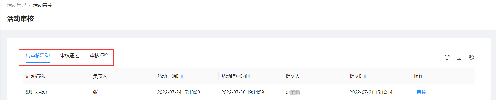

### 5.5.2. 活动审核操作

* 活动审核
  在**待审核活动**标签页下，点击活动列表右侧【审核】按钮，跳转审核页面
  
* 活动审核查看
  在**审核通过**和**审核拒绝**标签页下，点击活动列表右侧【查看】按钮，查看活动详情 
  


## 5.6. 打卡初审

打卡初审流程：


打卡终审流程


### 5.6.1. 查看打卡初审列表

点击不同标签页，查看不同状态的打卡审核列表


### 5.6.2. 打卡初审审核

1. 在**待初审**标签页下，点击打卡列表右侧【审核】按钮，弹出审核窗口
   
2. 在弹出的审核窗口中，选择通过或拒绝，填写参与时长，奖励金额等
   
3. 点击弹出的审核窗口右下角【确定】按钮，完成打卡初审审核

### 5.6.3. 打卡初审操作

* 查看签到记录
  在所有标签页下，点击打卡列表右侧【签到记录】按钮，查看打卡签到记录
* 查看活动详情
  在**待初审**标签页下，点击打卡列表右侧【活动详情】，查看打卡的活动详情
* 查看打卡详情
  在**审核通过**和**审核拒绝**标签页下，点击打卡列表右侧【打卡详情】按钮，查看打卡详情
  
  
  
  

## 5.7. 打卡终审

### 5.7.1. 查看打卡审核列表

点击不同标签页，查看不同状态的打卡审核列表

 


### 5.7.2. 打卡终审审核

* 审核待初审打卡
  1. 在**待初审**标签页下，点击打卡列表右侧【审核】按钮，弹出审核窗口
   
  2. 在弹出的审核窗口中，选择通过或拒绝，填写参与时长，奖励金额等
   
  3. 点击弹出的审核窗口右下角【确定】按钮，完成打卡审核

**注意：直接终审待初审打卡，即此打卡审核完成**
**注意：直接终审待初审打卡，审核后，待初审权限将看不到此打卡的信息**


* 审核待终审打卡
  1. 在**待终审**标签页下，点击打卡列表右侧【审核】按钮，弹出审核窗口
   
  2. 在弹出的审核窗口中，查看打卡详情，以及初审审核信息
   
  3. 在弹出的审核窗口中，选择通过或拒绝，填写参与时长，奖励金额等
   
  4. 点击弹出的审核窗口右下角【确定】按钮，完成打卡审核


### 5.7.3. 打卡终审操作


* 查看签到记录
  在所有标签页下，点击打卡列表右侧【签到记录】按钮，查看打卡签到记录
* 查看活动详情
  在**待初审**和**待终审**标签页下，点击打卡列表右侧【活动详情】，查看打卡的活动详情
* 查看打卡详情
  在**审核通过**和**审核拒绝**标签页下，点击打卡列表右侧【打卡详情】按钮，查看打卡详情


## 5.8. 评价列表

活动结束后，参与活动的群众可以在群众端小程序填写对志愿者的评价

### 5.8.1. 查看评价列表

点击**评价列表**标签页，可以查看当前商户地区下的评价列表


### 5.8.2. 查询评价

1. 在查询框中输入活动名称 或 评价人的手机号
2. 点击页面【查询】按钮，以查询框中的条件查询评价


## 5.9. 奖励统计

### 5.9.1. 查看奖励统计列表

通过点击**组织者** 或 **地区** 标签可以查看组织者的奖励统计列表和当前商户下的地区奖励统计


### 5.9.2. 查询奖励统计

1. 在查询框中选择日期 或 活动地区
2. 点击页面【查询】按钮，以查询框中的条件查询奖励统计


### 5.9.3. 奖励统计操作

* 导出奖励统计：支持全量或根据查询条件导出组织者奖励统计数据 或 地区奖励统计
  1. 添加查询条件，日期或者活动，**(可多选)** 
  2. 点击页面【导出】按钮，当前标签页下的奖励统计
  
* 查看奖励明细
  点击奖励统计列表右侧【查看明细】按钮，查看组织者和地区的明细
  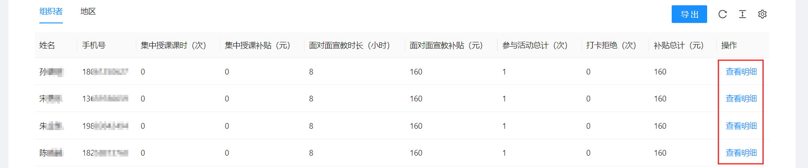
* 查看地区统计下级地区
  在**地区**标签页下，点击奖励统计列表右侧【下级】按钮，查看下级地区奖励统计情况
  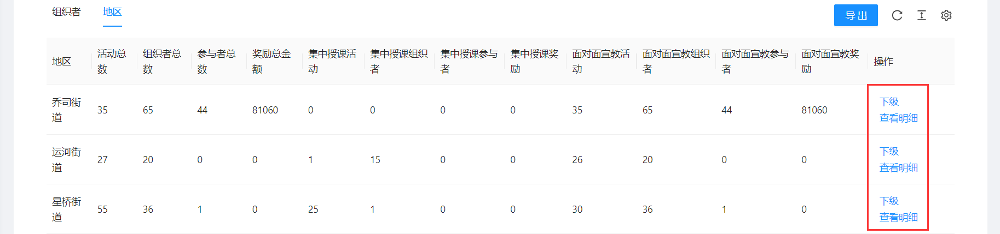

## 5.10. 活动配置


**1. 配置管理员的地区权限，即管理员可以看到当前地区下的组织者，活动列表等**
**2. 添加此活动配置的管理员，必须要在系统操作员内**

### 5.10.1. 查看管理员列表


### 5.10.2. 新增管理员

1. 点击页面【新增】按钮，弹出新增管理员窗口
   
2. 在弹出的新增窗口中填写管理员信息和所在区域
   
3. 在弹出的新增窗口中点击【确定】按钮，完成新增管理员

# 6. 积分管理

开启此功能需要在运营后台此商户下开启【积分功能】


积分获取流程：


积分使用流程：


## 6.1. 券码类目

### 6.1.1. 查看券码类目列表

点击**券码类目**标签页，可以查看当前商户地区下的券码类目


### 6.1.2. 查询券码类目

1. 在查询框中输入券码类目名称
2. 点击页面【查询】按钮，以查询框中的条件查询券码类目


### 6.1.3. 新增券码类目

1. 点击页面【新增按钮】，弹出新增券码类目窗口
   
2. 在弹出的窗口中，填写券码类目名称
   
3. 在弹出的新增窗口中，点击【确定】按钮

### 6.1.4. 券码类目操作

* 合并券码类目
  点击券码类目列表右边【合并】按钮，将其他券码类目下的券码合并到当前类目下
* 编辑券码类目
  点击券码类目列表右边【编辑】按钮，编辑券码类目信息
* 上移/下移券码类目 
  点击券码类目列表右侧【上移】/【下移】按钮，上移/下移券码类目
* 删除券码类目
  点击券码类目列表右侧【删除】按钮，删除券码类目


**注意：上移/下移 影响券码类目在小程序端的显示顺序**
**注意：只有当前券码类目下没有券码才能被删除**

## 6.2. 券码列表

<!-- ### 券码简介 -->


### 6.2.1. 查看券码列表

点击**券码列表**标签页，可以查看当前商户地区下的券码列表


### 6.2.2. 查询券码

1. 在查询框中输入券码名称，类型，类目，状态等
2. 点击页面【查询】按钮，以查询框中的条件查询券码


### 6.2.3. 新增券码

1. 点击页面【新增】按钮，跳转新增券码页面
   
2. 填写券码基本信息
   * 类型
     * 兑换码：用于平台自己兑换
     * 兑换券：用于兑换三方优惠券
     * 违章减免券：用于减免违章
   * 类目：券码类目，在**券码类目**标签页下自行设置，用于券码分类
   * 积分价值：设置此券码需要多少积分兑换
   * 领取有效期：当类型为兑换券时，设置兑换券的有效期，即领取兑换券后多少天内有效
   * 是否限时：是否券码是否限时兑换
   * 兑换期限：当设置限时兑换时，设置兑换时间
   
3. 在券码类型为**兑换券**和**违章减免券**的时候，填写库存数量
   
4. 填写券码详情
   
5. 点击页面右下角【保存】按钮，完成券码新增

**注意：兑换码需要导入明细才能被用户兑换**

### 6.2.4. 券码操作

* 券码查看
  点击券码列表右侧【查看】按钮，查看券码详情
* 券码上架/下架
  点击券码列表右侧【上架】/【下架】按钮，上架/下架 券码
* 券码编辑
  点击券码列表右侧【编辑】按钮，编辑券码内容
* 券码删除
  点击券码列表右侧【删除】按钮，删除券码


* 兑换码明细
  * 已上架 **(查看兑换码明细)**
    点击券码列表右侧【兑换码明细】按钮，查看兑换码明细
    
  * 未上架 **(导入兑换码明细)**
    1. 点击券码列表右侧【兑换码明细】按钮，跳转兑换码明细页面
    2. 点击页面【模板下载】按钮。下载excel模板
      
    3. 在刚刚下载的模板excel中添加兑换码
      
    4. 点击页面【excel导入】按钮，上传刚刚修改的模板excel
      
    5. 上传完成后，兑换码明细如下
      


**注意：只有券码类型为兑换码，才能查看兑换码明细**
**注意：只有下架的券码才能编辑和删除**

## 6.3. 积分发放码

用户可以通过扫积分发放码获取积分

### 6.3.1. 查看积分发放码列表

点击**积分发放码**标签页，可以查看当前商户地区下的积分发放码列表


### 6.3.2. 查询积分发放码

1. 在查询框中输入积分发放码名称
2. 点击页面【查询】按钮，以查询框中的条件查询积分发放码


### 6.3.3. 新增积分发放码

1. 点击页面【新增】按钮，弹出新增积分发放码窗口
   
2. 在弹出的新增窗口中填写积分发放码内容，
   单次发放积分：用户每次扫此积分发放码能获取积分数
   
3. 在弹出的新增窗口中，点击右下角【确定】按钮

### 6.3.4. 积分发放码操作

* 积分发放码查看
  点击积分发放码列表右侧【查看】按钮，查看积分发放码详情
* 积分发放码上架/下架
  点击积分发放码列表右侧【上架】/【下架】按钮，上架/下架 积分发放码
* 积分发放码编辑
  点击积分发放码列表右侧【编辑】按钮，编辑积分发放码内容
* 积分发放码链接
  点击积分发放码列表右侧【码链接】按钮，查看积分发放码链接
* 积分发放码发放明细
  点击积分发放码列表右侧【发放明细】按钮，查看积分发放码发放明细
* 积分发放码删除
  点击积分发放码列表右侧【删除】按钮，删除积分发放码


**注意：只有下架的积分发放码才能编辑和删除**

## 6.4. 兑换列表

### 6.4.1. 查看兑换列表

点击不同标签页，查看不同类型的兑换列表


### 6.4.2. 查询兑换列表

1. 在查询框中输入状态，券码，手机号，券码名称，兑换时间等
   * 状态：在**兑换券**标签页查询时，可选状态
     * 待核销：该兑换券在有效期内，且还未使用
     * 已使用：该兑换券已使用
     * 已过期：该兑换券超过兑换券有效期并未使用
   * 券码：每个券码的编号，唯一
   * 券码名称：新增券码时候设置的券码名称
   * 手机号：兑换券码的用户的手机号
2. 点击页面【查询】按钮，以查询框中的条件查询兑换列表


### 6.4.3. 兑换列表操作

* 兑换券核销
  在**兑换券**标签页下，点击兑换券列表右侧【核销】按钮，核销兑换券
  
* 兑换列表导出，支持全量或根据查询条件导出
  1. 添加查询条件，查询列表 **(可选)** 
  2. 点击页面【导出】按钮，导出当前查询条件下的券码列表
  

## 6.5. 积分账户

### 6.5.1. 查看积分账户列表

点击**积分账户**标签页，可以查看当前商户地区下的积分账户列表


### 6.5.2. 查询积分账户

1. 在查询框中输入手机号
2. 点击页面【查询】按钮，以查询框中的条件查询积分账户列表


### 6.5.3. 积分账户操作

* 查看积分明细
  点击积分账户右侧【积分明细】按钮，查看积分明细
  
* 积分变更
  1. 点击积分账户列表右侧【积分变更】按钮，弹出积分变更窗口
  
  2. 在弹出的变更窗口中填写积分变更 **(是否计入累计积分选择“否”，则累计积分不会变化)**
   
* 批量积分变更
  1. 点击页面【模板下载】按钮，下载excel模板
   
  2. 在下载的模板excel中填写手机号和积分增减
   
  3. 点击页面【积分变更导入】按钮，导入刚刚修改的excel
   

  **注意：批量积分变更的时候，是否计入累计积分取决于 积分设置的高级设置**


## 6.6. 月度排行

### 6.6.1. 查看月度排行

点击**月度排行**标签页，可以查看当前商户地区下的月度排行列表


### 6.6.2. 查询月度排行

1. 在查询框中选择日期
2. 点击页面【查询】按钮，以查询框中的条件查询月度排行


### 6.6.3. 月度排行导出


1. 添加查询条件，查询指定日期内的月度排行 **(可选)** 
2. 点击页面【导出】按钮，导出当前查询条件下的月度排行


## 6.7. 积分配置

* 发放规则
* 温馨提示
* 高级设置


### 6.7.1. 发放规则操作

* 发放规则配置
  1. 点击规则配置列表右侧【编辑】按钮，弹出发放规则编辑框
   
   
  2. 在弹出的编辑框中修改发放规则配置
      * 签到：设置首次签到积分，以及连续签到累计积分，最高每天签到获得积分等
      
      * 答题(绿码)：答题成为绿码可获得积分，可设置固定得分或者根据答对题数得分，以及每日答题获取积分次数上限，周次数，月次数等
      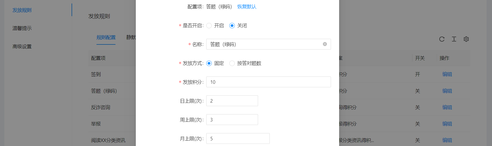
      
      * 反诈咨询，诈骗举报，阅读资讯，邀请推广：设置单次操作获得积分数，以及日获得积分次数上限，周次数，月次数等
      


**注意：发放规则需要开启才有效**

* 发放规则静默时长：第二次阅读需要等待多少时间后才算有效阅读，获得积分
  1. 点击静默时长列表右侧【编辑】按钮，弹出静默时长编辑框
   
  2. 在弹出的编辑框中修改静默时长配置
   

### 6.7.2. 温馨提示

用于展示在小程序端，积分中心的温馨提示
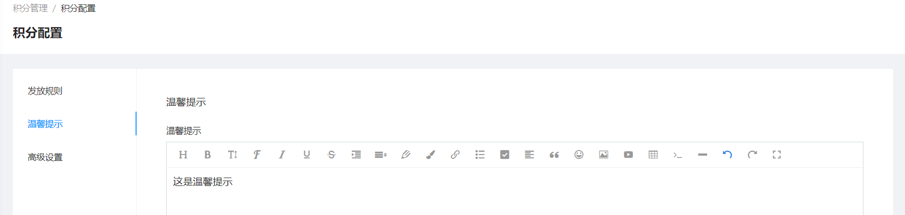
在小程序端显示如下


### 6.7.3. 高级设置

* 累计积分计算规则
  1. 设置后台积分变更默认是否计入累计积分，修改单个积分账户时可手动修改
  2. 批量导入积分变更时是否计入累计积分取决于此配置
  
* 兑换限制
  设置根据用户码类型是否可以兑换，例：如下图，只有绿码和黄码可以兑换
  
* 积分别名设置
* 积分商城入口设置
  设置积分商城入口图片地址
* 成长等级
  设置是否开启成长等级，以及添加等级和所需积分
  

# 7. 推送管理

## 7.1. 政安信使

可以给指定用户或者指定地区下的用户推送短信或微信小程序 预警信息

### 7.1.1. 查看信使推送列表

点击**政安信使**标签页，可以查看当前商户地区下的推送任务


### 7.1.2. 查询信使推送任务

1. 在查询框中选择查询条件
   * 状态
     * 待推送：没到推送时间
     * 推送中：正在推送过程中
     * 已完成：已全部推送完成
     * 创建失败：任务创建失败，一般是没有可用小程序条数或者短信条数
2. 点击页面【查询】按钮，以查询框中的条件查询推送任务


### 7.1.3. 新增信使推送任务

此功能需要在运营后台该商户下配置 政安信使账户，并添加数量，**剩余条数(条)** 要大于0才能正常推送任务


1. 点击页面【新增推送】按钮，跳转新增页面

2. 填写信使推送基本信息
    * 推送时间：选择推送的时间，可选择此刻，即创建完推送任务后直接推送

3. 选择推送人群
   * 按号码推送
      * 手动输入号码，直接输入到发送号码框中，以英文逗号分隔
       
      * 导入手机号码
        1. 下载模板excel
        
        2. 在下载的模板中填写需要推送的手机号
        
        3. 点击【导入excel】按钮，上传刚刚下载的模板excel
        
        4. 导入excel后，也可以在发送号码框中继续修改
        
   * 按地区推送
     1. 选择地区，可以从 省 级别到 社区/村 级别
     
     2. 选择**红码**情况下，选择严重程度
     
     **例：选择按地区推送，选择浙江省杭州市，码颜色为红码，严重程度为中危，则会给杭州市下的红码中危用户推送**

4. 选择推送渠道
   * 微信小程序
    
   * 短信
    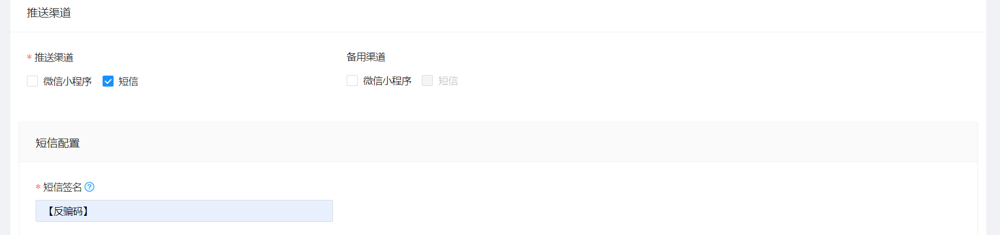

**备用渠道：在推送渠道推送不成功的情况下，会对当前号码再次用备用渠道推送一遍**

5. 填写推送内容
   * 纯文字：在短信中直接显示，在小程序中显示为通知内容
    
   * 富文本：在短信中以链接形式显示，点击链接跳转页面，页面内容为此富文本，在小程序中显示为进入小程序查看跳转网页，显示富文本内容
    

6. 点击右下角【保存】按钮，新增推送任务

### 7.1.4. 信使推送操作

* 查看推送明细
  点击政安信使列表右侧【推送明细】按钮，跳转推送明细页面，并显示此政安信使任务的明细列表
  

## 7.2. 推送明细

### 7.2.1. 查看推送明细列表

点击**推送明细**标签页，可以查看当前商户地区下的推送明细


### 7.2.2. 查询推送明细

1. 在查询框中输入手机号，任务名称，推送渠道等
2. 点击页面【查询】按钮，以查询框中的条件查询推送明细


## 7.3. 日推送统计

### 7.3.1. 日推送统计查看

点击**日推送统计**标签页，可以查看当前商户地区下的日推送统计


### 7.3.2. 日推送统计查询

1. 在查询框中选择日期
2. 点击页面【查询】按钮，以查询框中的条件查询日推送统计


### 7.3.3. 日推送统计操作

* 查看日推送统计明细
  点击日推送统计列表有车【推送明细】按钮，查看日推送明细


# 8. 反诈咨询


## 8.1. 咨询记录

### 8.1.1. 查看咨询、举报记录

分别点击**咨询** 和 **举报** 标签页，可以查看当前商户地区下的咨询记录和举报记录


### 8.1.2. 查询咨询、举报记录

1. 分别在**咨询** 和 **举报** 标签页
2. 在查询框中输入 咨询内容 或者 举报内容 或 手机号
3. 点击页面【查询】按钮，以查询框中的条件查询咨询和举报记录


### 8.1.3. 导出咨询、举报记录

1. 添加查询条件，查询咨询和举报 **(可选)** 
2. 点击页面【导出】按钮，导出当前查询条件下的咨询和举报列表


## 8.2. 文案配置

### 8.2.1. 查看文案配置列表

点击**文案配置** 标签页，可以查看当前商户的文案配置


### 8.2.2. 文案配置操作

此文案为用户在小程序端咨询内容，提示的文案

* 文案配置编辑
  1. 点击文案配置右侧【编辑】按钮，弹出编辑窗口
    
  2. 在弹出框中修改提示文案和恢复默认文案配置
    


# 9. 系统管理


## 9.1. 派出所管理

### 9.1.1. 查看派出所列表

点击**派出所** 标签页，可以查看当前商户地区下的派出所


### 9.1.2. 查询派出所

1. 在查询框中输入 派出所名称 或 地区
2. 点击页面【查询】按钮，以查询框中的条件查询派出所


### 9.1.3. 导入派出所

1. 点击页面【模板下载】按钮，下载excel模板

2. 在下载的模板excel填写派出所信息
   **注意：一个派出所一条记录**

1. 点击页面【excel导入】按钮，上传刚刚修改的excel


### 9.1.4. 派出所操作

* 派出所删除
  点击派出所列表右侧【删除】按钮，删除派出所


## 9.2. 操作员管理

### 9.2.1. 查看操作员列表

点击**操作员管理** 标签页，可以查看当前商户地区下的操作员
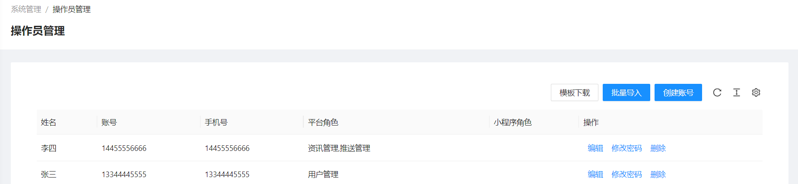

### 9.2.2. 新增操作员

* 新增单个操作员
  1. 点击页面【创建账号】按钮，弹出新增窗口
   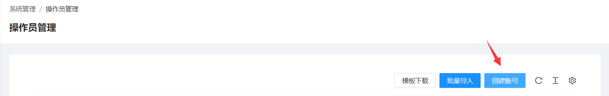
  2. 在弹出新增窗口中填写操作员信息
   * 手机号码：真实填写，登陆系统需要手机号验证
   * 登陆账号名，可自定义，也可以直接使用手机号
   * 平台角色：刑侦反骗码用户后台的角色
   * 小程序角色：小程序警员端的角色
   
  3. 点击弹出的新增窗口右下角【确定】按钮，完成操作员新增

* 批量新增操作员
  1. 点击页面【模板下载】按钮，下载excel模板
   
  2. 在下载的excel模板中填写操作员信息
   
  3. 点击页面【批量导入】按钮，选择刚刚修改的excel
   

**注意：批量新增操作员时，模板excel要在sheet为 导入数据 下填写操作员信息**

### 9.2.3. 操作员操作

* 操作员编辑
  点击操作员列表右侧【编辑】按钮，编辑操作员信息
* 操作员修改密码
  点击操作员列表右侧【修改密码】按钮，修改操作员密码
* 操作员删除
  点击操作员列表右侧【删除】按钮，删除操作员

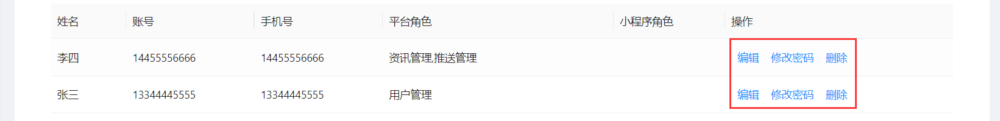

## 9.3. 角色管理

### 9.3.1. 查看角色列表

点击**角色管理** 标签页，可以查看刑侦反骗码用户后台的角色


### 9.3.2. 新增角色

1. 点击页面【创建角色】按钮，弹出新增窗口
   
2. 在弹出的新增窗口中填写基本信息
   
3. 在弹出的新增窗口中把需要的权限勾选上
   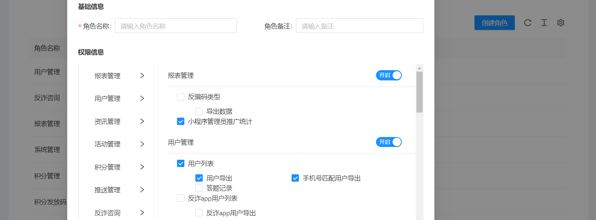

### 9.3.3. 角色操作

* 角色查看
  点击角色列表右侧【查看】按钮，查看角色信息
* 角色编辑
  点击角色列表右侧【编辑】按钮，编辑角色信息
* 角色删除
  点击角色列表右侧【删除】按钮，删除角色


**注意：系统内置角色不能编辑和删除，只能查看**

## 9.4. 系统设置

### 9.4.1. 查看系统设置列表

点击**系统设置** 标签页，可以查看刑侦反骗码用户后台的系统设置


### 9.4.2. 系统设置操作

* 系统设置编辑
  点击系统设置列表右侧【编辑】按钮，编辑系统设置内容

  
  

## 9.5. 小程序菜单

### 9.5.1. 查看小程序菜单列表

点击 **小程序菜单** 标签页，可以查看当前商户地区下的小程序菜单以及开关状态


### 9.5.2. 小程序菜单操作

* 小程序菜单开启
  1. 点击小程序菜单列表右侧【编辑】按钮，弹出小程序菜单编辑框
   
  2. 在弹出的编辑框中选择 【自定义】按钮，并点击【确定】按钮返回
   
  3. 此时【是否开启】按钮已经可选择，点击此按钮，开启关闭小程序菜单
  
* 小程序菜单编辑
  1. 点击小程序菜单列表右侧【编辑】按钮，弹出小程序菜单编辑框
    
  2. 在弹出的编辑框中选择 【自定义】按钮，编辑导航名称
   
  


