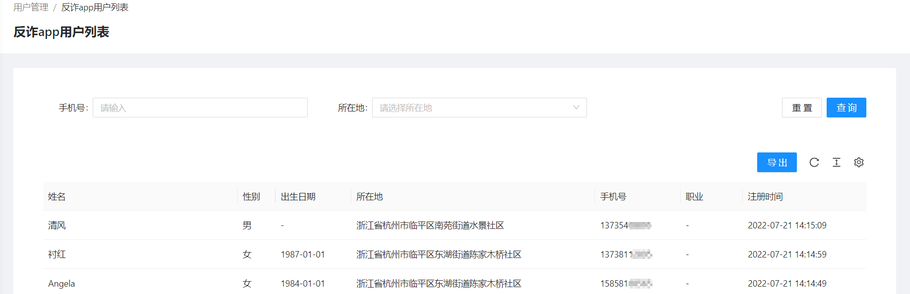
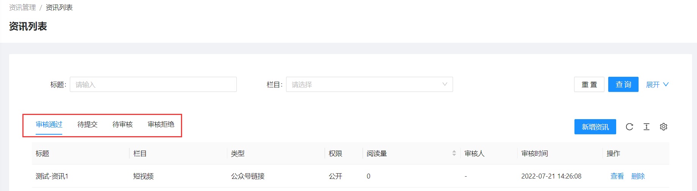
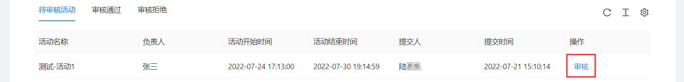
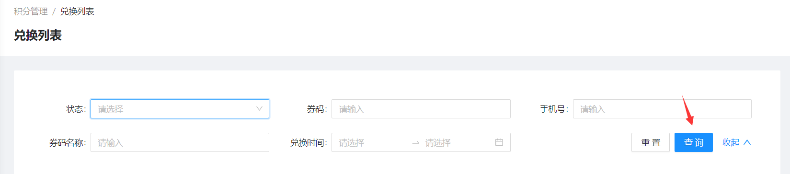
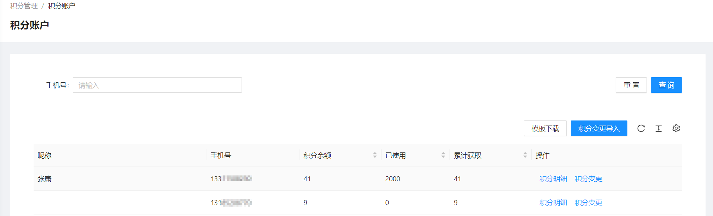
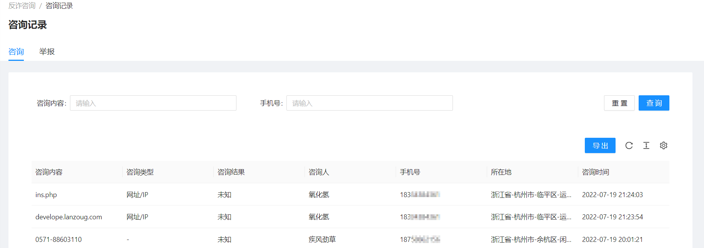

<!--第一页 start-->

<h1>刑侦反骗码用户后台</h1>
<h4>用户手册</h4>

                            

浙江政安信息安全研究中心
`https://www.gov-security.com/`
平台版本：1.0.10

<!--第一页 end-->

<!--第二页 start-->

Copyright © 2020-2022 浙江政安信息安全中心有限公司及其许可者 版权所有，保留一切权利。
未经本公司书面许可，任何单位和个人不得擅自摘抄、复制本书内容的部分或全部，并不得以任何形式传播。
除政安信息安全中心有限公司的商标外，本手册中出现的其它公司的商标、产品标识及商品名称，由各自权利人拥有。
由于产品版本升级或其他原因，本手册内容有可能变更。政安保留在没有任何通知或者提示的情况下对本手册的内容进行修改的权利。本手册仅作为使用指导，政安 尽全力在本手册中提供准确的信息，但是 政安 并不确保手册内容完全没有错误，本手册中的所有陈述、信息和建议也不构成任何明示或暗示的担保。

                           
<!--第二页 end-->

<h2>目录</h2>

[toc]

 

# 1. 系统登录

## 1.1. 登录地址

使用浏览器打开以下地址
https://mage.gov-security.com/mage/management/merchant/user/login

## 1.2. 登录界面

### 1.2.1. 登录

1. 在登录页输入用户名和密码
2. 点击按钮智能认证
3. 点击【登录】按钮，登录系统
4. 登录过期或者登录ip改变则需要短信验证
  

### 1.2.2. 忘记密码

1. 点击登录页面的【忘记密码】按钮，跳转修改密码页面
   
2. 输入手机号码，点击获取验证码
   
3. 弹出智能验证框，点击按钮，发送短信
   
4. 输入验证码，并输入新密码
   
5. 点击按钮智能认证
6. 点击【确认修改】按钮，完成密码修改
  

# 2. 报表管理

## 2.1. 反骗码类型

查看当前商户地区下的反骗码注册用户

### 2.1.1. 查看反骗码类型列表

### 2.1.2. 查询反骗码类型列表

### 2.1.3. 导出反骗码列表

根据查询条件导出列表，不添加任何查询条件导出所有

## 2.2. 小程序管理员推广统计

### 2.2.1. 查看小程序管理员推广统计

### 2.2.2. 查询小程序管理员推广统计

# 3. 用户管理

## 3.1. 用户列表

查看当前商户地区下的反骗码用户

### 3.1.1. 查看用户列表

### 3.1.2. 查询用户

根据条件筛选用户

### 3.1.3. 导出用户列表

根据查询条件导出用户列表

**注意： 不添加查询条件，将会导出所有用户，数据量过大时可能会导致导出失败**

1. 点击【导出】按钮，弹出导出确认框

2. 弹出框中点【确定】，导出excel

### 3.1.4. 手机号匹配

已有一批手机号，判断是否在系统中

1. 点击【模板下载】按钮，下载excel模板
  
2. 在下载的模板中填写需要匹配的手机号
  
3. 点击【手机号匹配】按钮，上传刚刚下载的模板进行匹配
  
4. 自动下载匹配上的用户列表excel

## 3.2. 反诈app用户列表

查看当前商户地区下的反诈app用户

### 3.2.1. 查看反诈app用户列表

### 3.2.2. 搜索反诈app用户

### 3.2.3. 导出反诈app用户列表

根据搜索条件导出反诈app用户列表

**注意：不添加搜索条件，将会导出所有用户，数据量过大时可能会导致导出失败**

1. 点击【导出】按钮，弹出导出确认框

2. 弹出框中点【确定】，导出excel

# 4. 资讯管理

## 4.1. 资讯列表

<!-- ### 资讯列表简介
 -->

### 4.1.1. 查看资讯列表

* 资讯列表
  * 审核通过
  * 待提交
  * 待审核
  * 审核拒绝

点击不同标签页，查看不同状态的资讯列表

### 4.1.2. 查询资讯列表

### 4.1.3. 新增资讯

1. 点击页面【新增资讯】按钮，跳转新增页面

2. 填写资讯信息

3. 填写资讯内容
   *  填写公众号链接
    
   * 填写自定义内容
      * 填写自定义文章
      
      * 上传百度网盘链接
      
      
      * 上传文件
      
    
4. 保存和提交资讯
   * 点击页面右下角【保存】按钮，保存资讯
   * 点击页面右下角【提交】按钮，提交资讯

**注意：点击【保存】按钮，在待提交列表下查看当前资讯**
**注意：点击【提交】按钮， 如果该商户开启了资料审核，则在待审核列表下查看此资讯。没有开启资料审核，则直接在审核通过列表下查看当前资讯**

### 4.1.4. 资讯操作

* 查看资讯
  在**审核通过** **待审核** **审核拒绝**标签下点击列表右侧【查看】按钮，查看资讯内容
* 删除资讯
  在**审核通过** **待审核** **审核拒绝**标签下点击列表右侧【查看】按钮，删除资讯
* 提交资讯
  在**待提交**标签下点击列表右侧【提交】按钮，提交资讯到**待审核**或**审核通过**
* 编辑资讯
  在**待提交**标签下点击列表右侧【编辑】按钮，编辑资讯内容
* 撤回资讯
  在**待审核**标签下点击列表右侧【撤回】按钮，撤回资讯到**待提交**
* 再次发起资讯
  当资讯被审核拒绝后，在**审核拒绝**标签下点击列表右侧【再次提交】按钮，跳转新增资讯页面，带入当前资讯内容，可以重新编辑提交

## 4.2. 我审核的

### 4.2.1. 查看我审核的资讯列表

### 4.2.2. 查询我审核的资讯

### 4.2.3. 资讯操作

* 审核资讯
  1. 在**待审核**标签下点击列表右侧【审核】按钮，跳转审核详情页面
    
  2. 选择审核是否通过，再点击页面右下角【审核】按钮，完成审核
    
* 查看资讯

## 4.3. 上传排名

### 4.3.1. 查看上传排名列表

### 4.3.2. 查询上传排名列表

### 4.3.3. 上传排名操作

* 导出
  点击页面【导出】按钮，导出当前条件下的上传排名信息excel
  

# 5. 活动管理

## 5.1. 组织者列表

### 5.1.1. 查看组织者列表

### 5.1.2. 查询组织者

### 5.1.3. 组织者操作

* 导出组织者列表
  点击页面【导出】按钮，导出组织者列表
  
* 编辑组织者信息
  点击组织者列表右侧【编辑】按钮，编辑组织者信息
* 编辑组织者打款信息
  点击组织者列表右侧【打款信息】按钮，编辑组织者打款信息
  

## 5.2. 组织者初审

### 5.2.1. 查看组织者初审列表

* 组织者初审
  * 待初审
  * 初审通过
  * 初审拒绝

点击不同标签页，查看不同状态的组织者列表

### 5.2.2. 查询组织者初审

### 5.2.3. 组织者初审操作

* 组织者审核
  在**待初审**标签下，点击列表右侧【审核】按钮，初审组织者
  

  **审核通过在 审核通过标签页下查看**
  **审核拒绝在 审核拒绝标签页下查看**

## 5.3. 组织者终审

### 5.3.1. 查看组织者审核列表

* 组织者终审
  * 待初审
  * 待终审
  * 终审通过
  * 终审拒绝

点击不同标签页，查看不同状态的组织者列表

### 5.3.2. 查询组织者审核

### 5.3.3. 组织者审核操作

* 组织者审核
  在**待初审**或**待终审**标签下，点击列表右侧【审核】按钮，直接终审组织者

  

  **注意：可以直接终审待初审的组织者，终审待初审组织者后，待初审权限将看不到此组织者的信息**

## 5.4. 活动列表

### 5.4.1. 查看活动列表

* 活动
  * 审核通过
  * 待提交
  * 待审核
  * 审核拒绝

点击不同标签页，查看不同状态的活动列表

### 5.4.2. 查询活动

### 5.4.3. 活动新增

1. 点击页面【创建】按钮，跳转新增活动页面
   
2. 填写活动基本信息
   
3. 填写活动地址，也可以在地图上选择
   
4. 后台添加组织者 **(可选)**
   
5. 填写活动详细
   
6. 点击页面右下角【确定】按钮

**注意：如果活动选择不公开，则只能通过后台添加组织者**

### 5.4.4. 活动操作

* 活动查看
  点击活动列表右侧【查看】按钮，查看活动详情
* 活动编辑
  在**待提交**标签下，点击活动列表右侧【编辑】按钮，编辑活动内容
* 活动提交
  在**待提交**标签下，点击活动列表右侧【提交】按钮，提交活动至审核
* 活动撤回
  在**待审核**标签下，点击活动列表右侧【撤回】按钮，撤回活动至**待提交**
* 活动取消
  在**审核通过**标签下，点击活动列表右侧【取消】按钮，取消活动
* 活动删除
  在**待提交**和**审核拒绝**标签下，点击活动列表右侧【删除】按钮，删除活动
* 活动再次发起
  在**审核拒绝**标签下，点击活动列表右侧【再次提交】按钮，跳转新增活动页面，带入此活动内容，重新编辑提交

**注意：只有未开始的活动才能取消**

## 5.5. 活动审核

### 5.5.1. 查看活动审核列表

点击不同标签页，查看不同状态的活动审核列表

### 5.5.2. 活动审核操作

* 活动审核
  在**待审核活动**标签页下，点击活动列表右侧【审核】按钮，跳转审核页面
  
* 活动审核查看
  在**审核通过**和**审核拒绝**标签页下，点击活动列表右侧【查看】按钮，查看活动详情 
  

## 5.6. 打卡初审

### 5.6.1. 查看打卡初审列表

点击不同标签页，查看不同状态的打卡审核列表

### 5.6.2. 打卡初审审核

1. 在**待审核**标签页下，点击打卡列表右侧【审核】按钮，弹出审核窗口
   
2. 在弹出的审核窗口中，选择通过或拒绝，填写参与时长，奖励金额等
   
3. 点击弹出的审核窗口右下角【确定】按钮，完成打卡初审审核

### 5.6.3. 打卡初审操作

* 查看签到记录
  在所有标签页下，点击打卡列表右侧【签到记录】按钮，查看打卡签到记录
* 查看活动详情
  在**待初审**标签页下，点击打卡列表右侧【活动详情】，查看打卡的活动详情
* 查看打卡详情
  在**审核通过**和**审核拒绝**标签页下，点击打卡列表右侧【打卡详情】按钮，查看打卡详情
  
  
  
  

## 5.7. 打卡终审

### 5.7.1. 查看打卡审核列表

点击不同标签页，查看不同状态的打卡审核列表

 

### 5.7.2. 打卡终审审核

### 5.7.3. 打卡终审操作

* 审核待初审
  审核过程和初审打卡一致
* 审核待终审
  审核过程和初审打卡一致
* 查看签到记录
  点击打卡列表右侧【签到记录】按钮，查看打卡签到记录
* 查看活动详情
  点击打卡列表右侧【活动详情】，查看活动详情

**注意：可以直接终审待初审打卡，终审待初审打卡后，待初审权限将看不到此打卡的信息**

## 5.8. 评价列表

### 5.8.1. 查看评价列表

### 5.8.2. 查询评价

## 5.9. 奖励统计

### 5.9.1. 查看奖励统计列表

### 5.9.2. 查询奖励统计

### 5.9.3. 奖励统计操作

* 导出奖励统计
  点击页面【导出】按钮，当前标签页下的奖励统计
  
* 查看奖励明细
  点击奖励统计列表右侧【查看明细】按钮，查看组织者和地区的明细
  
* 查看地区统计下级地区
  在**地区**标签页下，点击奖励统计列表右侧【下级】按钮，查看下级地区奖励统计情况
  

## 5.10. 活动配置

**1. 配置管理员的地区权限，即管理员可以看到当前地区下的组织者，活动列表等**
**2. 添加此活动配置的管理员，必须要在系统操作员内**

### 5.10.1. 查看管理员列表

### 5.10.2. 新增管理员

1. 点击页面【新增】按钮，弹出新增管理员窗口
   
2. 在弹出的新增窗口中填写管理员信息和所在区域
   
3. 在弹出的新增窗口中点击【确定】按钮，完成新增管理员

# 6. 积分管理

**积分使用流程**
1. 新增券码类目
2. 新增券码
3. 新增积分发放码
4. 用户通过积分发放码，获取积分
5. 用户使用积分兑换 券码的商品

## 6.1. 券码类目

### 6.1.1. 查看券码类目列表

### 6.1.2. 查询券码类目

### 6.1.3. 新增券码类目

1. 点击页面【新增按钮】，弹出新增券码类目窗口
   
2. 在弹出的窗口中，填写券码类目名称
   
3. 在弹出的新增窗口中，点击【确定】按钮

### 6.1.4. 券码类目操作

* 合并券码类目
  点击券码类目列表右边【合并】按钮，将其他券码类目下的券码合并到当前类目下
* 编辑券码类目
  点击券码类目列表右边【编辑】按钮，编辑券码类目信息
* 上移/下移券码类目 
  点击券码类目列表右侧【上移】/【下移】按钮，上移/下移券码类目
* 删除券码类目
  点击券码类目列表右侧【删除】按钮，删除券码类目

**注意：上移/下移 影响券码类目在小程序端的显示顺序**
**注意：只有当前券码类目下没有券码才能被删除**

## 6.2. 券码列表

<!-- ### 券码简介 -->

### 6.2.1. 查看券码列表

### 6.2.2. 查询券码

### 6.2.3. 新增券码

1. 点击页面【新增】按钮，跳转新增券码页面
   
2. 填写券码基本信息
   
3. 在券码类型为**兑换券**和**违章减免券**的时候，填写库存数量
   
4. 填写券码详情
   
5. 点击页面右下角【保存】按钮，完成券码新增

### 6.2.4. 券码操作

* 券码查看
  点击券码列表右侧【查看】按钮，查看券码详情
* 券码上架/下架
  点击券码列表右侧【上架】/【下架】按钮，上架/下架 券码
* 券码编辑
  点击券码列表右侧【编辑】按钮，编辑券码内容
* 查看兑换码明细
  点击券码列表右侧【兑换码明细】按钮，查看兑换码明细
* 券码删除
  点击券码列表右侧【删除】按钮，删除券码

**注意：只有券码类型为兑换码，才能查看兑换码明细**
**注意：只有下架的券码才能编辑和删除**

## 6.3. 积分发放码

### 6.3.1. 查看积分发放码列表

### 6.3.2. 查询积分发放码

### 6.3.3. 新增积分发放码

1. 点击页面【新增】按钮，弹出新增积分发放码窗口
   
2. 在弹出的新增窗口中填写积分发放码内容
   
3. 在弹出的新增窗口中，点击右下角【确定】按钮

### 6.3.4. 积分发放码操作

* 积分发放码查看
  点击积分发放码列表右侧【查看】按钮，查看积分发放码详情
* 积分发放码上架/下架
  点击积分发放码列表右侧【上架】/【下架】按钮，上架/下架 积分发放码
* 积分发放码编辑
  点击积分发放码列表右侧【编辑】按钮，编辑积分发放码内容
* 积分发放码链接
  点击积分发放码列表右侧【码链接】按钮，查看积分发放码链接
* 积分发放码发放明细
  点击积分发放码列表右侧【发放明细】按钮，查看积分发放码发放明细
* 积分发放码删除
  点击积分发放码列表右侧【删除】按钮，删除积分发放码

**注意：只有下架的积分发放码才能编辑和删除**

## 6.4. 兑换列表

### 6.4.1. 查看兑换列表

点击不同标签页，查看不同类型的兑换列表

### 6.4.2. 查询兑换列表

### 6.4.3. 导出兑换列表

## 6.5. 积分账户

### 6.5.1. 查看积分账户列表

### 6.5.2. 查询积分账户

### 6.5.3. 积分账户操作

* 查看积分明细
  点击积分账户右侧【积分明细】按钮，查看积分明细
  
* 积分变更
  1. 点击积分账户列表右侧【积分变更】按钮，弹出积分变更窗口
  
  2. 在弹出的变更窗口中填写积分变更
   
* 批量积分变更
  1. 点击页面【模板下载】按钮，下载excel模板
   
  2. 在下载的模板excel中填写手机号和积分增减
   
  3. 点击页面【积分变更导入】按钮，导入刚刚修改的excel
   

## 6.6. 月度排行

### 6.6.1. 查看月度排行

### 6.6.2. 查询月度排行

### 6.6.3. 月度排行导出

## 6.7. 积分配置

### 6.7.1. 查看发放规则列表

### 6.7.2. 发放规则操作

* 发放规则配置
  1. 点击规则配置列表右侧【编辑】按钮，弹出发放规则编辑框
   
  2. 在弹出的编辑框中修改发放规则配置
   

* 发放规则静默时长
  1. 点击静默时长列表右侧【编辑】按钮，弹出静默时长编辑框
   
  2. 在弹出的编辑框中修改静默时长配置
   

### 6.7.3. 温馨提示

### 6.7.4. 高级设置

# 7. 推送管理

## 7.1. 政安信使

### 7.1.1. 查看信使推送列表

### 7.1.2. 查询信使推送任务

### 7.1.3. 新增信使推送任务

1. 点击页面【新增推送】按钮，跳转新增页面

2. 填写信使推送基本信息

3. 选择推送人群
   * 按号码推送
      * 手动输入号码，直接输入到发送号码框中，以英文逗号分隔
       
      * 导入手机号码
        1. 下载模板excel
        
        2. 在下载的模板中填写需要推送的手机号
        
        3. 点击【导入excel】按钮，上传刚刚下载的模板excel
        
        4. 导入excel后，也可以在发送号码框中继续修改
        
   * 按地区推送
     1. 选择地区，可以从 省 级别到 社区/村 级别
     
     2. 选择**红码**情况下，选择严重程度
     

4. 选择推送渠道
   * 微信小程序
    
   * 短信
    

**备用渠道：在推送渠道推送不成功的情况下，会对当前号码再次用备用渠道推送一遍**

5. 填写推送内容
   * 纯文字
    
   * 富文本 
    

6. 点击右下角【保存】按钮

### 7.1.4. 信使推送操作

* 查看推送明细

## 7.2. 推送明细

### 7.2.1. 查看推送明细列表

### 7.2.2. 查询推送明细

## 7.3. 日推送统计

### 7.3.1. 日推送统计查看

### 7.3.2. 日推送统计查询

### 7.3.3. 日推送统计操作

* 查看日推送统计明细

# 8. 反诈咨询

## 8.1. 咨询记录

### 8.1.1. 查看咨询、举报记录

### 8.1.2. 查询咨询、举报记录

### 8.1.3. 导出咨询、举报记录

**注意： 不添加查询条件，将会导出所有记录，数据量过大时可能会导致导出失败**

## 8.2. 文案配置

### 8.2.1. 查看文案配置列表

### 8.2.2. 文案配置操作

* 文案配置编辑
  1. 点击文案配置右侧【编辑】按钮，弹出编辑窗口
    
  2. 在弹出框中修改提示文案和恢复默认文案配置
    

# 9. 系统管理

## 9.1. 派出所管理

### 9.1.1. 查看派出所列表

### 9.1.2. 查询派出所

### 9.1.3. 导入派出所

1. 点击页面【模板下载】按钮，下载excel模板

2. 在下载的模板excel填写派出所信息

3. 点击页面【excel导入】按钮，上传刚刚修改的excel

### 9.1.4. 派出所操作

* 派出所删除
  点击派出所列表右侧【删除】按钮，删除派出所

## 9.2. 操作员管理

### 9.2.1. 查看操作员列表

### 9.2.2. 新增操作员

* 单个新增操作员
  1. 点击页面【创建账号】按钮，弹出新增窗口
   
  2. 在弹出新增窗口中填写操作员信息
   
  3. 点击弹出的新增窗口右下角【确定】按钮，完成操作员新增

* 批量新增操作员
  1. 点击页面【模板下载】按钮，下载excel模板
   
  2. 在下载的excel模板中填写操作员信息
   
  3. 点击页面【批量导入】按钮，选择刚刚修改的excel
   

**注意：批量新增操作员时，模板excel要在sheet为 导入数据 下填写操作员信息**

### 9.2.3. 操作员操作

* 操作员编辑
  点击操作员列表右侧【编辑】按钮，编辑操作员信息
* 操作员修改密码
  点击操作员列表右侧【修改密码】按钮，修改操作员密码
* 操作员删除
  点击操作员列表右侧【删除】按钮，删除操作员

## 9.3. 角色管理

### 9.3.1. 查看角色列表

### 9.3.2. 新增角色

1. 点击页面【创建角色】按钮，弹出新增窗口
   
2. 在弹出的新增窗口中填写基本信息
   
3. 在弹出的新增窗口中把需要的权限勾选上
   

### 9.3.3. 角色操作

* 角色查看
  点击角色列表右侧【查看】按钮，查看角色信息
* 角色编辑
  点击角色列表右侧【编辑】按钮，编辑角色信息
* 角色删除
  点击角色列表右侧【删除】按钮，删除角色

**注意：系统内置角色不能编辑和删除，只能查看**

## 9.4. 系统设置

### 9.4.1. 查看系统设置列表

### 9.4.2. 系统设置操作

* 系统设置编辑
  点击系统设置列表右侧【编辑】按钮，编辑系统设置内容

  
  

## 9.5. 小程序菜单

### 9.5.1. 查看小程序菜单列表

### 9.5.2. 小程序菜单操作

* 小程序菜单开启
  点击小程序菜单列表右侧【是否开启】按钮，开启/关闭 小程序端此功能
  
* 小程序菜单编辑
  点击小程序菜单列表右侧【编辑】按钮，编辑小程序菜单
  

