<!--第一页 start-->

<h1>积分功能</h1>
<h4>用户手册</h4>

                            

浙江政安信息安全研究中心
`https://www.gov-security.com/`
平台版本：1.0.10

<!--第一页 end-->

<!--第二页 start-->

Copyright © 2020-2022 浙江政安信息安全中心有限公司及其许可者 版权所有，保留一切权利。
未经本公司书面许可，任何单位和个人不得擅自摘抄、复制本书内容的部分或全部，并不得以任何形式传播。
除政安信息安全中心有限公司的商标外，本手册中出现的其它公司的商标、产品标识及商品名称，由各自权利人拥有。
由于产品版本升级或其他原因，本手册内容有可能变更。政安保留在没有任何通知或者提示的情况下对本手册的内容进行修改的权利。本手册仅作为使用指导，政安 尽全力在本手册中提供准确的信息，但是 政安 并不确保手册内容完全没有错误，本手册中的所有陈述、信息和建议也不构成任何明示或暗示的担保。

                           
<!--第二页 end-->

<h2>目录</h2>

[toc]

# 1. 系统登录

## 1.1. 登录地址

使用浏览器打开以下地址
https://mage.gov-security.com/mage/management/merchant/user/login

## 1.2. 登录界面

### 1.2.1. 登录

1. 在登录页输入用户名和密码
2. 点击按钮智能认证
3. 点击【登录】按钮，登录系统
4. 登录过期或者登录ip改变则需要短信验证
  

### 1.2.2. 忘记密码

1. 点击登录页面的【忘记密码】按钮，跳转修改密码页面
   
2. 输入手机号码，点击获取验证码
   
3. 弹出智能验证框，点击按钮，发送短信
   
4. 输入验证码，并输入新密码
   密码设置规则： **6-16位密码，至少包含字母、数字、特殊符号中的两种**
   
5. 点击按钮智能认证
6. 点击【确认修改】按钮，完成密码修改
  

  
# 2. 积分管理

## 2.1. 券码类目

### 2.1.1. 查看券码类目列表

点击**券码类目** 菜单栏，可以查看当前商户下的券码类目

### 2.1.2. 查询券码类目

1. 在查询框中输入券码类目名称
2. 点击页面【查询】按钮，以查询框中的条件查询券码类目

### 2.1.3. 新增券码类目

1. 点击页面【新增按钮】，弹出新增券码类目窗口
   
2. 在弹出的窗口中，填写券码类目名称 **(字数限制最多4个字)**
   
3. 在弹出的新增窗口中，点击【确定】按钮

### 2.1.4. 券码类目操作

* 合并券码类目
  点击券码类目列表右边【合并】按钮，将其他券码类目下的券码合并到当前类目下
* 编辑券码类目
  点击券码类目列表右边【编辑】按钮，编辑券码类目信息
* 上移/下移券码类目 
  点击券码类目列表右侧【上移】/【下移】按钮，上移/下移券码类目
* 删除券码类目
  点击券码类目列表右侧【删除】按钮，删除券码类目

**注意：上移/下移 影响券码类目在小程序端的显示顺序**
**注意：只有当前券码类目下没有券码才能被删除**

## 2.2. 券码列表

<!-- ### 券码简介 -->

### 2.2.1. 查看券码列表

点击**券码列表** 菜单栏，可以查看当前商户下的券码列表
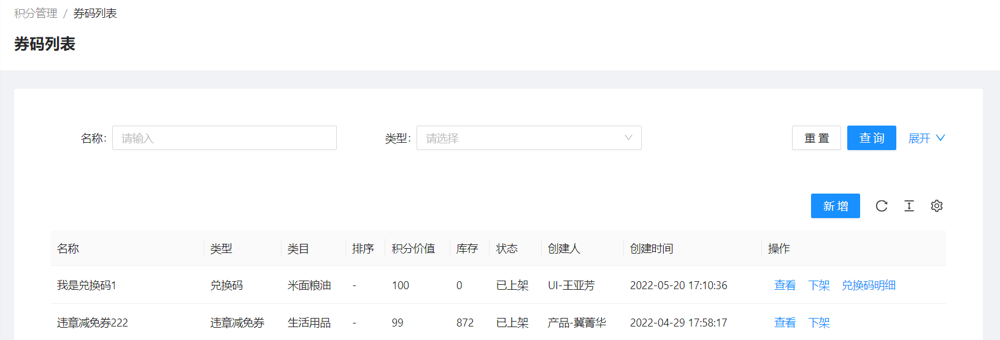

### 2.2.2. 查询券码

1. 在查询框中输入或选中 券码名称、类型等条件，支持多条件组合筛选
2. 点击页面【查询】按钮，以查询框中的条件查询券码
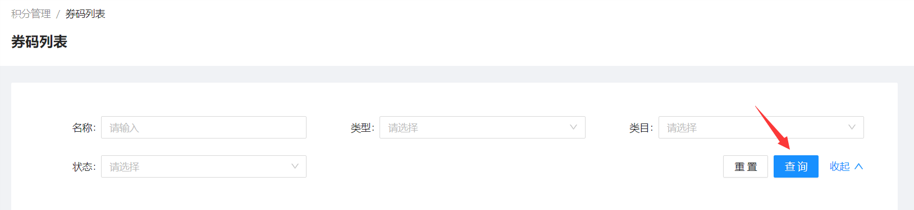

### 2.2.3. 新增券码

1. 点击页面【新增】按钮，跳转新增券码页面
   
2. 填写券码基本信息
   * 类型
     * 兑换码：用于平台自己兑换
     * 兑换券：用于兑换三方优惠券
     * 违章减免券：用于减免违章
   * 类目：券码类目，在**券码类目**标签页下自行设置，用于券码分类
   * 积分价值：设置此券码需要多少积分兑换
   * 领取有效期：当类型为兑换券时，设置兑换券的有效期，即领取兑换券后多少天内有效
   * 是否限时：设置券码是否限时兑换
   * 兑换期限：当设置限时兑换时，设置兑换时间
   * 显示排序 **(可选)**：券码在小程序端的显示排序，不填写默认999，数值越小排名越靠前
   
3. 在券码类型为**兑换券**和**违章减免券**的时候，填写库存数量
   
4. 填写券码详情
   
5. 点击页面右下角【保存】按钮，完成券码新增

**注意：兑换码需要导入明细才能被用户兑换**

### 2.2.4. 券码操作

* 券码查看
  点击券码列表右侧【查看】按钮，查看券码详情
* 券码上架/下架
  点击券码列表右侧【上架】/【下架】按钮，上架/下架 券码
* 券码编辑
  点击券码列表右侧【编辑】按钮，编辑券码内容
* 券码删除
  点击券码列表右侧【删除】按钮，删除券码

* 兑换码明细：已上架和未上架状态的兑换码明细不同，已上架只能查看，需要修改应先下架兑换码
  * 已上架 **(查看兑换码明细)**
    点击券码列表右侧【兑换码明细】按钮，查看兑换码明细
    
  * 未上架
    * 导入兑换码明细
      1. 点击券码列表右侧【兑换码明细】按钮，跳转兑换码明细页面
      2. 点击页面【模板下载】按钮。下载excel模板
      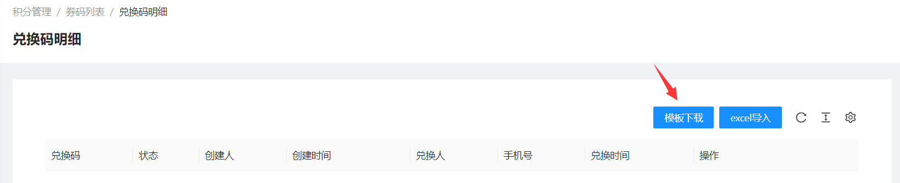
      3. 在刚刚下载的模板excel中添加兑换码
      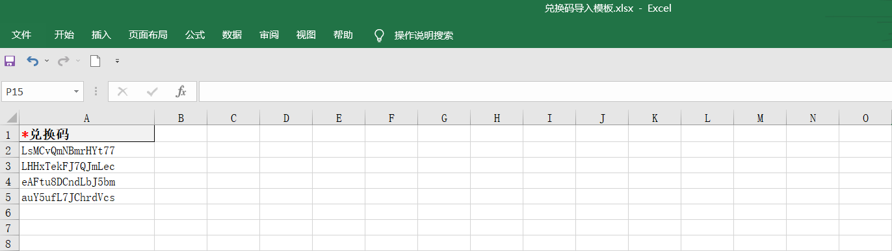
      4. 点击页面【excel导入】按钮，上传刚刚修改的模板excel
      
      5. 上传完成后，兑换码明细如下
      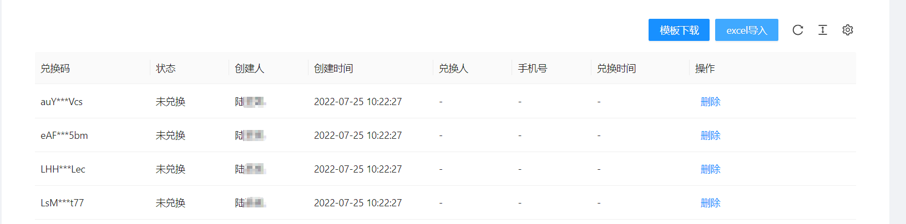
    * 删除兑换码明细：当导入的兑换码明细有错或者不需要时，可以单个删除
      

**注意：只有券码类型为兑换码，才能查看兑换码明细**
**注意：只有下架的券码才能编辑和删除**

## 2.3. 积分发放码

用户可以通过扫积分发放码获取积分

### 2.3.1. 查看积分发放码列表

点击**积分发放码** 菜单栏，可以查看当前商户地区下的积分发放码列表
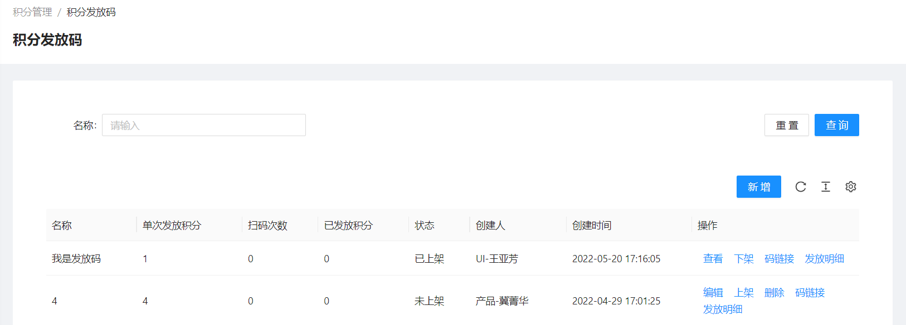

### 2.3.2. 查询积分发放码

1. 在查询框中输入积分发放码名称
2. 点击页面【查询】按钮，以查询框中的条件查询积分发放码

### 2.3.3. 新增积分发放码

1. 点击页面【新增】按钮，弹出新增积分发放码窗口
   
2. 在弹出的新增窗口中填写积分发放码内容，
   单次发放积分：用户扫此积分发放码能获取积分数
   
3. 在弹出的新增窗口中，点击右下角【确定】按钮

**说明：用户扫同一个积分发放码每天只能获取一次积分**

### 2.3.4. 积分发放码操作

* 积分发放码查看
  点击积分发放码列表右侧【查看】按钮，查看积分发放码详情
* 积分发放码上架/下架
  点击积分发放码列表右侧【上架】/【下架】按钮，上架/下架 积分发放码
* 积分发放码编辑
  点击积分发放码列表右侧【编辑】按钮，编辑积分发放码内容
* 积分发放码链接
  点击积分发放码列表右侧【码链接】按钮，自动复制码链接，可粘贴到浏览器或者其他地方储存和查看
* 积分发放码发放明细
  点击积分发放码列表右侧【发放明细】按钮，查看积分发放码发放明细
* 积分发放码删除
  点击积分发放码列表右侧【删除】按钮，删除积分发放码

**注意：只有下架的积分发放码才能编辑和删除**

## 2.4. 兑换列表

### 2.4.1. 查看兑换列表

点击不同标签页，查看不同类型的兑换列表

### 2.4.2. 查询兑换列表

1. 在查询框中输入或选中状态、券码、手机号等条件，支持多条件组合筛选
   * 状态：在**兑换券**标签页查询时，可选状态
     * 待核销：该兑换券在有效期内，且还未使用
     * 已使用：该兑换券已使用
     * 已过期：该兑换券超过兑换券有效期并未使用
   * 券码：每个券码的编号，唯一
   * 券码名称：新增券码时候设置的券码名称
   * 手机号：兑换券码的用户的手机号
2. 点击页面【查询】按钮，以查询框中的条件查询兑换列表

### 2.4.3. 兑换列表操作

* 兑换券核销
  在**兑换券**标签页下，点击兑换券列表右侧【核销】按钮，核销兑换券
  
* 兑换列表导出，支持全量或根据查询条件导出
  1. 添加查询条件，查询列表
  2. 点击页面【导出】按钮，导出当前查询条件下的券码列表
  

## 2.5. 积分账户

### 2.5.1. 查看积分账户列表

点击**积分账户**菜单栏，可以查看当前商户地区下的积分账户列表

### 2.5.2. 查询积分账户

1. 在查询框中输入手机号
2. 点击页面【查询】按钮，以查询框中的条件查询积分账户列表
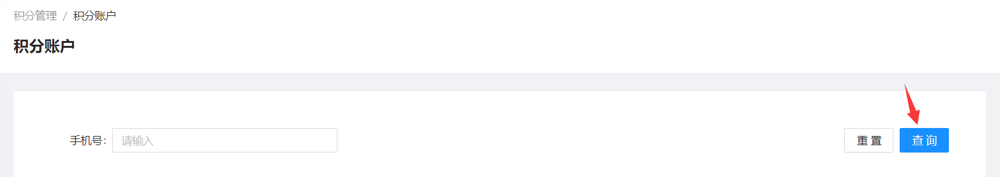

### 2.5.3. 积分账户操作

* 查看积分明细
  点击积分账户右侧【积分明细】按钮，查看积分明细
  
* 积分变更
  1. 点击积分账户列表右侧【积分变更】按钮，弹出积分变更窗口
  
  2. 在弹出的变更窗口中填写积分变更 **(是否计入累计积分选择“否”，则累计积分不会变化)**
   
* 批量积分变更
  1. 点击页面【模板下载】按钮，下载excel模板
   
  2. 在下载的模板excel中填写手机号和积分增减
   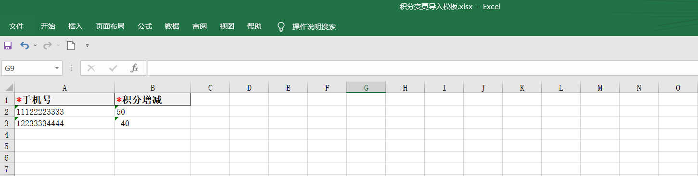
  3. 点击页面【积分变更导入】按钮，导入刚刚修改的excel
   

  **注意：批量积分变更的时候，是否计入累计积分取决于 积分设置的高级设置**

## 2.6. 月度排行

### 2.6.1. 查看月度排行

点击**月度排行**菜单栏，可以查看当前商户管辖地区下的用户累计积分排行

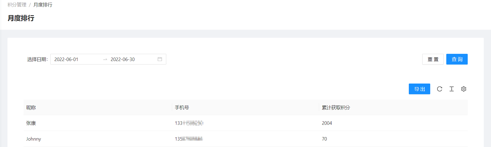

### 2.6.2. 查询月度排行

1. 在查询框中选择日期
2. 点击页面【查询】按钮，以查询框中的条件查询月度排行

### 2.6.3. 月度排行导出

支持导出总排行 或者 导出指定日期内的排行数据

1. 添加查询条件，查询指定日期内的月度排行
2. 点击页面【导出】按钮，导出当前查询条件下的月度排行

## 2.7. 积分配置

* 发放规则
* 温馨提示
* 高级设置

### 2.7.1. 发放规则操作

* 发放规则配置，**注意：发放规则需要开启才生效**
  1. 点击规则配置列表右侧【编辑】按钮，弹出发放规则编辑框
   
   
  2. 在弹出的编辑框中修改发放规则配置
      * 签到：设置首次签到积分，以及连续签到累计积分，最高每天签到获得积分等
      **示例1：用户第一天签到得1分，第二天签到得2分，连续签到第七天得7分，第八天签到也得7分**
      **示例2：用户第一天签到得1分，第二天签到得2分，连续第五天签到得5分，第六天没有签到，第七天签到得1分**
      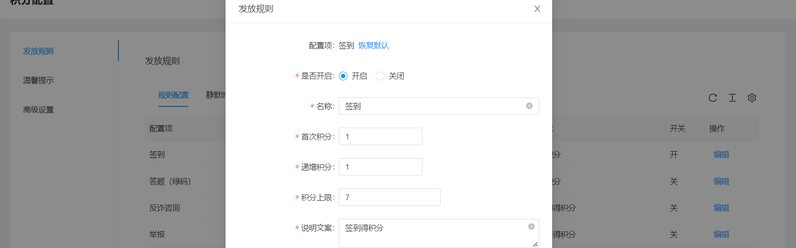
      * 答题(绿码)：答题成为绿码可获得积分，可设置固定得分或者根据答对题数得分，以及每日答题获取积分次数上限，周次数，月次数等
        * 固定发放积分：答对题目成为绿码获得一定积分
        **示例：如下图，每次答题成为绿码可直接获得10积分，每天可答题2次，每周最多可答题3次，每月最多可答题5次**
        
        * 根据答对题数发放积分：答对题目成为绿码，并根据答对题数发放不同积分
        **示例：如下图，答对8题得8分，答对9题得9分，答对10题得10分，每日通过答题只能获得一次积分**
        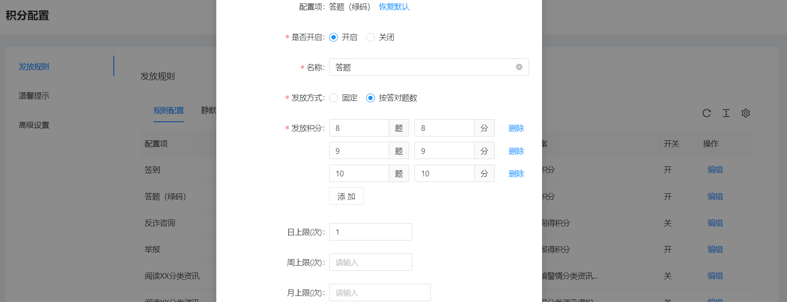
      * 反诈咨询，诈骗举报，阅读资讯，邀请推广：设置单次操作获得积分数，以及日获得积分次数上限，周次数，月次数等
      

* 发放规则静默时长：两次有效阅读的间隔时间
  **示例：第一次点击资讯并阅读，过30秒之后再次点开资讯则获取第二次积分，如果过了15秒之后点开资讯，则不能获取第二次积分**
  1. 点击静默时长列表右侧【编辑】按钮，弹出静默时长编辑框
   
  2. 在弹出的编辑框中修改静默时长配置
   

### 2.7.2. 温馨提示

用于展示在小程序端，积分中心的温馨提示

在小程序端显示如下，点击【温馨提示】可查看温馨提示内容

### 2.7.3. 高级设置

* 累计积分计算规则：用于配置后台变更用户积分时是否将变更的积分数计入累计积分中
  1. 单个修改用户积分账户时，将此配置作为默认配置，可在变更时自行修改
  2. 批量导入时，根据此配置判断导入记录的积分数是否要计入累计积分
  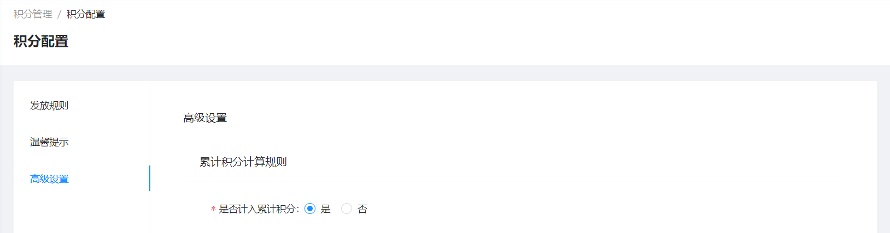
* 兑换限制
  限制可进行积分兑换的用户类型
  **示例：如下图，只有绿码和黄码用户可以兑换**
  
* 积分别名设置
  
* 积分商城入口设置
  设置积分商城入口图片地址
  
* 成长等级
  设置是否开启成长等级，以及添加等级和所需积分
  

