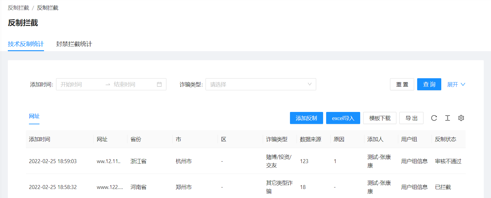
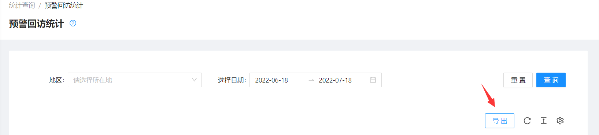
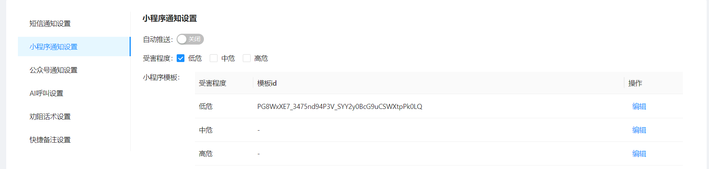

<!--第一页 start-->

<h1>反诈大脑管理后台</h1>
<h4>用户手册</h4>

                           

浙江政安信息安全研究中心
`https://www.gov-security.com/`
软件版本：1.0.6
 

<!--第一页 end-->

<!--第二页 start-->

Copyright © 2020-2022 浙江政安信息安全中心有限公司及其许可者 版权所有，保留一切权利。
未经本公司书面许可，任何单位和个人不得擅自摘抄、复制本书内容的部分或全部，并不得以任何形式传播。
除政安信息安全中心有限公司的商标外，本手册中出现的其它公司的商标、产品标识及商品名称，由各自权利人拥有。
由于产品版本升级或其他原因，本手册内容有可能变更。政安保留在没有任何通知或者提示的情况下对本手册的内容进行修改的权利。本手册仅作为使用指导，政安 尽全力在本手册中提供准确的信息，但是 政安 并不确保手册内容完全没有错误，本手册中的所有陈述、信息和建议也不构成任何明示或暗示的担保。

                           

<!--第二页 end-->

<h2>目录</h2>

[toc]

      
           
           

# 1. 反制拦截

## 1.1. 查看反制拦截列表

* 技术反制统计列表
  
* 封禁拦截统计列表
  

## 1.2. 查询反制拦截列表

* 技术反制
  
* 封禁拦截
  

## 1.3. 添加反制

* 添加单个反制
  1. 点击页面【添加反制】按钮，弹出添加窗口
   
  2. 在弹出的添加窗口中填写反制内容
   
  3. 点击弹出的添加窗口右下角【确定】按钮

* 批量添加反制
  1. 点击页面【模板下载】按钮，下载模板excel
   
  2. 在下载的模板excel中填写反制内容
   
  3. 点击页面【excel导入】按钮，导入刚刚修改的模板excel
   

## 1.4. 反制拦截操作

* 反制拦截记录导出

# 2. 预警处理

## 2.1. 精准宣防

### 2.1.1. 查看精准宣防列表

### 2.1.2. 查询精准宣防

### 2.1.3. 新增精准宣防

1. 点击页面【新增】按钮，弹出新增窗口
   
2. 在弹出的新增窗口中填写任务名称
   
3. 点击弹出的新增窗口右下角【确定】按钮
4. 点击刚刚创建的精准宣防任务右侧【线索记录】按钮，跳转线索记录页面
   
5. 点击页面【模板下载】按钮，下载excel模板
   
6. 在刚刚下载的模板excel中填写需要预警的人员信息，**注意：在 Sheet1 下添加记录**
   
7. 点击页面【excel导入】按钮，上传刚刚修改的excel
    
8. 导入成功后，如下图所示
   
9. 返回上一页，精准宣防列表页，点击刚刚创建的精准宣防任务右侧【发布】按钮，发布任务 
    
    

 

### 2.1.4. 精准宣防操作

* 精准宣防编辑
  点击精准宣防右侧【编辑】按钮，编辑精准宣防信息
* 精准宣防发布
  点击精准宣防右侧【发布】按钮，发布精准宣防
* 精准宣防线索记录
  点击精准宣防右侧【线索记录】按钮，添加和查看线索记录
* 精准宣防删除
  点击精准宣防右侧【删除】按钮，删除精准宣防

**注意：只有未发布的精准宣防才能发布，删除，线索记录的增加**

## 2.2. 待处理预警

### 2.2.1. 查看待处理列表

### 2.2.2. 查看待处理统计

### 2.2.3. 查询待处理预警

### 2.2.4. 待处理预警操作

* 工单处理
  1. 点击待处理预警列表右侧【领取】按钮，跳转工单处理页
   
  2. 查看工单详情
   
  3. 查看工单处理记录
   
  4. 查看此电话号码近30天内预警工单
   
  5. 点击右下角【工单处理】按钮，弹出工单处理窗口
     * 基础表单
   
     *  高级表单
   
  6. 点击弹出的工单处理窗口右下角【跳过】/【保存/下一条】按钮
     * 跳过
        不处理此工单，跳转到下一条工单
     * 保存/下一条 
        处理此工单，并跳转到下一条工单
 
* 工单批量处理
  1. 勾选待处理预计列表前面选择框一个或多个工单
   
  2. 点击待处理预计列表右上角【快捷处理】按钮，弹出快捷处理框
   
  3. 在弹出的快捷处理框，批量处理工单
   

* 工单挂起
  1. 在领取工单后，点击页面右下角【挂起】按钮，挂起工单
  
  2. 挂起的工单可在**挂起**标签页下查看
   
* 工单流转
   点击待处理预警列表右侧【流转】按钮，弹出流转窗口 
   
   * 转推
    把工单转推给同级别商户，例如当前商户为杭州市，可以转推给宁波市
    
   * 下派
    下派给下级行政区域
    
   * 退回
    退回工单到上一级行政区域
    
* 导出
  点击页面【导出】按钮，导出当前查询条件下的所有工单excel
  
* 更新配置
  点击页面【更新配置】按钮，开启/关闭 系统自动更新
  
* 系统通知
  点击待处理列表右侧【系统通知】按钮，查看系统通知历史
  

## 2.3. 已处理预警

### 2.3.1. 查看已处理列表

### 2.3.2. 查看已处理统计

### 2.3.3. 查询已处理预警

### 2.3.4. 已处理预警操作

* 已处理预警查看
  点击页面【导出】按钮，导出当前查询条件下的所有已处理工单记录
  
* 已处理预警导出
  点击已处理预警右侧【查看】按钮，查看处理详情
  

## 2.4. 面对面干预列表

### 2.4.1. 查看面对面干预列表

### 2.4.2. 查询面对面干预列表

### 2.4.3. 面对面干预列表操作

* 面对面干预列表导出
  点击页面【导出】按钮，导出当前查询条件下的面对面干预列表
  

## 2.5. 警情碰撞

### 2.5.1. 警情碰撞简介

通过导入手机号，比对手机号是否在系统预警中

### 2.5.2. 警情碰撞操作

1. 点击页面【模板下载】按钮，下载excel模板
   
2. 在下载的模板excel中填写手机号码
   
3. 点击页面【手机号导入】按钮，上传刚刚修改的模板excel
   
4. 导入成功后，模板excel中手机号码存在于系统预警中的，则会在列表中显示
   
5. 查询警情碰撞记录
   
6. 点击页面【导出】按钮，导出匹配上的记录
   

**注意：离开此页面，警情碰撞会重置，需要重新导入手机号模板**

# 3. 统计查询

## 3.1. 反制拦截分析

### 3.1.1. 反制拦截总计分析

### 3.1.2. 反制拦截查询分析

通过点击不同标签页，查看不同类型得反制和拦截

## 3.2. 预警处置分析

### 3.2.1. 预警处置总计分析

### 3.2.2. 预警处置查询分析

## 3.3. 预警回访统计

### 3.3.1. 预警回访统计查看列表

### 3.3.2. 预警回访统计查询

### 3.3.3. 预警回访统计操作

* 导出列表
  点击页面【导出】按钮，导出当前查询条件下的列表
  

## 3.4. 回访及时性统计

### 3.4.1. 回访及时性查看列表

### 3.4.2. 回访及时性查询

### 3.4.3. 回访及时性操作

* 导出列表
  点击页面【导出】按钮，导出当前查询条件下的列表
  

## 3.5. 回访等级统计

### 3.5.1. 回访等级统计查看列表

### 3.5.2. 回访等级统计查询

### 3.5.3. 回访等级统计操作

* 导出列表
  点击页面【导出】按钮，导出当前查询条件下的列表 
  

## 3.6. 推送统计

### 3.6.1. 推送统计今日总计

### 3.6.2. 推送统计查询

## 3.7. 绩效统计

### 3.7.1. 绩效统计查看列表

通过点击不同标签页查看用户和管理员的绩效

### 3.7.2. 绩效统计查询

### 3.7.3. 绩效统计操作

* 导出列表
  点击页面【导出】按钮，导出当前查询条件下的列表 
  

# 4. 系统管理

## 4.1. 系统设置

### 4.1.1. 短信通知设置

* 剩余条数
  使用总数减去已发送条数，短信总量由运营后台商户界面设置
* 日短信统计
  点击【日短信统计】按钮，查看每天短信发送量
* 自动推送
  针对当前商户地区下的红码用户进行每天发送短信
* 发送限制
  同一个号码，每天自动推送和手动推送总和
* 受害程度
  对勾选的低危，中危，高危进行每天发送短信
* 短信模板
  设置针对低危，中危，高危的不同推送模板

**注意：自动推送需要自动推送开启，并且勾选了受害程度，才会对勾选的受害程度的用户进行每天短信发送**
**例：自动推送开启，受害程度勾选了中危，则对当前商户下的红码的中危用户进行每天短信通知**

### 4.1.2. 小程序通知设置

* 自动推送
  针对当前商户下的红码用户进行每天自动推送小程序消息
* 受害程度
  对勾选的低危，中危，高危用户进行推送
* 小程序模板
  设置针对低危，中危，高危的不同小程序推送模板

**注意：自动推送需要自动推送开启，并且勾选了受害程度，才会对勾选的受害程度的用户进行每天小程序通知**

### 4.1.3. 公众号通知设置

* 自动推送
  针对当前商户下的红码用户进行每天自动推送公众号消息
* 受害程度
  对勾选的低危，中危，高危用户进行推送
* 公众号模板
  设置针对低危，中危，高危的不同公众号推送模板

**注意：自动推送需要自动推送开启，并且勾选了受害程度，才会对勾选的受害程度的用户进行每天公众号通知**

### 4.1.4. AI呼叫设置

* 自动呼叫
  针对当前商户下的红码用户进行每天AI呼叫
* 受害程度
  对勾选的低危，中危，高危用户进行AI呼叫

**注意：自动呼叫需要开启自动呼叫，并且勾选了受害程度，才会对勾选的受害程度的用户进行每天AI呼叫**

### 4.1.5. 劝阻话术设置

设置处理预警工单时候的话术模板，如下，设置了仿冒他人诈骗的话术

则在处理工单的时候，如果此工单诈骗类型为仿冒他人诈骗，则显示设置的劝阻话术

### 4.1.6. 快捷备注设置

设置处理预警工单时候的备注模板，如下设置了两个备注

则在处理工单的时候，可以直接选择模板备注

## 4.2. 操作员管理

### 4.2.1. 查看操作员列表

### 4.2.2. 查询操作员

### 4.2.3. 新增操作员

1. 点击页面【新建】按钮，弹出新增窗口
   
2. 在弹出的新增窗口中填写手机号，登录名，密码等
   
3. 在弹出的新增窗口中选择预警处置区域，此设置决定当前新增账号能操作的区域下的预警工单
   
4. 在弹出的新增窗口中选择角色
   
5. 点击弹出的新增窗口右下角【确定】按钮，完成操作员新增

### 4.2.4. 操作员操作

* 操作员编辑
  点击操作员列表右侧【编辑】按钮，编辑操作员信息
* 操作员修改密码
  点击操作员列表右侧【修改密码】按钮，修改操作员密码
* 操作员登陆日志
  点击操作员列表右侧【登陆日志】按钮，查看操作员登陆日志
* 操作员删除
  点击操作员列表右侧【删除】按钮，删除操作员

## 4.3. 角色管理

### 4.3.1. 查看角色列表

### 4.3.2. 新增角色

1. 点击页面【创建角色】按钮，弹出新增窗口
   
2. 在弹出的新增窗口中填写角色基础信息
   
3. 在弹出的新增窗口勾选角色权限
   
4. 点击弹出的新增窗口右下角【确定】按钮，完成角色新增

### 4.3.3. 角色操作

* 角色查看
  点击角色列表右侧【查看】按钮，查看角色详情
* 角色编辑
  点击角色列表右侧【编辑】按钮，编辑角色内容
* 角色删除
  点击角色列表右侧【删除】按钮。删除角色

**注意：系统内置角色不能编辑和删除，只能查看**

## 4.4. 用户组

### 4.4.1. 查看用户组列表

### 4.4.2. 新增用户组

1. 点击页面【新建】按钮，弹出新增窗口
    
2. 在弹出的新增窗口中填写用户组名称
   
3. 点击弹出的新增窗口右下角【确定】按钮，完成用户组新增

### 4.4.3. 用户组操作

* 编辑
  点击用户组列表右侧【编辑】按钮，编辑用户组信息
* 删除
  点击用户组列表右侧【删除】按钮，删除用户组

## 4.5. 系统消息通知

### 4.5.1. 查看系统消息通知列表

### 4.5.2. 新增系统消息通知

**系统消息通知会给系统用户发消息**
**1. 创建消息后，如果系统用户正登陆系统，则直接收到消息提醒**
**2. 如果系统用户没有登陆，则在下次登陆系统时收到消息提醒**

1. 点击页面【创建消息】按钮，跳转创建消息通知页面
   
2. 填写系统消息标签和内容
   
3. 选择通知人
   
4. 点击页面右下角【保存】按钮，完成系统消息通知创建

### 4.5.3. 系统消息通知操作

* 查看系统消息
  点击系统消息列表右侧【查看】按钮，查看消息详情和接收人详情
  
  

<!-- 
End
 -->