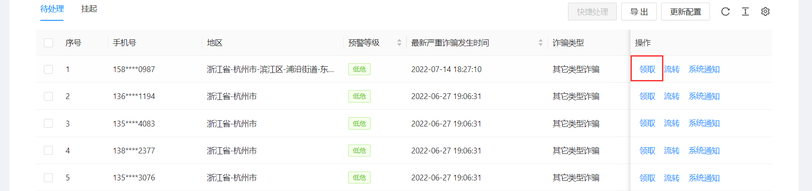

<!--第一页 start-->

<h1>反诈大脑管理后台</h1>
<h4>用户手册</h4>

                           

浙江政安信息安全研究中心
`https://www.gov-security.com/`

  

<!--第一页 end-->

<!--第二页 start-->
  

Copyright © 2020-2022 浙江政安信息安全中心有限公司及其许可者 版权所有，保留一切权利。
未经本公司书面许可，任何单位和个人不得擅自摘抄、复制本书内容的部分或全部，并不得以任何形式传播。
除政安信息安全中心有限公司的商标外，本手册中出现的其它公司的商标、产品标识及商品名称，由各自权利人拥有。
由于产品版本升级或其他原因，本手册内容有可能变更。政安保留在没有任何通知或者提示的情况下对本手册的内容进行修改的权利。本手册仅作为使用指导，政安 尽全力在本手册中提供准确的信息，但是 政安 并不确保手册内容完全没有错误，本手册中的所有陈述、信息和建议也不构成任何明示或暗示的担保。

                         
<!--第二页 end-->

<h2>目录</h2>

[toc]

   

# 1. 反制拦截

## 1.1. 查看反制拦截列表

* 技术反制统计列表
  
* 封禁拦截统计列表
  

## 1.2. 查询反制拦截列表

* 技术反制
  
* 封禁拦截
  

## 1.3. 添加反制

* 添加单个反制
  1. 点击页面【添加反制】按钮，弹出添加窗口
   
  2. 在弹出的添加窗口中填写反制内容
   
  3. 点击弹出的添加窗口右下角【确定】按钮

* 批量添加反制
  1. 点击页面【模板下载】按钮，下载模板excel
   
  2. 在下载的模板excel中填写反制内容
   
  3. 点击页面【excel导入】按钮，导入刚刚修改的模板excel
   

## 1.4. 反制拦截操作

* 反制拦截记录导出

# 2. 预警处理

## 2.1. 精准宣防

### 2.1.1. 查看精准宣防列表

### 2.1.2. 查询精准宣防

### 2.1.3. 新增精准宣防

1. 点击页面【新增】按钮，弹出新增窗口
   
2. 在弹出的新增窗口中填写任务名称
   
3. 点击弹出的新增窗口右下角【确定】按钮
4. 点击刚刚创建的精准宣防任务右侧【线索记录】按钮，跳转线索记录页面
   
5. 点击页面【模板下载】按钮，下载excel模板
   
6. 在刚刚下载的模板excel中填写需要预警的人员信息，**注意：在 Sheet1 下添加记录**
   
7. 点击页面【excel导入】按钮，上传刚刚修改的excel
    
8. 导入成功后，如下图所示
   
9. 返回上一页，精准宣防列表页，点击刚刚创建的精准宣防任务右侧【发布】按钮，发布任务 
    
    

 

### 2.1.4. 精准宣防操作

* 精准宣防编辑
  点击精准宣防右侧【编辑】按钮，编辑精准宣防信息
* 精准宣防发布
  点击精准宣防右侧【发布】按钮，发布精准宣防
* 精准宣防线索记录
  点击精准宣防右侧【线索记录】按钮，添加和查看线索记录
* 精准宣防删除
  点击精准宣防右侧【删除】按钮，删除精准宣防

**注意：只有未发布的精准宣防才能发布，删除，线索记录的增加**

## 2.2. 待处理预警

### 2.2.1. 查看待处理列表

### 2.2.2. 查看待处理统计

### 2.2.3. 查询待处理预警

### 2.2.4. 待处理预警操作

* 工单处理
  1. 点击待处理预警列表右侧【领取】按钮，跳转工单处理页
   
  2. 查看工单详情
   
  3. 查看工单处理记录
   
  4. 查看此电话号码近30天内预警工单
   
  5. 点击右下角【工单处理】按钮，弹出工单处理窗口
     * 基础表单
   
     *  高级表单
   
  6. 点击弹出的工单处理窗口右下角【跳过】/【保存/下一条】按钮
     * 跳过
        不处理此工单，跳转到下一条工单
     * 保存/下一条 
        处理此工单，并跳转到下一条工单
 
* 工单批量处理
  1. 勾选待处理预计列表前面选择框一个或多个工单
   
  2. 点击待处理预计列表右上角【快捷处理】按钮，弹出快捷处理框
   
  3. 在弹出的快捷处理框，批量处理工单
   

* 工单挂起
  1. 在领取工单后，点击页面右下角【挂起】按钮，挂起工单
  
  2. 挂起的工单可在**挂起**标签页下查看
   
* 工单流转
   点击待处理预警列表右侧【流转】按钮，弹出流转窗口 
   
   * 转推
    把工单转推给同级别商户，例如当前商户为杭州市，可以转推给宁波市
    
   * 下派
    下派给下级行政区域
    
   * 退回
    退回工单到上一级行政区域
    
* 导出
  点击页面【导出】按钮，导出当前查询条件下的所有工单excel
  
* 更新配置
* 系统通知

## 2.3. 已处理预警

## 2.4. 面对面干预列表

## 2.5. 警情碰撞

# 3. 统计查询

## 3.1. 反制拦截分析
## 3.2. 预警处置分析
## 3.3. 预警回访统计

## 3.4. 回访及时性统计
## 3.5. 回访等级统计
## 3.6. 推送统计
## 3.7. 绩效统计

# 4. 系统管理

<!-- 
End
 -->