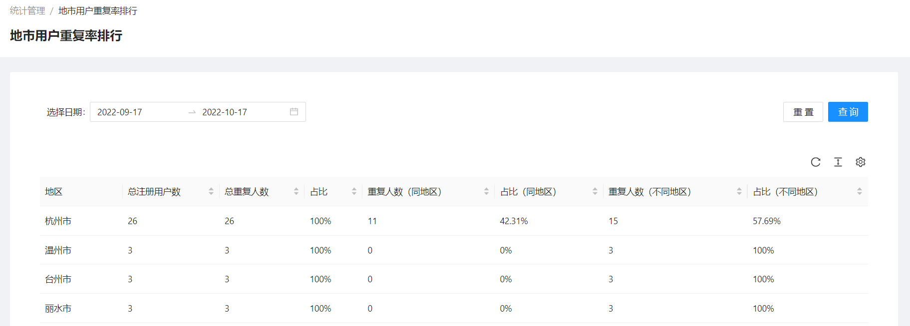
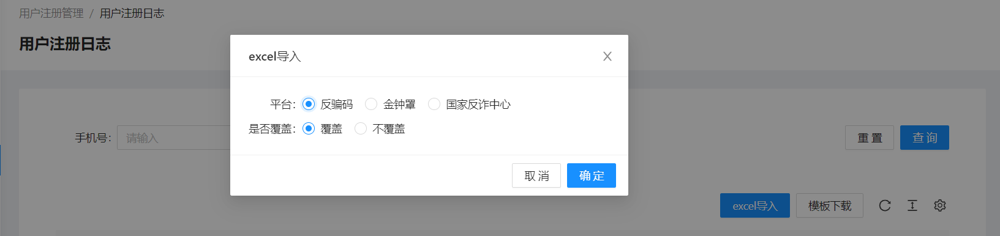

<!--第一页 start-->

<h1>反诈宣防数据汇总平台</h1>
<h4>用户手册</h4>

                            

浙江政安信息安全研究中心
`https://www.gov-security.com/`
平台版本：1.0.0

<!--第一页 end-->

<!--第二页 start-->

Copyright © 2020-2022 浙江政安信息安全中心有限公司及其许可者 版权所有，保留一切权利。
未经本公司书面许可，任何单位和个人不得擅自摘抄、复制本书内容的部分或全部，并不得以任何形式传播。
除政安信息安全中心有限公司的商标外，本手册中出现的其它公司的商标、产品标识及商品名称，由各自权利人拥有。
由于产品版本升级或其他原因，本手册内容有可能变更。政安保留在没有任何通知或者提示的情况下对本手册的内容进行修改的权利。本手册仅作为使用指导，政安 尽全力在本手册中提供准确的信息，但是 政安 并不确保手册内容完全没有错误，本手册中的所有陈述、信息和建议也不构成任何明示或暗示的担保。

                           
<!--第二页 end-->

<h2>目录</h2>

[toc]

         

# 1. 系统登录

## 1.1. 登录地址

使用浏览器打开以下地址
http://41.190.21.212/mage/management/kaohe01

## 1.2. 登录界面

### 1.2.1. 登录

1. 在登录页输入密码
2. 点击【登录】按钮，登录系统
  

### 1.2.2. 退出登录

点击页面右上角【退出登录】按钮，即可退出登录到登录页

# 2. 工作台

## 2.1. 查看工作台内容

点击**工作台**菜单栏，可查看注册用户信息，默认查看本周用户注册信息
包括用户注册情况，各平台注册情况和各市注册情况

**注意：本周，本月指当前所在的周或者月，例如今天为周一，则本周是今天到这周末**

## 2.2. 时间筛选查看
可以通过页面右上角【本周】，【本月】，【本年】按钮，以及自定义日期选择，可显示时间段内的用户注册信息

# 3. 统计管理

## 3.1. 城市注册用户排行

### 3.1.1. 查看地市注册用户排行列表

点击【地市注册用户排行】菜单栏，可以查看地市注册用户排行，默认显示为近一个月数据

### 3.1.2. 查询地市注册用户排行

1. 在查询框中选择 开始时间和 结束时间
2. 点击页面【查询】按钮，以查询框中的条件查询时间段内的地市注册用户排行

## 3.2. 地市用户重复率排行

### 3.2.1. 查看地市用户重复率排行列表

点击【地市用户重复率排行】菜单栏，可以查看地市用户重复率排行列表，默认为近一个月数据

**说明：用户重复率为同一个用户同时注册反骗码，金钟罩，国家反诈中心 的其中2个或3个全注册**
**说明：重复人数(同地区) 为用户注册的反骗码，金钟罩，国家反诈中心全在一个地区**

### 3.2.2. 查询地市用户重复率排行

1. 在查询框中选择 开始时间 和 结束时间
2. 点击页面【查询】按钮，以查询框中的条件查询时间段内的地市用户重复率排行

## 3.3. 重复用户覆盖率

### 3.3.1. 查看重复用户覆盖率

点击【重复用户覆盖率】，并通过点击不同标签页，可以查看不同平台重复用户覆盖率，默认为近一个月数据

### 3.3.2. 查询重复用户覆盖率

1. 在查询框中选择 开始时间 和 结束时间，
2. 点击页面【查询】按钮，以查询框中的条件查询时间段内的重复用户覆盖率

# 4. 用户注册管理

## 4.1. 用户注册记录

### 4.1.1. 查看用户注册记录列表

点击【用户注册记录】菜单栏，可以查看用户注册记录列表
此列表展示的是用户的所有注册记录，即一个用户只有一条记录，分别展示此用户在各个平台的注册情况

### 4.1.2. 查询用户注册记录

1. 在查询框中输入手机号
2. 点击查询框右侧【查询】按钮，以查询框中的手机号为条件，查询用户注册记录

## 4.2. 用户注册日志

### 4.2.1. 查看用户注册日志列表

点击【用户注册日志】菜单栏，可以查看用户注册日志列表
此列表展示的是用户注册的日志，即用户注册过一个平台则为一条记录

### 4.2.2. 查询用户注册记录

1. 在查询框中输入手机号
2. 点击查询框右侧【查询】按钮，以查询框中的手机号为条件，查询用户注册日志

### 4.2.3. 导入用户注册记录

1. 点击页面【模板下载】按钮，下载excel模板
   
2. 在下载的模板excel中填写手机号，注册时间以及所在地
   
3. 点击页面【excel导入】按钮，上传刚刚修改的模板excel
   
4. 在弹出的excel导入框中选择平台，以及是否覆盖
   **是否覆盖：系统中存在此条记录，选择覆盖，则会更新此条记录**
   

