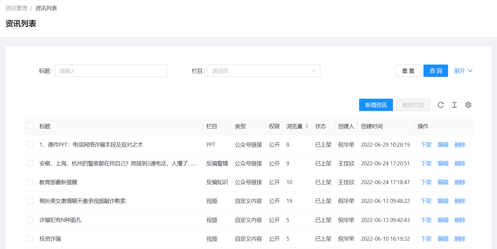

<!--第一页 start-->

<h1>反骗码运营管理后台</h1>
<h4>用户手册</h4>

                           

浙江政安信息安全研究中心
`https://www.gov-security.com/`

  

<!--第一页 end-->

<!--第二页 start-->
  

Copyright © 2020-2022 浙江政安信息安全中心有限公司及其许可者 版权所有，保留一切权利。
未经本公司书面许可，任何单位和个人不得擅自摘抄、复制本书内容的部分或全部，并不得以任何形式传播。
除政安信息安全中心有限公司的商标外，本手册中出现的其它公司的商标、产品标识及商品名称，由各自权利人拥有。
由于产品版本升级或其他原因，本手册内容有可能变更。政安保留在没有任何通知或者提示的情况下对本手册的内容进行修改的权利。本手册仅作为使用指导，政安 尽全力在本手册中提供准确的信息，但是 政安 并不确保手册内容完全没有错误，本手册中的所有陈述、信息和建议也不构成任何明示或暗示的担保。

                         
<!--第二页 end-->

<h2>目录</h2>

[toc]

# 1. 用户管理

## 1.1. 用户列表

反骗码用户
### 1.1.1. 查看用户列表

### 1.1.2. 搜索用户

根据条件筛选用户

### 1.1.3. 导出用户列表

根据搜索条件导出用户列表

**注意： 不添加搜索条件，将会导出所有用户，数据量过大时可能会导致导出失败**

1. 点击【导出】按钮，弹出导出确认框

2. 弹出框中点【确定】，导出excel

### 1.1.4. 手机号匹配

已有一批手机号，判断是否在系统中

1. 点击【模板下载】按钮，下载excel模板

2. 在下载的模板中填写需要匹配的手机号

3. 点击【手机号匹配】按钮，上传刚刚下载的模板进行匹配

4. 自动下载匹配上的用的列表excel

## 1.2. 反诈app用户列表

反诈app用户

### 1.2.1. 查看反诈app用户列表

### 1.2.2. 搜索反诈app用户

根据条件筛选用户

### 1.2.3. 导出反诈app用户列表

根据搜索条件导出反诈app用户列表

**注意：不添加搜索条件，将会导出所有用户，数据量过大时可能会导致导出失败**

1. 点击【导出】按钮，弹出导出确认框

2. 弹出框中点【确定】，导出excel

# 2. 资讯管理

## 2.1. 资讯列表

### 2.1.1. 查看资讯列表

### 2.1.2. 查询资讯

根据条件查询资讯列表

### 2.1.3. 新增资讯

* 栏目：资讯归类，栏目是否公开决定栏目下的资讯是否公开
* 权限
  * 公开：群众端和警员端都能查看
  * 不公开：只有警员端可以查看
* 资讯内容类型
  * 公众号链接：直接输入链接地址
  * 自定义内容
    * 自定义文章：输入文章内容
    * 文件列表：添加百度云盘地址

1. 点击【新增资讯】按钮，跳转新增资讯页面

2. 填写资讯基本信息

3. 添加资讯内容
   1. 公众号链接资讯内容 

   2. 自定义资讯内容

4. 点击右下角【保存】按钮，即可发布新资讯(新增资讯默认上架状态)

### 2.1.4. 资讯操作

* 资讯上架、下架
    点击资讯列表右边【上架】/【下架】按钮，操作资讯的上下架

* 编辑资讯
    点击资讯列表右边【编辑】按钮，编辑资讯内容

* 删除资讯
    点击资讯列表右边【删除】按钮，删除资讯

## 2.2. 栏目管理

### 查看栏目列表

### 查询栏目

根据栏目名搜索栏目

### 新增栏目

1. 点击【新增栏目】按钮

2. ss

### 栏目操作

## 2.3. 举报分享
## 2.4. 近期风险
## 2.5. 诈骗解密

# 3. 推送管理

## 3.1. 推送模板
## 3.2. 推送任务
## 3.3. 政安信使
## 3.4. 推送明细
## 3.5. 日推送统计

# 4. 反诈咨询
# 5. 营销位管理
# 6. 答题管理
# 7. 意见反馈
# 8. 商户管理
# 9. 报表管理
# 10. 系统管理

