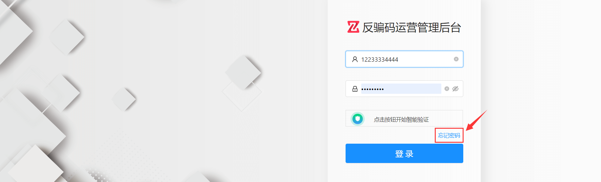
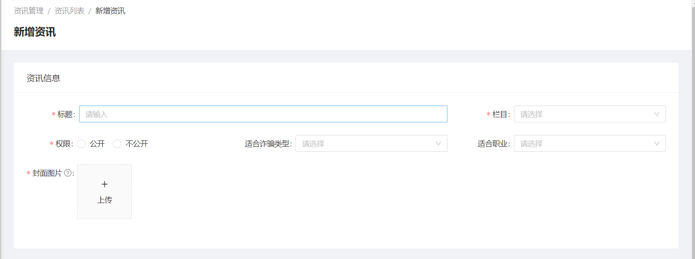
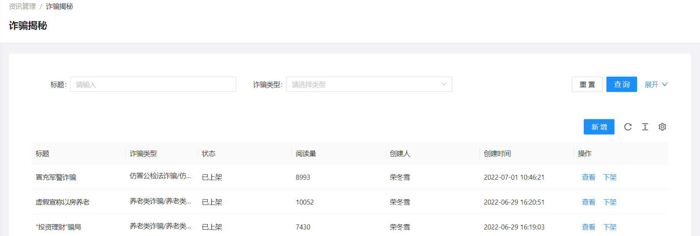
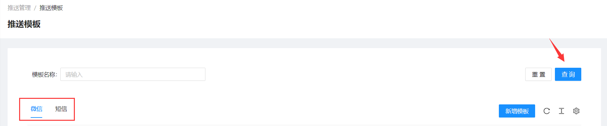
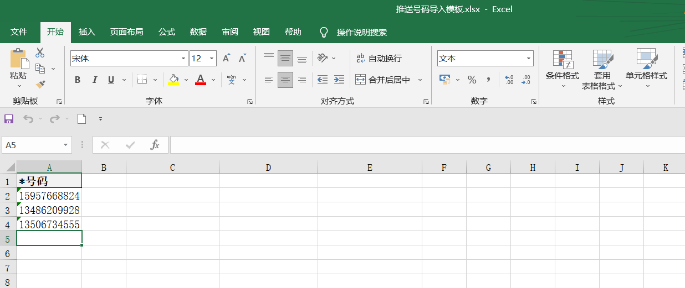
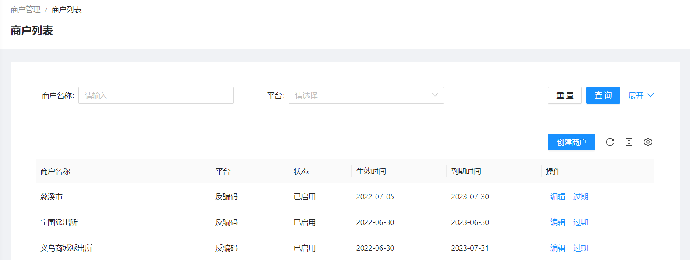
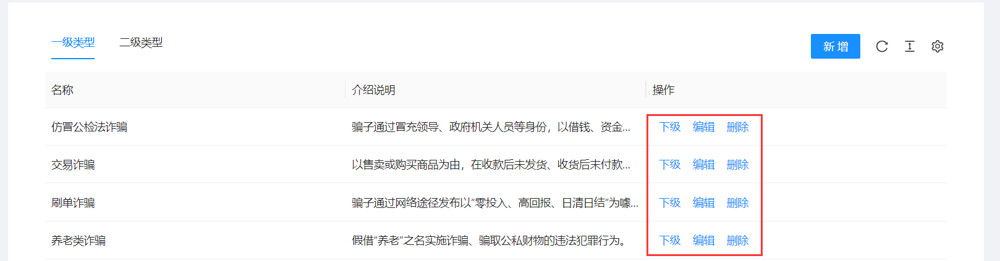

<!--第一页 start-->

<h1>反骗码运营管理后台</h1>
<h4>用户手册</h4>

                            

浙江政安信息安全研究中心
`https://www.gov-security.com/`
平台版本：1.0.10

<!--第一页 end-->

<!--第二页 start-->

Copyright © 2020-2022 浙江政安信息安全中心有限公司及其许可者 版权所有，保留一切权利。
未经本公司书面许可，任何单位和个人不得擅自摘抄、复制本书内容的部分或全部，并不得以任何形式传播。
除政安信息安全中心有限公司的商标外，本手册中出现的其它公司的商标、产品标识及商品名称，由各自权利人拥有。
由于产品版本升级或其他原因，本手册内容有可能变更。政安保留在没有任何通知或者提示的情况下对本手册的内容进行修改的权利。本手册仅作为使用指导，政安 尽全力在本手册中提供准确的信息，但是 政安 并不确保手册内容完全没有错误，本手册中的所有陈述、信息和建议也不构成任何明示或暗示的担保。

                           
<!--第二页 end-->

<h2>目录</h2>

[toc]

                      

# 1. 系统登录

## 1.1. 登录地址

使用浏览器打开以下地址
https://mage.gov-security.com/mage/management/admin/user/login

## 1.2. 登录界面

### 1.2.1. 登录

1. 在登录页输入用户名和密码
2. 点击按钮智能认证
3. 点击【登录】按钮，登录系统
4. 登录过期或者登录ip改变则需要短信验证
  

### 1.2.2. 忘记密码

1. 点击登录页面的【忘记密码】按钮，跳转修改密码页面
   
2. 输入手机号码，点击获取验证码
   
3. 弹出智能验证框，点击按钮，发送短信
   
4. 输入验证码，并输入新密码
    密码设置规则： **6-16位密码，至少包含字母、数字、特殊符号中的两种**
   
5. 点击按钮智能认证
6. 点击【确认修改】按钮，完成密码修改
  

# 2. 用户管理

## 2.1. 用户列表

### 2.1.1. 查看用户列表

点击**用户列表**菜单栏，可以查看所有的用户列表

* 列表字段释义：
  * 码
    * 绿码
    * 黄码
    * 红码
  * 危险程度
    * 轻危：黄码轻危用户 或 红码轻危用户
    * 低危：红码低危用户
    * 中危：红码中危用户
    * 高危：红码高危用户
  * 邀请人：邀请本用户的群众
  * 推荐人：邀请本用户的警员
  * 邀请数：当前用户的邀请数
  * 注册时间：注册反骗码小程序的时间
  * 首次领码：第一次在反骗码小程序完成答题领码的时间

### 2.1.2. 查询用户

1. 在查询框中输入或选择 手机号、所在的 等条件，支持多条件组合筛选
2. 点击页面【查询】按钮，以选择框中的条件查询反骗码用户

### 2.1.3. 导出用户列表

支持全量或根据查询条件导出用户列表数据

1. 添加查询条件，查询列表
2. 点击【导出】按钮，弹出导出确认框
  
3. 弹出框中点【确定】，导出excel
  

**注意： 不添加查询条件，将会导出所有用户，数据量过大时可能会导致导出失败**

### 2.1.4. 手机号匹配

通过导入手机号的方式，进行用户匹配，查询用户是否注册反骗码小程序

1. 点击【模板下载】按钮，下载excel模板
  
2. 在下载的模板中填写需要匹配的手机号
  
3. 点击【手机号匹配】按钮，上传刚刚下载的模板进行匹配
  
4. 自动下载匹配上的用户列表excel

## 2.2. 反诈app用户列表

进行过国家反诈中心app下载登记的用户

### 2.2.1. 查看反诈app用户列表

点击**反诈app用户列表**菜单栏，可以查看所有的反诈app用户列表

### 2.2.2. 查询反诈app用户

1. 在查询框中输入或选择 手机号、所在地 等条件，支持多条件组合筛选
2. 点击页面【查询】按钮，以选择框中的条件查询反诈app用户

### 2.2.3. 导出反诈app用户列表

支持全量或根据查询条件导出反诈app用户列表数据

1. 添加查询条件，查询列表
2. 点击【导出】按钮，弹出导出确认框
  
3. 弹出框中点【确定】，导出excel
  

**注意：不添加搜索条件，将会导出所有用户，数据量过大时可能会导致导出失败**

# 3. 资讯管理

## 3.1. 资讯列表

### 3.1.1. 查看资讯列表

点击 **资讯列表** 菜单栏，查看所有资讯列表

 
### 3.1.2. 查询资讯

1. 在查询框中输入或选择 标题，栏目等条件，支持多条件组合筛选
2. 点击页面【查询】按钮，以选择框中的条件查询资讯

### 3.1.3. 新增资讯

1. 点击页面【新增资讯】按钮，跳转新增页面

2. 填写资讯信息
   * 栏目：相当于资讯分类，可在 **栏目管理** 下设置
   * 权限：
     * 公开：小程序端群众和警员都可以查看此资讯 **此资讯的栏目还需要可见**
     * 不公开：小程序端只有警员可以查看此资讯
    
3. 填写资讯内容
   *  填写公众号链接
    
   * 填写自定义内容
      * 填写自定义文章
      
      * 上传百度网盘链接：输入文件名，然后直接复制百度网盘链接，普通版和企业版分别选择
      
      
      * 上传文件
      
    
4. 点击右下角【保存】按钮，即可发布新资讯(新增资讯默认上架状态)

### 3.1.4. 资讯操作

* 资讯上架、下架
    点击资讯列表右边【上架】/【下架】按钮，操作资讯的上下架
* 资讯编辑
    点击资讯列表右边【编辑】按钮，编辑资讯内容
* 资讯删除
    点击资讯列表右边【删除】按钮，删除资讯

* 批量修改栏目
  1. 勾选资讯列表前面选择框一个或者多个资讯
  2. 资讯列表右上角【修改栏目】按钮
  3. 在弹出框中选择栏目

## 3.2. 栏目管理

### 3.2.1. 查看栏目列表

点击 **栏目管理** 菜单栏，查看栏目列表

### 3.2.2. 查询栏目

1. 在查询框中填写 栏目名称
2. 点击页面【查询】按钮，以选择框中的条件查询栏目

### 3.2.3. 新增栏目

1. 点击【新增栏目】按钮，弹出新增栏目窗口

2. 在弹出窗中填写栏目名称，栏目权限等
   * 公开：此栏目下的所有资讯群众端小程序不可见
   * 不公开：此栏目下的所有资讯群众端小程序不可见，只有警员端可见

**注意：如果栏目不公开，则此栏目下的资讯都是不公开**
**示例：栏目a不公开，栏目a下的资讯b是公开，但此资讯在群众端小程序也是不显示**

### 3.2.4. 栏目操作

* 栏目合并
    点击栏目列表右边【合并】按钮，将其他栏目下的资讯合并到当前栏目下
* 栏目编辑
    点击栏目列表右边【编辑】按钮，编辑栏目内容
* 栏目上移、下移(影响栏目在小程序端的显示顺序)
    点击栏目列表右边【上移】/【下移】按钮，上移/下移栏目
* 栏目删除
    点击栏目列表右边【删除】按钮删除栏目，只有当栏目下没有资讯才能删除

## 3.3. 举报分享

### 3.3.1. 查看举报分享列表

点击 **举报分享** 菜单栏，查看举报分享列表

### 3.3.2. 查询举报分享

1. 在查询框中填写或选择举报内容、诈骗类型等，支持多条件组合筛选
2. 点击页面【查询】按钮，以查询框中的条件查询举报分享

### 3.3.3. 新增举报分享

1. 点击【新增】按钮，跳转新增页面

2. 填写举报分享基本信息
   * 诈骗类型：选择诈骗类型，在 系统设置-诈骗类型 菜单栏可设置
   * 虚拟阅读量：填写一个正整数，新增完资讯即有此阅读量 **(可选)**

1. 添加举报分享描述

4. 添加举报分享官方回复，并点击右下角【保存】按钮

### 3.3.4. 举报分享操作

* 举报分享查看
    点击举报分享列表右边【查看】按钮，查看举报分享详情 
* 举报分享编辑
    点击举报分享列表右边【编辑】按钮，编辑举报分享 
* 举报分享上架、下架
    点击举报分享列表右边【上架】/【下架】按钮，上下架举报分享 
* 举报分享删除
    点击举报分享列表右边【删除】按钮，删除举报分享 

**注意：只有下架状态的举报分享，才能编辑和删除**

## 3.4. 近期风险

### 3.4.1. 查看近期风险列表

点击 **近期风险** 菜单栏，查看近期风险列表

### 3.4.2. 查询近期风险

1. 在查询框中输入或选择 标题、状态，支持多条件组合查询
   * 状态
     * 已上架：可在小程序端查看
     * 未上架：在小程序端不显示
2. 点击页面【查询】按钮，以查询框中的条件查询近期风险

### 3.4.3. 新增近期风险

1. 点击【新增】按钮，跳转新增页面

2. 填写近期风险基本信息

3. 填写近期风险详情

4. 点击右下角【保存】按钮，完成近期风险新增

### 3.4.4. 近期风险操作

* 近期风险查看
    点击近期风险列表右边【查看】按钮，查看近期风险详情 
* 近期风险编辑
    点击近期风险列表右边【编辑】按钮，编辑近期风险
* 近期风险上架、下架
    点击近期风险列表右边【上架】/【下架】按钮，上下架近期风险 
* 近期风险删除
    点击近期风险列表右边【删除】按钮，删除近期风险 

**注意：只有下架状态的近期风险，才能编辑和删除**

## 3.5. 诈骗解密

### 3.5.1. 查看诈骗解密列表

点击 **诈骗解密** 菜单栏，查看诈骗解密列表

### 3.5.2. 查询诈骗解密

1. 在查询框中输入或选择标题、诈骗类型等，支持多条件组合查询
   * 状态
     * 已上架：可在小程序端查看
     * 未上架：在小程序端不显示
2. 点击页面【查询】按钮，以选择框中的条件查询近期风险

### 3.5.3. 新增诈骗解密

1. 点击【新增】按钮，跳转新增页面

2. 填写诈骗解密基本信息

3. 填写诈骗解密风险详情

4. 点击右下角【保存】按钮，完成诈骗解密新增

### 3.5.4. 诈骗解密操作

* 诈骗解密查看
    点击诈骗解密列表右边【查看】按钮，查看诈骗解密详情 
* 诈骗解密编辑
    点击诈骗解密列表右边【编辑】按钮，编辑诈骗解密
* 诈骗解密上架、下架
    点击诈骗解密列表右边【上架】/【下架】按钮，上下架诈骗解密
* 诈骗解密删除
    点击诈骗解密列表右边【删除】按钮，删除诈骗解密

**注意：只有下架状态的诈骗解密，才能编辑和删除**

# 4. 推送管理

## 4.1. 推送模板

### 4.1.1. 查看推送模板列表

点击**微信** 和 **短信** 标签分别查看模板

### 4.1.2. 查询推送模板

1. 分别在**微信** 和 **短信** 标签页
2. 在查询框中输入 模板名称
3. 点击页面【查询】按钮，以查询框中的条件查询 微信模板 和 短信模板

### 4.1.3. 新增推送模板

1. 分别在**微信** 和 **短信** 标签页下点击【新增模板】按钮，弹出新增模板窗口

**在微信模板页面下点击【新增模板】跳出新增微信模板窗口**
**在短信模板页面下点击【新增模板】跳出新增短信模板窗口**

2. 在弹出框中填写微信模板信息
    <!-- * 微信模板
      * 渠道
        * 公众号：
        * 小程序：
      * 模板ID：又微信生成，将消息模板ID填入此处 -->
      
    * 短信模板
      

3. 点击弹出框右下角【确定】按钮，完成新增模板

## 4.2. 推送任务

### 4.2.1. 查看推送任务列表

点击 **推送任务** 菜单栏，查看推送任务列表

### 4.2.2. 查询推送任务

1. 在查询框中输入或选择任务名称、模板名称等，支持多条件组合查询
2. 点击页面【查询】按钮，以选择框中的条件查询推送任务

### 4.2.3. 新增推送任务

1. 点击页面【新增推送】按钮，跳转新增页面

2. 填写推送信息
  * 按号码推送
      * 手动输入号码
        直接输入到发送号码框中，以英文逗号分隔
      * 导入手机号码
        1. 下载模板excel
        
        2. 在下载的模板中填写需要推送的手机号
        
        3. 点击【导入excel】按钮，上传刚刚下载的模板excel
        
        4. 导入excel后，也可以在发送号码框中继续修改
        
  * 按地区推送
     1. 选择地区，可以从 省 级别到 社区/村 级别
     
     1. 支持按照码颜色选择推送人群，当选择红码时还可配置根据严重程度条件选择人群进行推
     
    **示例：选择按地区推送，选择浙江省杭州市，码颜色为红码，严重程度为中危，则会给杭州市下的红码中危用户推送**

  * 推送时间：选择推送的时间，可选择此刻，即创建完推送任务后直接推送
3. 选择推送模板，此模板决定推送方式，小程序，公众号，短信等
4. 点击页面右下角【保存】按钮，完成推送任务新增

### 4.2.4. 推送任务操作

* 推送任务查看
  点击推送任务列表右侧【查看】按钮，查看推送任务详情
    
    1. 查看推送任务基本信息
    
    2. 查看推送任务模板
    
    3. 查看推送记录，查询号码，再次推送
    

## 4.3. 政安信使

可以给指定用户或者指定地区下的用户推送短信或微信小程序 内容，比如推送预警信息等

### 4.3.1. 查看信使推送列表

点击**政安信使**菜单栏，可以查看政安信使任务列表

### 4.3.2. 查询信使推送任务

1. 在查询框中选择输入或选中 任务名称、推送形式等条件，支持多条件组合筛选
   * 状态
     * 待推送：没到推送时间
     * 推送中：正在推送过程中
     * 已完成：已全部推送完成
2. 点击页面【查询】按钮，以查询框中的条件查询推送任务

### 4.3.3. 新增信使推送任务

1. 点击页面【新增推送】按钮，跳转新增页面

2. 填写信使推送基本信息
    * 推送时间：选择推送的时间，可选择此刻，即创建完推送任务后直接推送

3. 选择推送人群
   * 按号码推送
      * 手动输入号码，直接输入到发送号码框中，以英文逗号分隔
       
      * 导入手机号码
        1. 下载模板excel
        
        2. 在下载的模板中填写需要推送的手机号
        
        3. 点击【导入excel】按钮，上传刚刚下载的模板excel
        
        4. 导入excel后，也可以在发送号码框中继续修改
        
   * 按地区推送
     1. 选择地区，可以从 省 级别到 社区/村 级别
     
     2. 支持按照码颜色选择推送人群，当选择红码时还可配置根据严重程度条件选择人群进行推送
     
     **例：选择按地区推送，选择浙江省杭州市，码颜色为红码，严重程度为中危，则会给杭州市下的红码中危用户推送**

4. 选择推送渠道
   * 微信小程序
    
    **示例：信息来源为【反骗码】，重要提醒为【反骗码提醒】的微信小程序推送通知如下**
    
   * 短信
    
    **示例：短信签名为【反骗码】的短信如下**
    

**备用渠道：在推送渠道推送不成功的情况下，系统会自动使用备用渠道进行再次推送**

5. 填写推送内容
   * 纯文字：在短信中直接显示，在小程序中显示为通知内容
    
   * 富文本：在短信中以链接形式显示，点击链接跳转页面，页面内容为此富文本，在小程序中显示为进入小程序查看跳转网页，显示富文本内容
    

6. 点击右下角【保存】按钮，新增推送任务

### 4.3.4. 信使推送操作

* 查看推送明细
  点击政安信使列表右侧【推送明细】按钮，跳转推送明细页面，并显示此政安信使任务的明细列表
  

## 4.4. 推送明细

### 4.4.1. 查看推送明细列表

点击**推送明细**菜单栏，将按照推送时间倒序，展示本商户下地区的所有推送记录及推送结果

### 4.4.2. 查询推送明细

1. 在查询框中输入或选择手机号、任务名称、推送渠道等条件，支持多条件组合筛选
2. 点击页面【查询】按钮，以查询框中的条件查询推送明细

## 4.5. 日推送统计

### 4.5.1. 日推送统计查看

点击**日推送统计**标签页，可以查看日推送统计
**示例：6月23日的微信小程序 2/4 表示成功推送2条，实际计费4条**

### 4.5.2. 日推送统计查询

1. 在查询框中选择日期
2. 点击页面【查询】按钮，以查询框中的条件查询日推送统计

### 4.5.3. 日推送统计操作

* 查看日推送统计明细
  点击日推送统计列表有车【推送明细】按钮，查看日推送明细

# 5. 反诈咨询

## 5.1. 咨询记录

### 5.1.1. 查看咨询、举报记录

分别点击**咨询** 和 **举报** 标签页，可以查看咨询记录和举报记录

### 5.1.2. 查询咨询、举报记录

1. 分别在**咨询** 和 **举报** 标签页
2. 在查询框中输入 咨询内容 或者 举报内容 或 手机号
3. 点击页面【查询】按钮，以查询框中的条件查询咨询和举报记录

### 5.1.3. 导出咨询、举报记录

支持全量或根据查询条件导出 咨询和举报数据

1. 添加查询条件，查询咨询和举报 
2. 点击页面【导出】按钮，导出当前查询条件下的咨询和举报列表

## 5.2. 白名单管理

### 5.2.1. 查看白名单管理列表

分别在**网站/IP**，**app**，**QQ号** 等标签页，查看不同类型的白名单列表
* 白名单种类
  * 网址/IP
  * app
  * QQ号
  * 微信号
  * 电话号码
  * 短信号码
  * 银行卡号

### 5.2.2. 查询白名单

1. 分别在**网站/IP**，**app**，**QQ号** 等标签页下
2. 在查询框中输入 内容
3. 点击页面【查询】按钮，以查询框中的条件查询当前标签页下的白名单

### 5.2.3. 新增白名单

* 添加单个白名单
  1. 点击页面【新增】按钮，弹出新增窗口
    

  2. 在弹出框中填写内容和选择白名单类型
    

* 批量导入白名单

  1. 点击页面【模板下载】按钮，下载模板excel
    
  2. 在下载的模板excel中填写白名单内容
    
  3. 点击页面【导入excel】按钮导入刚刚修改的excel
    

### 5.2.4. 白名单操作

* 白名单编辑
    点击白名单列表右边【编辑】按钮，修改白名单的内容和类型
* 白名单删除
    点击白名单列表右边【删除】按钮，删除白名单 

## 5.3. 黑名单管理

### 5.3.1. 查看黑名单管理列表

分别在**网站/IP**，**app**，**QQ号** 等标签页，查看不同类型的黑名单列表
* 黑名单种类
  * 网址/IP
  * app
  * QQ号
  * 微信号
  * 电话号码
  * 短信号码
  * 银行卡号

### 5.3.2. 查询黑名单

1. 分别在**网站/IP**，**app**，**QQ号** 等标签页下
2. 在查询框中输入 内容
3. 点击页面【查询】按钮，以查询框中的条件查询当前标签页下的黑名单

### 5.3.3. 新增黑名单

* 添加单个黑名单
  1. 点击页面【新增】按钮，弹出新增窗口
    
  2. 在弹出框中填写内容和选择黑名单类型
    

* 批量导入白名单

  1. 点击页面【模板下载】按钮，下载模板excel
    
  2. 在下载的模板excel中填写黑名单内容
    
  3. 点击页面【导入excel】按钮导入刚刚修改的excel
    

### 5.3.4. 黑名单操作

* 黑名单编辑
    点击黑名单列表右边【编辑】按钮，修改黑名单的内容和类型
* 黑名单删除
    点击黑名单列表右边【删除】按钮，删除黑名单 

## 5.4. 文案配置

### 5.4.1. 查看文案配置列表

点击**文案配置** 菜单栏，可以查看当前商户的文案配置

### 5.4.2. 文案配置操作

此文案为用户在小程序端咨询内容，提示的文案

* 文案配置编辑
  1. 点击文案配置右侧【编辑】按钮，弹出编辑窗口
    
  2. 在弹出框中修改提示文案和恢复默认文案配置
    

# 6. 营销位管理

## 6.1. 轮播图列表

### 6.1.1. 查看轮播图列表

点击**轮播图列表**菜单栏，可以查看轮播图列表

### 6.1.2. 新增轮播图

1. 点击页面【新增轮播图】按钮，弹出新增窗口
   
2. 在弹出框中填写轮播图内容
   
3. 点击【确定】按钮 

### 6.1.3. 轮播图操作

* 轮播图编辑
  点击轮播图列表右边【编辑】按钮，编辑轮播图 
* 轮播图删除
  点击轮播图列表右边【删除】按钮，删除轮播图

# 7. 答题管理

## 7.1. 答题策略

### 7.1.1. 查看答题策略列表

点击**答题策略列表**菜单栏，可以查看答题策略列表

### 7.1.2. 查询答题策略

1. 在查询框中输入或选择 策略名称和状态，支持多条件组合筛选
   * 状态
     * 已发布
     * 待发布
2. 点击页面【查询】按钮，以查询框中的条件查询答题策略

### 7.1.3. 新增答题策略

1. 点击页面【创建答题策略】按钮，跳转新增页面
   
2. 填写答题策略基本信息
   
3. 填写答题策略匹配条件
   
4. 填写答题策略必要条件
   
5. 填写答题策略题目配置
   
6. 选择题目
   
7. 点击右下角【保存】按钮

**注意：新增的答题策略为未发布状态**

### 7.1.4. 答题策略操作

* 答题策略 发布/取消发布
  点击答题策略列表右边【发布】/【取消发布】按钮，发布/取消发布 答题策略 
* 答题策略编辑
  点击答题策略列表右边【编辑】按钮，编辑答题策略 
* 答题策略删除
  点击答题列表右边【删除】按钮，删除答题策略 

## 7.2. 题目列表

### 7.2.1. 查看题目列表

点击**题目列表**菜单栏，可以查看题目列表

### 7.2.2. 查询题目

1. 在查询框中输入或选择 题目标题和题目标签，支持多条件组合筛选
2. 点击页面【查询】按钮，以查询框中的条件查询题目

### 7.2.3. 新增题目

* 添加单个题目
  1. 点击页面【新增题目】按钮，跳转新增页面
  
  2. 填写题目基本信息
   * 题型
     * 单选题
     * 多选题
     * 判断题
   * 题目标签：选择一个题目标签，可在**题目标签**菜单栏设置
  
  3. 填写题目选项
    **1.选择只能有一个正确选项**
    **2.最多能有4个选项**
  
  1. 点击页面右下角【提交】按钮

* 批量添加题目
  1. 点击页面【模板下载】按钮，下载模板excel
  
  2. 在下载的模板excel填写题目信息
   
  3. 点击【题目导入】按钮导入刚刚修改的excel
   

### 7.2.4. 题目操作

* 批量修改标签
  1. 勾选题目列表前面选择框一个或者多个题目
  2. 点击题目列表右上角【批量修改标签】按钮
  3. 在弹出框中选择标签

  

* 题目编辑
  点击题目列表右侧【编辑】按钮，编辑题目内容 
* 题目删除
  点击题目列表右侧【删除】按钮，删除题目

  

## 7.3. 题目标签

### 7.3.1. 查看题目标签列表

点击**题目标签列表**菜单栏，可以查看题目标签列表

### 7.3.2. 新增题目标签

1. 点击页面【】按钮，弹出新增窗口

2. 填写题目标签

# 8. 意见反馈

## 8.1. 反馈列表

### 8.1.1. 查看反馈列表

点击**反馈列表**菜单栏，可以查看反馈列表

### 8.1.2. 查询反馈列表

### 8.1.3. 反馈列表操作

* 处理反馈
  1. 点击反馈列表右侧【处理】按钮，弹出反馈窗口
  2. 在弹出的处理框中填写回复和处理备注
  3. 点击弹出的处理框右下角 【不予采纳】和【采纳】按钮，完成反馈处理
  
* 反馈查看
  点击反馈列表右侧【查看】按钮，查看反馈处理结果 
  
**未处理的反馈可以处理，处理完的反馈只能查看**

# 9. 商户管理

## 9.1. 商户列表

### 9.1.1. 查看商户列表

点击**商户列表**菜单栏，可以查看商户列表
* 平台
  * 反骗码
  * 反诈大脑
  * 网址安全中心
  * 浙江省无毒码平台
* 状态
  * 待生效：商户未到生效时间，不能登陆
  * 已启用：在商户有效期内，可以登陆
  * 已到期：商户已过有效期，不能登陆

### 9.1.2. 查询商户

1. 在查询框中输入或选择 商户名称和选择平台，支持多条件组合筛选
2. 点击页面【查询】按钮，以查询框中的条件查询商户

### 9.1.3. 新增商户

1. 点击页面【创建商户】按钮，跳转商户创建页面
 
2. 填写商户基本信息
   * 平台：选择商户平台，反骗码、反诈大脑等
   * 商户有效期：设置商户有效期，商户只有在有效期内能够登陆
   * 平台名称：登陆平台后页面左上角显示的文字，不填写默认 **(可选)**
  
3. 填写商户可发送短信数量

4. 选择商户数据权限，即地区，商户可查看当前管辖地区下的信息

5. 点击右下角【保存】按钮，完成商户新增

**说明：商户新增后还需编辑商户，添加管理员等**

### 9.1.4. 商户操作

* 商户编辑
  点击商户列表右侧【编辑】按钮，编辑商户信息
  * 修改商户信息
    * 商户平台：不能修改
    * 角色配置：配置此商户能够拥有的功能，在下面配置操作员时能够选择的角色，**(修改角色后需要保存重新编辑此商户，下面管理员才能选择此商户拥有的角色)**
    **示例：测试商户添加一个 用户管理 角色，保存后，再次编辑此商户，在下方添加管理员或者编辑管理员才能添加 用户管理角色**   
    * 工作台角色配置 **(当商户平台为反骗码时配置)**：配置此商户能够拥有的小程序管理员角色，在刑侦反骗码用户后台配置操作员时可设置的小程序角色
  
  * 管理员设置：添加此商户的用户，并赋予角色
    * 新增管理员：点击右上角【⊕】 按钮，弹出新增管理员窗口，输入手机号，登陆账号名，选择角色等，如果输入手机号在运营后台系统中将会自动带入账号名等信息
    
    * 编辑管理员：可修改管理员信息，直接修改密码，删除管理员
    
  * 政安信息账户配置 **(当商户平台为反骗码时配置)**：配置商户的可用小程序和短信条数，当可用条数不足时，此商户的政安信使将不能使用(推送失败)
    
  * 功能权限配置
     * 资料审核：开启此开关并选择审核商户，则此商户新增资讯需要审核
    
* 商户过期
  点击商户列表右侧【过期】按钮，直接过期此商户，过期后此商户不能登陆，即拥有此商户的管理员不能选择此商户 
  

# 10. 报表管理

## 10.1. 反骗码类型

### 10.1.1. 查看反骗码类型列表

点击**反骗码类型**菜单栏，可以查看不同地区的反骗码类型统计

* 反骗码类型
  * 绿码：注册反骗码小程序并答题成为绿码
  * 黄码：注册反骗码小程序并答题成为黄码
  * 红码：注册反骗码小程序并答题成为红码，触网变红码，黄码过期变红码
    * 红码轻危
    * 红码低危
    * 红码中危
    * 红码高危
  * 无码：注册反骗码小程序，但是没有答题
 
* 列表字段释义： 
  * 注册用户/比率：此地区注册反骗码的用户占总人口比例
  * 绿码用户/比率：此地区绿码用户数占注册用户数的比例
  * 黄码用户/比率：此地区黄码用户数占注册用户数的比例
  * 红码总用户/比率：此地区红码用户数占注册用户数的比例
  * 红码(轻危)用户/比率：此地区红码(轻危)用户数占注册用户数的比例

红码(轻危)用户/比率，红码(低危)用户/比率，红码(中危)用户/比率，红码(高危)用户/比率 总和为 **红码总用户/比率**

### 10.1.2. 查询反骗码类型列表

1. 在查询框中选择 地区、注册时间 等条件，支持多条件组合筛选
2. 点击页面【查询】按钮，以上述条件查询反骗码类型列表

### 10.1.3. 导出反骗码列表

根据查询条件导出列表，不添加任何查询条件导出所有

1. 添加查询条件，查询列表 
2. 点击页面【导出】按钮，弹出提示框
3. 点击弹出框右下角【确定】按钮，导出反骗码类型列表excel

## 10.2. 小程序管理员推广统计

### 10.2.1. 查看小程序管理员推广统计

点击**小程序管理员推广统计**标签页，可以查看不同地区的小程序管理员推广统计列表

当用户通过扫码 **邀请码** 进入小程序并注册，则生成此邀请码的用户 **(小程序管理员)** 邀请人数加一

邀请人数增加的情况
* 当邀请人为群众时：
  * 新用户通过扫描此群众生成的邀请码进入反骗码小程序并注册
* 当邀请人为警员时：
  * 新用户通过扫描此警员生成的邀请码进入反骗码小程序并注册
  * 新用户通过扫描群众生成的邀请码进入反骗码小程序并注册，但是此群众邀请链最开始是此警员
  **例1：警员a 邀请 群众b，群众b 邀请 群众c，群众c邀请群众d注册，则群众c和警员a都会在小程序管理员推广中加一**
  **例2：群众a 邀请 群众b，群众b 邀请群众c注册，则群众b会在小程序管理员推广中加一**

**注意：此列表只展示警员(小程序管理员)的推广统计**

### 10.2.2. 查询小程序管理员推广统计

1. 在查询框填写 商户名称、注册时间、领码时间等，支持多条件组合筛选
2. 点击页面【查询】按钮，以查询框中的条件查询小程序管理员推广统计列表

# 11. 系统管理

## 11.1. 操作员管理

### 11.1.1. 操作员简介

**1. 此操作员为反骗码运营后台 用户**

### 11.1.2. 查看操作员列表

点击**操作员管理**菜单栏，可以查看运营后台操作员列表

### 11.1.3. 新增操作员
1. 点击页面【创建账号】按钮，弹出新增窗口

2. 在弹出的新增窗口中填写操作员信息
   密码设置规则： **6-16位密码，至少包含字母、数字、特殊符号中的两种**

### 11.1.4. 操作员操作

* 操作员状态
  点击操作员列表右侧【状态】按钮，设置操作员的状态，是否可用
* 操作员编辑
  点击操作员列表右侧【编辑】按钮，编辑操作员信息
* 操作员修改秘密
  点击操作员列表右侧【修改密码】按钮，修改操作员密码
* 操作员删除
  点击操作员列表右侧【删除】按钮，删除操作员  

## 11.2. 角色管理

### 11.2.1. 角色简介

### 11.2.2. 查看角色列表

**通过点击标签页，可以查看不同平台的角色**

* 角色分类
  * 运营管理后台
  * 刑侦反骗码用户后台
  * 反诈大脑管理后台
  * 工作台小程序
  * 网址安全中心

### 11.2.3. 新增角色

1. 点击页面【创建角色】按钮，弹出新增角色框口

2. 在弹出框中填写角色基础信息

3. 在弹出框中填写角色权限信息，把需要的权限勾选上
 
4. 在弹出框右下角点击【确定】按钮，完成角色新增

**注意： 在不同的标签页下点击【创建角色】按钮，将创建不同平台的角色**
**例如：在反诈大脑管理后台标签页下 点击【创建角色】按钮，将创建反诈大脑管理后台角色**

### 11.2.4. 角色操作

* 角色查看
  点击角色列表右侧【查看】按钮，查看角色详情
* 角色编辑
  点击角色列表右侧【编辑】按钮，编辑角色内容
* 角色删除
  点击角色列表右侧【删除】按钮，删除角色

**注意：系统内置角色不能编辑和删除，只能查看**

## 11.3. 地区管理

### 11.3.1. 查看地区列表

点击**地区管理**菜单栏，可以查看反骗码所有地区

### 11.3.2. 新增地区

1. 点击页面【新增地区】按钮，弹出新增窗口
2. 在弹出的新增窗口中填写地区信息

**注意：在不同地区级别标签页下，新增地区为当前级别地区**
**注意：在省级别以下，添加的地区为当前上级地区的下级地区**

**例：在河北省唐山市下新增一个 区/县**
1. 点击 省级别列表下 河北省 右侧【下级】按钮

2. 点击 市级别列表下 唐山市 右侧【下级】按钮

3. 点击 区/县 级别下 右侧【新增地区按钮】

4. 在弹出的新增窗口中填写地区信息

### 11.3.3. 地区操作

* 地区下级查看
  点击地区列表右侧【下级】按钮，查看当前地区下级地区列表 
* 地区修改
  点击地区列表右侧【修改】按钮，修改地区信息
* 地区码查看
  点击地区列表右侧【地区码】按钮，查看当前地区二维码
  **扫此二维码进反骗码小程序自带当前地区信息**
* 地区删除
  点击地区列表右侧【删除】按钮，删除地区

## 11.4. 派出所管理

### 11.4.1. 查看派出所列表

点击**派出所管理**菜单栏，可以查看反骗码系统所有派出所

### 11.4.2. 查询派出所

1. 在查询框中输入或选择派出所名称、地区，支持多条件组合筛选
2. 点击页面【查询】按钮，以查询框中条件查询派出所

### 11.4.3. 导入派出所

1. 点击页面【模板下载】按钮，下载excel模板
  
2. 在下载的模板excel填写派出所信息
   **注意：一个派出所管辖多个社区，则一个社区一条记录，如下图**
  
3. 点击页面【excel导入】按钮，上传刚刚修改的excel
  

### 11.4.4. 派出所操作

* 删除派出所
  点击派出所列表右侧【删除】按钮，删除派出所
  

## 11.5. 反制拦截

### 11.5.1. 反制拦截简介

* 反制拦截
  * 手机号
  * 网址
  * app

### 11.5.2. 查看反制拦截列表

**通过点击标签页，可以查看不同类型的反制拦截列表**

* 反制拦截类型
  * 手机号
  * 网址
  * app

### 11.5.3. 查询反制拦截

1. 在查询框中输入手机号码
2. 点击页面【查询】按钮，以查询框中的条件查询反制拦截

### 11.5.4. 导入反制拦截

1. 点击页面【模板下载】按钮，下载excel模板
   
2. 在下载的模板excel填写反制拦截信息
   * 手机号模板 
    
   * 网址模板
    
   * app模板
    
3. 点击页面【excel导入】按钮，上传刚刚修改的excel
   

**注意：在不同标签页点击【模板下载】将下载不同的模板，导入同理**

## 11.6. 三方数据

### 11.6.1. 三方数据简介

### 11.6.2. 查看三方数据列表

点击**三方数据**菜单栏，可以查看三方数据来源
**通过点击不同标签页，可以查看不同三方数据类型列表**

* 三方数据类型
  * 灵鲲导入
  * 腾讯数据
  * 电信数据
  * 人工导入

### 11.6.3. 导入三方数据

1. 点击页面【模板下载】按钮，下载excel模板

2. 在下载的模板excel填写三方数据
   * 灵鲲导入
    
   * 腾讯数据
    
   * 人工导入
    
3. 点击页面【excel导入】按钮，上传刚刚修改的excel

**注意：在不同标签页点击【模板下载】将下载不同的模板，导入同理**
**注意：电信数据为接口获取，其他三方数据均为人工导入**
**注意：腾讯数据导入后，需腾讯匹配导入的手机号，匹配成功后才会显示在三方数据列表中，查看导入数据可点击页面【导入记录】按钮查看**

## 11.7. 拦截网址库

## 11.8. 标签管理

### 11.8.1. 查看标签列表

点击**标签管理**菜单栏，可以查看各种标签列表，点击不同标签页，可以查看不同标签类型列表
* 标签
  * 诈骗类型
  * 职业类型
  * 年龄段
  * 触网类型

### 11.8.2. 新增标签

1. 点击页面【新增】按钮，弹出新增窗口
2. 在弹出的新增窗口中填写标签信息

### 11.8.3. 标签操作

* 标签编辑
  点击标签列表右侧【编辑】按钮，修改标签名称
* 标签删除
  点击标签列表右侧【删除】按钮，删除标签

**注意：诈骗类型为系统内置，不支持新增和删除**

## 11.9. 诈骗类型

### 11.9.1. 查看诈骗类型列表

点击**诈骗类型**菜单栏，可以查看诈骗类型列表

### 11.9.2. 新增诈骗类型

1. 点击页面【新增】按钮，弹出新增窗口
  
2. 在弹出的新增窗口填写诈骗类型信息
   

**注意：在 一级类型 标签页下新增一级诈骗类型，在 二级类型 标签页下新增二级诈骗类型**

### 11.9.3. 诈骗类型操作

* 诈骗类型下级查看
  点击诈骗类型列表右侧【下级】按钮，查看诈骗类型下级类型
* 诈骗类型编辑
  点击诈骗类型列表右侧【编辑】按钮，编辑诈骗类型内容
* 诈骗类型删除
  点击诈骗类型列表右侧【删除】按钮，删除诈骗类型

## 11.10. 系统设置

用于配置小程序首页页面展示内容

### 11.10.1. 查看系统设置列表

点击**系统设置**菜单栏，可以查看小程序设置列表

### 11.10.2. 系统设置操作

* 系统设置编辑
  点击系统设置列表右侧【编辑】按钮，编辑系统设置内容 
  

## 11.11. 小程序菜单

用于配置默认反骗码商户默认配置

### 11.11.1. 查看小程序菜单列表

点击**小程序菜单**菜单栏，可以查看小程序菜单列表

### 11.11.2. 小程序菜单操作

* 小程序菜单开启
  点击小程序列表右侧【是否开启】按钮，配置默认小程序菜单是否开启
* 小程序菜单编辑
  点击小程序列表右侧【编辑】按钮，修改小程序菜单名字

  