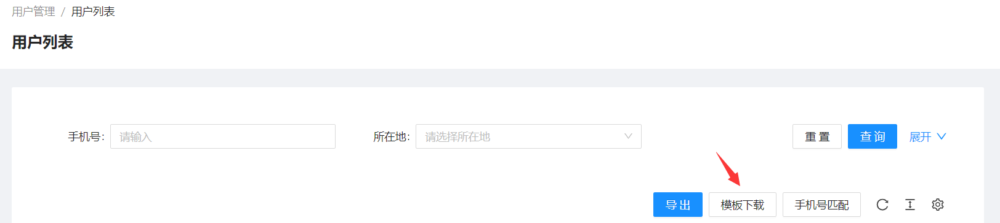
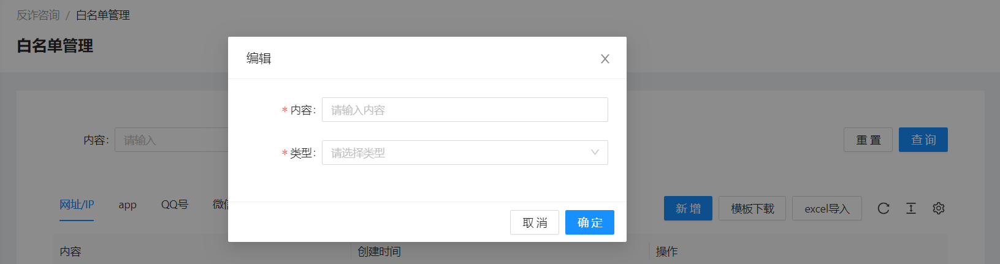
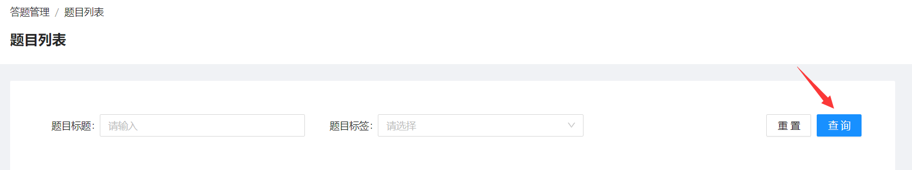
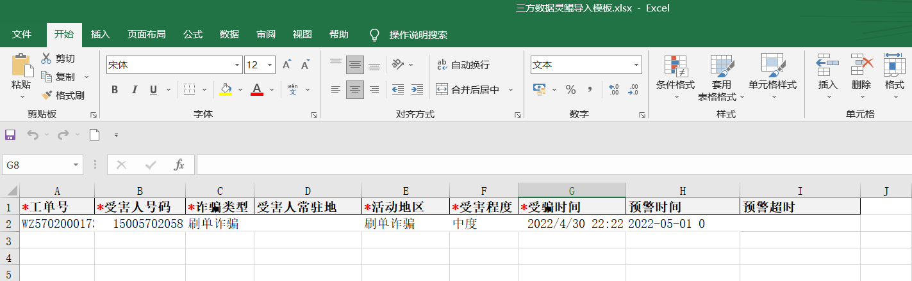

<!--第一页 start-->

<h1>反骗码运营管理后台</h1>
<h4>用户手册</h4>

                           

浙江政安信息安全研究中心
`https://www.gov-security.com/`

  

<!--第一页 end-->

<!--第二页 start-->
  

Copyright © 2020-2022 浙江政安信息安全中心有限公司及其许可者 版权所有，保留一切权利。
未经本公司书面许可，任何单位和个人不得擅自摘抄、复制本书内容的部分或全部，并不得以任何形式传播。
除政安信息安全中心有限公司的商标外，本手册中出现的其它公司的商标、产品标识及商品名称，由各自权利人拥有。
由于产品版本升级或其他原因，本手册内容有可能变更。政安保留在没有任何通知或者提示的情况下对本手册的内容进行修改的权利。本手册仅作为使用指导，政安 尽全力在本手册中提供准确的信息，但是 政安 并不确保手册内容完全没有错误，本手册中的所有陈述、信息和建议也不构成任何明示或暗示的担保。

                         
<!--第二页 end-->

<h2>目录</h2>

[toc]

                          

# 1. 用户管理

## 1.1. 用户列表

### 1.1.1. 查看用户列表

### 1.1.2. 查询用户

根据条件筛选用户

### 1.1.3. 导出用户列表

根据查询条件导出用户列表

**注意： 不添加查询条件，将会导出所有用户，数据量过大时可能会导致导出失败**

1. 点击【导出】按钮，弹出导出确认框

2. 弹出框中点【确定】，导出excel

### 1.1.4. 手机号匹配

已有一批手机号，判断是否在系统中

1. 点击【模板下载】按钮，下载excel模板

2. 在下载的模板中填写需要匹配的手机号

3. 点击【手机号匹配】按钮，上传刚刚下载的模板进行匹配

4. 自动下载匹配上的用的列表excel

## 1.2. 反诈app用户列表

### 1.2.1. 查看反诈app用户列表

### 1.2.2. 搜索反诈app用户

根据条件筛选用户

### 1.2.3. 导出反诈app用户列表

根据搜索条件导出反诈app用户列表

**注意：不添加搜索条件，将会导出所有用户，数据量过大时可能会导致导出失败**

1. 点击【导出】按钮，弹出导出确认框

2. 弹出框中点【确定】，导出excel

# 2. 流动人口管理

## 2.1. 流动人口登记

# 3. 资讯管理

## 3.1. 资讯列表

### 3.1.1. 查看资讯列表

### 3.1.2. 查询资讯

根据条件查询资讯列表

### 3.1.3. 新增资讯

* 栏目：资讯归类，栏目是否公开决定栏目下的资讯是否公开
* 权限
  * 公开：群众端和警员端都能查看
  * 不公开：只有警员端可以查看
* 资讯内容类型
  * 公众号链接：直接输入链接地址
  * 自定义内容
    * 自定义文章：输入文章内容
    * 文件列表：添加百度云盘地址

1. 点击【新增资讯】按钮，跳转新增资讯页面

2. 填写资讯基本信息

3. 添加资讯内容
   * 公众号链接资讯内容 
    
   * 自定义资讯内容
    

4. 点击右下角【保存】按钮，即可发布新资讯(新增资讯默认上架状态)

### 3.1.4. 资讯操作

* 资讯上架、下架
    点击资讯列表右边【上架】/【下架】按钮，操作资讯的上下架

* 资讯编辑
    点击资讯列表右边【编辑】按钮，编辑资讯内容

* 资讯删除
    点击资讯列表右边【删除】按钮，删除资讯

* 批量修改栏目
  1. 勾选资讯列表前面选择框一个或者多个资讯
  2. 资讯列表右上角【修改栏目】按钮
  3. 在弹出框中选择栏目

## 3.2. 栏目管理

### 3.2.1. 查看栏目列表

### 3.2.2. 查询栏目

根据栏目名搜索栏目

### 3.2.3. 新增栏目

1. 点击【新增栏目】按钮

2. 在弹出窗中填写栏目名称，栏目权限等

### 3.2.4. 栏目操作

* 栏目合并
    点击栏目列表右边【合并】按钮，将其他栏目下的资讯合并到当前栏目下

* 栏目编辑
    点击栏目列表右边【编辑】按钮，编辑栏目内容

* 栏目上移、下移(影响栏目在小程序端的显示顺序)
    点击栏目列表右边【上移】/【下移】按钮，上移/下移栏目

* 栏目删除
    点击栏目列表右边【删除】按钮删除栏目，只有当栏目下没有资讯才能删除

## 3.3. 举报分享

### 3.3.1. 查看举报分享列表

### 3.3.2. 查询举报分享

### 3.3.3. 新增举报分享

1. 点击【新增】按钮，跳转新增页面

2. 填写举报分享基本信息

3. 添加举报分享描述

4. 添加举报分享官方回复，并点击右下角【保存】按钮

### 3.3.4. 举报分享操作

* 举报分享查看
    点击举报分享列表右边【查看】按钮，查看举报分享详情 

* 举报分享编辑
    点击举报分享列表右边【编辑】按钮，编辑举报分享 

* 举报分享上架、下架
    点击举报分享列表右边【上架】/【下架】按钮，上下架举报分享 

* 举报分享删除
    点击举报分享列表右边【删除】按钮，删除举报分享 

**只有下架状态的举报分享，才能编辑和删除**

## 3.4. 近期风险

### 3.4.1. 查看近期风险列表

### 3.4.2. 查询近期风险

### 3.4.3. 新增近期风险

1. 点击【新增】按钮，跳转新增页面

2. 填写近期风险基本信息

3. 填写近期风险详情

4. 点击右下角【保存】按钮

### 3.4.4. 近期风险操作

* 近期风险查看
    点击近期风险列表右边【查看】按钮，查看近期风险详情 

* 近期风险编辑
    点击近期风险列表右边【编辑】按钮，编辑近期风险

* 近期风险上架、下架
    点击近期风险列表右边【上架】/【下架】按钮，上下架近期风险 

* 近期风险删除
    点击近期风险列表右边【删除】按钮，删除近期风险 

**只有下架状态的近期风险，才能编辑和删除**

## 3.5. 诈骗解密

### 3.5.1. 查看诈骗解密列表

### 3.5.2. 查询诈骗解密

### 3.5.3. 新增诈骗解密

1. 点击【新增】按钮，跳转新增页面

2. 填写诈骗解密基本信息

3. 填写诈骗解密风险详情

4. 点击右下角【保存】按钮

### 3.5.4. 诈骗解密操作

* 诈骗解密查看
    点击诈骗解密列表右边【查看】按钮，查看诈骗解密详情 
* 诈骗解密编辑
    点击诈骗解密列表右边【编辑】按钮，编辑诈骗解密
* 诈骗解密上架、下架
    点击诈骗解密列表右边【上架】/【下架】按钮，上下架诈骗解密
* 诈骗解密删除
    点击诈骗解密列表右边【删除】按钮，删除诈骗解密

**只有下架状态的诈骗解密，才能编辑和删除**

# 4. 推送管理

## 4.1. 推送模板

### 4.1.1. 查看推送模板列表

可以查看微信模板和短信模板

### 4.1.2. 查询推送模板

### 4.1.3. 新增推送模板

1. 点击页面【新增模板】按钮，弹出新增模板窗口

**在微信模板页面下点击【新增模板】跳出新增微信模板窗口**
**在短信模板页面下点击【新增模板】跳出新增短信模板窗口**

2. 在弹出框中填写微信模板信息
    * 微信模板  
    
    * 短信模板
    

3. 点击弹出框右下角【确定】按钮，完成新增模板

## 4.2. 推送任务

### 4.2.1. 查看推送任务列表

### 4.2.2. 查询推送任务

### 4.2.3. 新增推送任务

1. 点击页面【新增推送】按钮，跳转新增页面

2. 填写推送信息
   * 按号码推送
      * 手动输入号码
        直接输入到发送号码框中，以英文逗号分隔
      * 导入手机号码
        1. 下载模板excel
        
        2. 在下载的模板中填写需要推送的手机号
        
        3. 点击【导入excel】按钮，上传刚刚下载的模板excel
        
        4. 导入excel后，也可以在发送号码框中继续修改
        
   * 按地区推送
     1. 选择地区，可以从 省 级别到 社区/村 级别
     
     2. 选择**红码**情况下，选择严重程度
     

3. 点击页面右下角【保存】按钮

### 4.2.4. 推送任务操作

* 推送任务查看

    1. 查看推送任务基本信息
    
    2. 查看推送任务模板
    
    3. 查看推送记录，查询号码，再次推送
    

## 4.3. 政安信使

### 4.3.1. 查看信使推送列表

### 4.3.2. 查询信使推送任务

### 4.3.3. 新增信使推送任务

1. 点击页面【新增推送】按钮，跳转新增页面

2. 填写信使推送基本信息

3. 选择推送人群
   * 按号码推送
      * 手动输入号码，直接输入到发送号码框中，以英文逗号分隔
       
      * 导入手机号码
        1. 下载模板excel
        
        2. 在下载的模板中填写需要推送的手机号
        
        3. 点击【导入excel】按钮，上传刚刚下载的模板excel
        
        4. 导入excel后，也可以在发送号码框中继续修改
        
   * 按地区推送
     1. 选择地区，可以从 省 级别到 社区/村 级别
     
     2. 选择**红码**情况下，选择严重程度
     

4. 选择推送渠道
   * 微信小程序
    
   * 短信
    

**备用渠道：在推送渠道推送不成功的情况下，会对当前号码再次用备用渠道推送一遍**

5. 填写推送内容
   * 纯文字
    
   * 富文本 
    

6. 点击右下角【保存】按钮

### 4.3.4. 信使推送操作

* 查看推送明细

## 4.4. 推送明细

### 4.4.1. 查看推送明细列表

### 4.4.2. 查询推送明细

## 4.5. 日推送统计

### 4.5.1. 日推送统计查看

### 4.5.2. 日推送统计查询

### 4.5.3. 日推送统计操作

* 查看日推送统计明细

# 5. 反诈咨询

## 5.1. 咨询记录

### 5.1.1. 查看咨询、举报记录

### 5.1.2. 查询咨询、举报记录

### 5.1.3. 导出咨询、举报记录

**注意： 不添加查询条件，将会导出所有记录，数据量过大时可能会导致导出失败**

## 5.2. 白名单管理

* 白名单种类
  * 网址/IP
  * app
  * QQ号
  * 微信号
  * 电话号码
  * 短信号码
  * 银行卡号

### 5.2.1. 查看白名单管理列表

### 5.2.2. 查询白名单

### 5.2.3. 新增白名单

* 添加单个白名单
  1. 点击页面【新增】按钮，弹出新增窗口
    

  2. 在弹出框中填写内容和选择白名单类型
    

* 批量导入白名单

  1. 点击页面【模板下载】按钮，下载模板excel
    
  2. 在下载的模板excel中填写白名单内容
    
  3. 点击页面【导入excel】按钮导入刚刚修改的excel
    

### 5.2.4. 白名单操作

* 白名单编辑
    点击白名单列表右边【编辑】按钮，编辑白名单 
* 白名单删除
    点击白名单列表右边【删除】按钮，删除白名单 

## 5.3. 黑名单管理

* 黑名单种类
  * 网址/IP
  * app
  * QQ号
  * 微信号
  * 电话号码
  * 短信号码
  * 银行卡号

### 5.3.1. 查看黑名单管理列表

### 5.3.2. 查询黑名单

### 5.3.3. 新增黑名单

* 添加单个黑名单
  1. 点击页面【新增】按钮，弹出新增窗口
    

  2. 在弹出框中填写内容和选择黑名单类型
    

* 批量导入白名单

  1. 点击页面【模板下载】按钮，下载模板excel
    
  2. 在下载的模板excel中填写黑名单内容
    
  3. 点击页面【导入excel】按钮导入刚刚修改的excel
    

### 5.3.4. 黑名单操作

* 黑名单编辑
    点击黑名单列表右边【编辑】按钮，编辑黑名单 
* 黑名单删除
    点击黑名单列表右边【删除】按钮，删除黑名单 

## 5.4. 文案配置

### 5.4.1. 查看文案配置列表

### 5.4.2. 文案配置操作

* 文案配置编辑
  1. 点击文案配置右侧【编辑】按钮，弹出编辑窗口
    
  2. 在弹出框中修改提示文案和恢复默认文案配置
    

# 6. 营销位管理

## 6.1. 轮播图列表

### 6.1.1. 查看轮播图列表

### 6.1.2. 新增轮播图

1. 点击页面【新增轮播图】按钮，弹出新增窗口
   
2. 在弹出框中填写轮播图内容
   
3. 点击【确定】按钮

### 6.1.3. 轮播图操作

* 轮播图编辑
  点击轮播图列表右边【编辑】按钮，编辑轮播图 
* 轮播图删除
  点击轮播图列表右边【删除】按钮，删除轮播图

# 7. 答题管理

## 7.1. 答题策略

### 7.1.1. 查看答题策略列表

### 7.1.2. 查询答题策略

### 7.1.3. 新增答题策略

1. 点击页面【创建答题策略】按钮，跳转新增页面
   
2. 填写答题策略基本信息
   
3. 填写答题策略匹配条件
   
4. 填写答题策略必要条件
   
5. 填写答题策略题目配置
   
6. 选择题目
   
7. 点击右下角【保存】按钮

**注意：新增的答题策略为未发布状态**

### 7.1.4. 答题策略操作

* 答题策略 发布/取消发布
  点击答题策略列表右边【发布】/【取消发布】按钮，发布/取消发布 答题策略 
* 答题策略编辑
  点击答题策略列表右边【编辑】按钮，编辑答题策略 
* 答题策略删除
  点击答题列表右边【删除】按钮，删除答题策略 

## 7.2. 题目列表

### 7.2.1. 查看题目列表

### 7.2.2. 查询题目

### 7.2.3. 新增题目

* 添加单个题目
  1. 点击页面【新增题目】按钮，跳转新增页面
  
  2. 填写题目基本信息
  
  3. 填写题目选项
  
  4. 点击页面右下角【提交】按钮

* 批量添加题目
  1. 点击页面【模板下载】按钮，下载模板excel
  
  2. 在下载的模板excel填写题目信息
   
  3. 点击【题目导入】按钮导入刚刚修改的excel
   

### 7.2.4. 题目操作

* 批量修改标签
  1. 勾选题目列表前面选择框一个或者多个题目
  2. 点击题目列表右上角【批量修改标签】按钮
  3. 在弹出框中选择标签
  

* 题目编辑
  点击题目列表右侧【编辑】按钮，编辑题目内容 
* 题目删除
  点击题目列表右侧【删除】按钮，删除题目

  

## 7.3. 题目标签

### 7.3.1. 查看题目标签列表

### 7.3.2. 新增题目标签

1. 点击页面【】按钮，弹出新增窗口

2. 填写题目标签

# 8. 意见反馈

## 8.1. 反馈列表

### 8.1.1. 查看反馈列表

### 8.1.2. 查询反馈列表

### 8.1.3. 反馈列表操作

* 处理反馈
  点击反馈列表右侧【处理】按钮，处理反馈
* 反馈查看
  点击反馈列表右侧【查看】按钮，查看反馈处理结果 

**未处理的反馈可以处理，处理完的反馈只能查看**

# 9. 商户管理

<!-- 
## 9.1. 商户简介

* 商户信息
  * 平台
    * 反骗码
    * 反诈大脑
    * 网址安全中心
  * 商户名称
  * 商户有效期：只有当前日期在商户有效期内，商户才生效
  * 平台名称：自定义标题和左上角显示
  * 角色配置
  * 工作台角色配置
  * 备注
* 管理员
-->

## 9.2. 商户列表

### 9.2.1. 查看商户列表

### 9.2.2. 新增商户

1. 点击页面【创建商户】按钮，跳转商户创建页面
 
2. 填写商户基本信息

3. 填写商户可发送短信数量

4. 选择商户数据权限，即地区

5. 点击右下角【保存】按钮

### 9.2.3. 商户操作

* 商户编辑
  点击商户列表右侧【编辑】按钮，编辑商户信息 
* 商户过期
  点击商户列表右侧【过期】按钮，直接过期此商户 

  

# 10. 报表管理

## 10.1. 反骗码类型

### 10.1.1. 查看反骗码类型列表

### 10.1.2. 查询反骗码类型列表

### 10.1.3. 导出反骗码列表

根据查询条件导出列表，不添加任何查询条件导出所有

## 10.2. 小程序管理员推广统计

### 10.2.1. 查看小程序管理员推广统计

### 10.2.2. 查询小程序管理员推广统计

# 11. 系统管理

## 11.1. 操作员管理

### 11.1.1. 操作员简介

**1. 此操作员为反骗码运营后台 用户**

### 11.1.2. 查看操作员列表

### 11.1.3. 新增操作员
1. 点击页面【创建账号】按钮，弹出新增窗口

2. 在弹出的新增窗口中填写操作员信息

### 11.1.4. 操作员操作

* 操作员状态
  点击操作员列表右侧【状态】按钮，改变操作员的状态

* 操作员编辑
  点击操作员列表右侧【编辑】按钮，编辑操作员信息

* 操作员修改秘密
  点击操作员列表右侧【修改密码】按钮，修改操作员密码

* 操作员删除
  点击操作员列表右侧【删除】按钮，删除操作员  

## 11.2. 角色管理

### 11.2.1. 角色简介

* 角色分类
  * 运营管理后台
  * 刑侦反骗码用户后台
  * 反诈大脑管理后台
  * 工作台小程序
  * 网址安全中心

### 11.2.2. 查看角色列表

**通过点击标签页，可以查看不同平台的角色**

### 11.2.3. 新增角色

1. 点击页面【创建角色】按钮，弹出新增角色框口

2. 在弹出框中填写角色基础信息

3. 在弹出框中填写角色权限信息，把需要的权限勾选上
 

4. 在弹出框右下角点击【确定】按钮，完成角色新增

**注意： 在不同的标签页下点击【创建角色】按钮，将创建不同平台的角色**
**例如：在反诈大脑管理后台标签页下 点击【创建角色】按钮，将创建反诈大脑管理后台角色**

### 11.2.4. 角色操作

* 角色查看
  点击角色列表右侧【查看】按钮，查看角色详情
* 角色编辑
  点击角色列表右侧【编辑】按钮，编辑角色内容
* 角色删除
  点击角色列表右侧【删除】按钮。删除角色

**注意：系统内置角色不能编辑和删除，只能查看**

## 11.3. 地区管理

### 11.3.1. 查看地区列表

### 11.3.2. 新增地区

1. 点击页面【新增地区】按钮，弹出新增窗口
2. 在弹出的新增窗口中填写地区信息

**注意：在不同地区级别标签页下，新增地区为当前级别地区**
**注意：在省级别以下，添加的地区为当前上级地区的下级地区**

**例：在河北省唐山市下新增一个 区/县**
1. 点击 省级别列表下 河北省 右侧【下级】按钮

2. 点击 市级别列表下 唐山市 右侧【下级】按钮

3. 点击 区/县 级别下 右侧【新增地区按钮】

4. 在弹出的新增窗口中填写地区信息

### 11.3.3. 地区操作

* 地区下级查看
  点击地区列表右侧【下级】按钮，查看当前地区下级地区列表 
* 地区修改
  点击地区列表右侧【修改】按钮，修改地区信息
* 地区码查看
  点击地区列表右侧【地区码】按钮，查看当前地区二维码
  **扫此二维码进反骗码小程序自带当前地区信息**
* 地区删除
  点击地区列表右侧【删除】按钮，删除地区

## 11.4. 派出所管理

### 11.4.1. 查看派出所列表

### 11.4.2. 查询派出所

### 11.4.3. 导入派出所

1. 点击页面【模板下载】按钮，下载excel模板

2. 在下载的模板excel填写派出所信息

3. 点击页面【excel导入】按钮，上传刚刚修改的excel

### 11.4.4. 派出所操作

* 派出所删除
  点击派出所列表右侧【删除】按钮，删除派出所

## 11.5. 反制拦截

### 11.5.1. 反制拦截简介

* 反制拦截
  * 手机号
  * 网址
  * app

### 11.5.2. 查看反制拦截列表

### 11.5.3. 查询反制拦截

### 11.5.4. 导入反制拦截

1. 点击页面【模板下载】按钮，下载excel模板

2. 在下载的模板excel填写反制拦截信息
   * 手机号模板 
    
   * 网址模板
    
   * app模板
    
3. 点击页面【excel导入】按钮，上传刚刚修改的excel
<!--  -->

**注意：在不同标签页点击【模板下载】将下载不同的模板，导入同理**

## 11.6. 三方数据

### 11.6.1. 三方数据简介

* 三方数据
  * 灵鲲导入
  * 腾讯数据
  * 电信数据
  * 人工导入

### 11.6.2. 查看三方数据列表

### 11.6.3. 导入三方数据

1. 点击页面【模板下载】按钮，下载excel模板

2. 在下载的模板excel填写三方数据
   * 灵鲲导入
    
   * 腾讯数据
    
   * 人工导入
    
3. 点击页面【excel导入】按钮，上传刚刚修改的excel

**注意：在不同标签页点击【模板下载】将下载不同的模板，导入同理**
**注意：电信数据为接口获取，其他三方数据均为人工导入**
**注意：腾讯数据导入后，需腾讯匹配导入的手机号，匹配成功后才会显示在三方数据列表中，查看导入数据可点击页面【导入记录】按钮查看**

## 11.7. 拦截网址库

## 11.8. 标签管理

### 11.8.1. 标签简介

* 标签
  * 诈骗类型
  * 职业类型
  * 年龄段
  * 触网类型

### 11.8.2. 查看标签列表

### 11.8.3. 新增标签

1. 点击页面【新增】按钮，弹出新增窗口
2. 在弹出的新增窗口中填写标签信息

### 11.8.4. 标签操作

* 标签编辑
  点击标签列表右侧【编辑】按钮，编辑标签内容
* 标签删除
  点击标签列表右侧【删除】按钮，删除标签

**注意：诈骗类型为系统内置，不支持新增和删除**

## 11.9. 诈骗类型

### 11.9.1. 查看诈骗类型列表

### 11.9.2. 新增诈骗类型

1. 点击页面【新增】按钮，弹出新增窗口
  
2. 在弹出的新增窗口填写诈骗类型信息
   

**注意：在 一级类型 标签页下新增一级诈骗类型，在 二级类型 标签页下新增二级诈骗类型**

### 11.9.3. 诈骗类型操作

* 诈骗类型下级查看
  点击诈骗类型列表右侧【下级】按钮，查看诈骗类型下级类型
* 诈骗类型编辑
  点击诈骗类型列表右侧【编辑】按钮，编辑诈骗类型内容
* 诈骗类型删除
  点击诈骗类型列表右侧【删除】按钮，删除诈骗类型

## 11.10. 系统设置

用于配置小程序首页页面展示内容

### 11.10.1. 查看系统设置列表

### 11.10.2. 系统设置操作

* 系统设置编辑
  点击系统设置列表右侧【编辑】按钮，编辑系统设置内容 
  

## 11.11. 小程序菜单

### 11.11.1. 查看小程序菜单列表

### 11.11.2. 小程序菜单操作

* 小程序菜单开启
  点击小程序列表右侧【是否开启】按钮，配置默认小程序菜单是否开启
* 小程序菜单编辑
  点击小程序列表右侧【编辑】按钮，修改小程序菜单名字

  