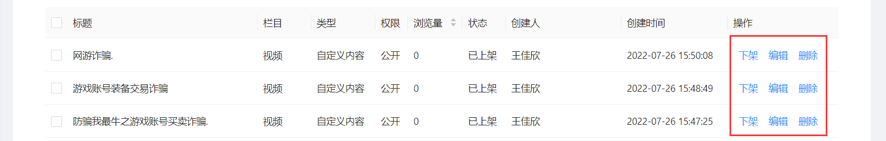

<!--第一页 start-->

<h1>反骗码运营管理后台</h1>
<h4>用户手册</h4>

                           

浙江政安信息安全研究中心
`https://www.gov-security.com/`

  

<!--第一页 end-->

<!--第二页 start-->
  

Copyright © 2020-2022 浙江政安信息安全中心有限公司及其许可者 版权所有，保留一切权利。
未经本公司书面许可，任何单位和个人不得擅自摘抄、复制本书内容的部分或全部，并不得以任何形式传播。
除政安信息安全中心有限公司的商标外，本手册中出现的其它公司的商标、产品标识及商品名称，由各自权利人拥有。
由于产品版本升级或其他原因，本手册内容有可能变更。政安保留在没有任何通知或者提示的情况下对本手册的内容进行修改的权利。本手册仅作为使用指导，政安 尽全力在本手册中提供准确的信息，但是 政安 并不确保手册内容完全没有错误，本手册中的所有陈述、信息和建议也不构成任何明示或暗示的担保。

                         
<!--第二页 end-->

<h2>目录</h2>

[toc]

# 1. 用户管理

## 1.1. 用户列表

反骗码用户
### 1.1.1. 查看用户列表

### 1.1.2. 搜索用户

根据条件筛选用户

### 1.1.3. 导出用户列表

根据搜索条件导出用户列表

**注意： 不添加搜索条件，将会导出所有用户，数据量过大时可能会导致导出失败**

1. 点击【导出】按钮，弹出导出确认框

2. 弹出框中点【确定】，导出excel

### 1.1.4. 手机号匹配

已有一批手机号，判断是否在系统中

1. 点击【模板下载】按钮，下载excel模板

2. 在下载的模板中填写需要匹配的手机号

3. 点击【手机号匹配】按钮，上传刚刚下载的模板进行匹配

4. 自动下载匹配上的用的列表excel

## 1.2. 反诈app用户列表

反诈app用户

### 1.2.1. 查看反诈app用户列表

### 1.2.2. 搜索反诈app用户

根据条件筛选用户

### 1.2.3. 导出反诈app用户列表

根据搜索条件导出反诈app用户列表

**注意：不添加搜索条件，将会导出所有用户，数据量过大时可能会导致导出失败**

1. 点击【导出】按钮，弹出导出确认框

2. 弹出框中点【确定】，导出excel

# 2. 流动人口管理

## 2.1. 流动人口登记

# 3. 资讯管理

## 3.1. 资讯列表

### 3.1.1. 查看资讯列表

### 3.1.2. 查询资讯

根据条件查询资讯列表

### 3.1.3. 新增资讯

* 栏目：资讯归类，栏目是否公开决定栏目下的资讯是否公开
* 权限
  * 公开：群众端和警员端都能查看
  * 不公开：只有警员端可以查看
* 资讯内容类型
  * 公众号链接：直接输入链接地址
  * 自定义内容
    * 自定义文章：输入文章内容
    * 文件列表：添加百度云盘地址

1. 点击【新增资讯】按钮，跳转新增资讯页面

2. 填写资讯基本信息

3. 添加资讯内容
   3.1 公众号链接资讯内容 

   3.2 自定义资讯内容

4. 点击右下角【保存】按钮，即可发布新资讯(新增资讯默认上架状态)

### 3.1.4. 资讯操作

* 资讯上架、下架
    点击资讯列表右边【上架】/【下架】按钮，操作资讯的上下架

* 资讯编辑
    点击资讯列表右边【编辑】按钮，编辑资讯内容

* 资讯删除
    点击资讯列表右边【删除】按钮，删除资讯

* 批量修改栏目
  1. 勾选资讯列表前面选择框一个或者多个资讯
  2. 资讯列表右上角【修改栏目】按钮
  3. 在弹出框中选择栏目

## 3.2. 栏目管理

### 3.2.1. 查看栏目列表

### 3.2.2. 查询栏目

根据栏目名搜索栏目

### 3.2.3. 新增栏目

1. 点击【新增栏目】按钮

2. 在弹出窗中填写栏目名称，栏目权限等

### 3.2.4. 栏目操作

* 栏目合并
    点击栏目列表右边【合并】按钮，将其他栏目下的资讯合并到当前栏目下

* 栏目编辑
    点击栏目列表右边【编辑】按钮，编辑栏目内容

* 栏目上移、下移(影响栏目在小程序端的显示顺序)
    点击栏目列表右边【上移】/【下移】按钮，上移/下移栏目

* 栏目删除
    点击栏目列表右边【删除】按钮删除栏目，只有当栏目下没有资讯才能删除

## 3.3. 举报分享

### 3.3.1. 查看举报分享列表

### 3.3.2. 查询举报分享

### 3.3.3. 新增举报分享

1. 点击【新增】按钮，跳转新增页面

2. 填写举报分享基本信息

3. 添加举报分享描述

4. 添加举报分享官方回复，并点击右下角【保存】按钮

### 3.3.4. 举报分享操作

* 举报分享查看
    点击举报分享列表右边【查看】按钮，查看举报分享详情 
* 举报分享编辑
    点击举报分享列表右边【编辑】按钮，编辑举报分享 
* 举报分享上架、下架
    点击举报分享列表右边【上架】/【下架】按钮，上下架举报分享 
* 举报分享删除
    点击举报分享列表右边【删除】按钮，删除举报分享 

## 3.4. 近期风险
## 3.5. 诈骗解密

# 4. 推送管理

## 4.1. 推送模板
## 4.2. 推送任务
## 4.3. 政安信使
## 4.4. 推送明细
## 4.5. 日推送统计

# 5. 反诈咨询

## 5.1. 咨询记录

# 6. 营销位管理
# 7. 答题管理
# 8. 意见反馈
# 9. 商户管理
# 10. 报表管理
# 11. 系统管理

