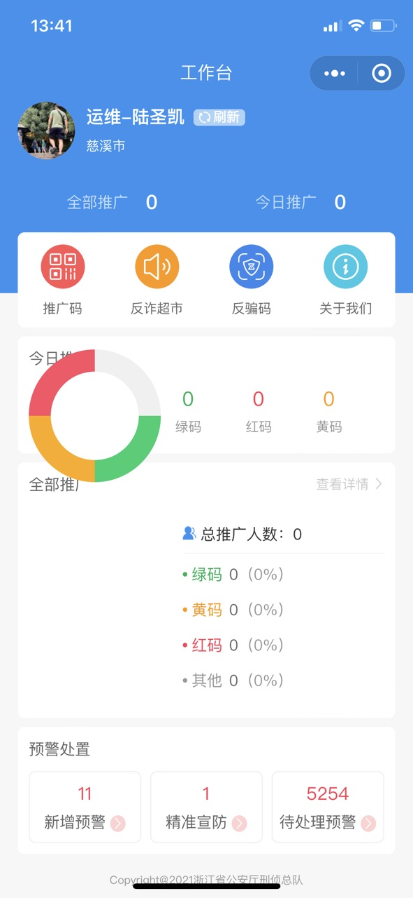

<!--第一页 start-->

<!--   

<h1>反骗码工作台(小程序)</h1>
<h4>用户手册</h4>

                          

浙江政安信息安全研究中心
`https://www.gov-security.com/`
平台版本：1.0.9 -->

<!--第一页 end-->

<!--第二页 start-->
<!-- 
Copyright © 2020-2022 浙江政安信息安全中心有限公司及其许可者 版权所有，保留一切权利。
未经本公司书面许可，任何单位和个人不得擅自摘抄、复制本书内容的部分或全部，并不得以任何形式传播。
除政安信息安全中心有限公司的商标外，本手册中出现的其它公司的商标、产品标识及商品名称，由各自权利人拥有。
由于产品版本升级或其他原因，本手册内容有可能变更。政安保留在没有任何通知或者提示的情况下对本手册的内容进行修改的权利。本手册仅作为使用指导，政安 尽全力在本手册中提供准确的信息，但是 政安 并不确保手册内容完全没有错误，本手册中的所有陈述、信息和建议也不构成任何明示或暗示的担保。

                            -->
<!--第二页 end-->

<!-- 
<h2>目录</h2>

[toc]

          -->

# 

<!-- 

      

 -->

 | 
---|---

<figure>

</figure>
