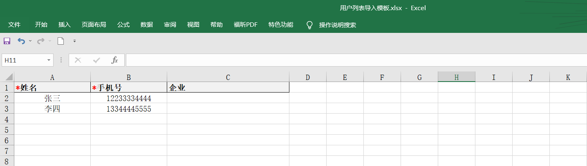
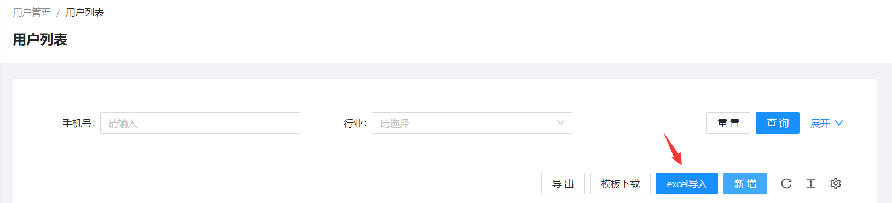

<!--第一页 start-->

<h1>浙江省无毒码平台</h1>
<h4>用户手册</h4>

                            

浙江政安信息安全研究中心
`https://www.gov-security.com/`
平台版本：1.0.0

<!--第一页 end-->

<!--第二页 start-->

Copyright © 2020-2022 浙江政安信息安全中心有限公司及其许可者 版权所有，保留一切权利。
未经本公司书面许可，任何单位和个人不得擅自摘抄、复制本书内容的部分或全部，并不得以任何形式传播。
除政安信息安全中心有限公司的商标外，本手册中出现的其它公司的商标、产品标识及商品名称，由各自权利人拥有。
由于产品版本升级或其他原因，本手册内容有可能变更。政安保留在没有任何通知或者提示的情况下对本手册的内容进行修改的权利。本手册仅作为使用指导，政安 尽全力在本手册中提供准确的信息，但是 政安 并不确保手册内容完全没有错误，本手册中的所有陈述、信息和建议也不构成任何明示或暗示的担保。

                           

<!--第二页 end-->

<h2>目录</h2>

[toc]

# 1. 系统登录

## 1.1. 登录地址

使用浏览器打开以下地址
https://mage.gov-security.com/mage/management/druggauge/user/login

## 1.2. 登录界面

### 1.2.1. 登录

1. 在登录页输入用户名和密码
2. 点击按钮智能认证
3. 点击【登录】按钮，登录系统
4. 登录过期或者登录ip改变则需要短信验证
  

### 1.2.2. 忘记密码

1. 点击登录页面的【忘记密码】按钮，跳转修改密码页面
   
2. 输入手机号码，点击获取验证码
   
3. 弹出智能验证框，点击按钮，发送短信
   
4. 输入验证码，并输入新密码
   密码设置规则： **6-16位密码，至少包含字母、数字、特殊符号中的两种**
   
5. 点击按钮智能认证
6. 点击【确认修改】按钮，完成密码修改 

# 2. 用户管理

## 2.1. 用户列表

### 2.1.1. 查看用户列表

点击 **用户列表** 菜单栏，根据操作员权限，查看所有用户或所管辖企业下的用户列表

### 2.1.2. 查询用户列表

1. 在查询框中输入 手机号，行业等，可多选
2. 点击页面【查询】按钮，以查询框中的条件查询用户

### 2.1.3. 新增用户

* 新增单个用户
  1. 点击页面【新增】按钮，弹出新增窗口
   
  2. 在弹出的新增窗口中填写用户信息
   
  3. 点击弹出的新增窗口右下角【确定】按钮，完成用户新增
* 批量新增
  1. 点击页面【模板下载】按钮，下载模板excel
   
  2. 在下载的模板excel中填写用户信息
    第三列企业可以为空，但是如果填写了企业信息，此企业必须要在系统内，否则将会导入失败
   
  3. 点击页面【excel导入】按钮，上传刚刚修改的excel
   

   
**说明1：两种新增用户方式，第一种是用字在浙江无毒码小程序自行注册，第二种是后台手动添加用户**
**说明2：用户在小程序自行注册后，需要管理员手动在后台编辑此用户添加用户所属企业，管理此企业的操作员才能看到此用户**

### 2.1.4. 用户列表操作

* 用户列表导出
  1. 添加查询条件，查询列表
  2. 点击【导出】按钮，弹出导出确认框
  3. 点击弹出框中的【确定】按钮，导出当前查询条件下的用户列表
  
* 用户列表编辑
  点击用户列表右侧【编辑】按钮，编辑用户企业
* 用户列表删除
  点击用户列表右侧【删除】按钮，删除用户
* 用户列表查看检测记录
  点击用户列表右侧【检测记录】按钮，跳转检测记录页面，并显示此用户的检测记录

**注意：后台导入的用户，且用户没有在小程序注册才可以删除**

## 2.2. 检测记录

### 2.2.1. 查看检测记录列表

点击 **检测记录** 菜单栏，查看当前管理员管理的用户检测记录列表

### 2.2.2. 查询检测记录

1. 在查询框中输入 手机号，行业等，可多选
2. 点击页面【查询】按钮，以查询框中的条件查询用户检测记录

### 2.2.3. 导入检测记录

1. 点击页面【模板下载】按钮，下载模板excel
   
2. 在下载的模板excel中填写内容(PIN为身份证号码MD5加密后32位小写)
   
3. 点击页面【excel导入】按钮，上传刚刚修改的excel
   

**注意：此功能适用于手动导入检测记录，默认通过检测设备会自动导入结果**

### 2.2.4. 检测记录操作

* 检测记录导出
  点击页面【导出】按钮，导出当前查询条件下的检测记录
  
* 检测结果查看
  点击检测结果列表中间【查看】按钮，查看不同毒品类型的检测结果
  

# 3. 系统管理

## 3.1. 角色管理

### 3.1.1. 查看角色列表

点击 **角色管理** 菜单栏，查看角色列表

### 3.1.2. 新增角色

1. 点击页面【创建角色】按钮，弹出新增窗口
   
2. 在弹出的新增窗口中填写角色基础信息
   
3. 在弹出的新增窗口中勾选角色权限
   
4. 点击弹出的新增窗口右下角【确定】按钮，完成角色新增
   

### 3.1.3. 角色操作

* 角色查看
  点击角色列表右侧【查看】按钮，查看角色信息
* 角色编辑
  点击角色列表右侧【编辑】按钮，编辑角色信息
* 角色删除
  点击角色列表右侧【删除】按钮，删除角色

**注意：系统内置角色不能编辑和删除，只能查看**

## 3.2. 操作员管理

### 3.2.1. 查看操作员列表

点击 **操作员管理** 菜单栏，查看当前管理员管理的用户检测记录列表

### 3.2.2. 新增操作员

* 新增单个用户
  1. 点击页面【创建账号】按钮，弹出新增窗口
   
  2. 在弹出的新增窗口中填写操作员基础信息
   
  3. 在弹出的新增窗口中选择数据权限，
      * 按全部则可以看到系统内所有用户
      * 按企业，选择相应企业，则只能看到企业下的用户
   
   
  4. 点击弹出的新增窗口右下角的【确定】按钮，完成操作员新增

* 批量新增
  1. 点击页面【模板下载】按钮，下载模板excel
   
  2. 在刚刚下载的模板excel中填写操作员内容
   
  3. 点击页面【批量导入】按钮，上传刚刚修改的模板excel
   

### 3.2.3. 操作员操作

* 操作员编辑
  点击操作员列表右侧【编辑】按钮，编辑操作员内容
* 操作员修改密码
  点击操作员列表右侧【修改密码】按钮，修改操作员密码
* 操作员删除
  点击操作员列表右侧【删除】按钮，删除操作员

## 3.3. 企业管理

### 3.3.1. 查看企业列表

点击 **企业管理** 菜单栏，查看企业列表

### 3.3.2. 查询企业列表

1. 在查询框中输入 企业名
2. 点击页面【查询】按钮，以查询框中的条件查询企业

### 3.3.3. 新增企业

1. 点击页面【新增】按钮，弹出新增企业窗口
   
2. 在弹出的新增窗口中填写企业信息
   
3. 点击弹出的新增窗口右下角【确定】按钮，完成企业新增

### 3.3.4. 企业操作

* 企业编辑
  点击企业列表右侧【编辑】按钮，修改企业名称
* 企业删除
  点击企业列表右侧【删除】按钮，删除企业

## 3.4. 系统设置

### 3.4.1. 无毒码设置

#### 3.4.1.1. 无毒码设置简介

1. 无毒码分为绿码，灰码，红码。
2. 绿码为检测通过，红码为检测不通过，灰码为没有检测或者检测有效期已过。
3. 根据用户所在行业，有不同的无毒码过期时间，如果用户的所在行业不在行业列表中或行业列表中的行业没有设置有效期，则取通用有效期

#### 3.4.1.2. 通用有效期设置

1. 在输入框中输入有效期天数
    
2. 点击右侧【保存】按钮，完成通用有效期设置 
   

#### 3.4.1.3. 添加行业

1. 点击页面【添加行业】按钮，弹出新增行业窗口
   
2. 在弹出的新增窗口中填写行业名称，有效期(可选)
   
3. 点击弹出的新增窗口右下角【确定】按钮，完成行业新增

#### 3.4.1.4. 行业操作

* 行业编辑
  点击行业列表右侧【编辑】按钮，编辑行业内容
* 行业删除
  点击行业列表右侧【删除】按钮，删除行业

