<!--第一页 start-->

<h1>网址安全中心</h1>
<h4>用户手册</h4>

                            

浙江政安信息安全研究中心
`https://www.gov-security.com/`
平台版本：1.0.2
  

<!--第一页 end-->

<!--第二页 start-->
  

Copyright © 2020-2022 浙江政安信息安全中心有限公司及其许可者 版权所有，保留一切权利。
未经本公司书面许可，任何单位和个人不得擅自摘抄、复制本书内容的部分或全部，并不得以任何形式传播。
除政安信息安全中心有限公司的商标外，本手册中出现的其它公司的商标、产品标识及商品名称，由各自权利人拥有。
由于产品版本升级或其他原因，本手册内容有可能变更。政安保留在没有任何通知或者提示的情况下对本手册的内容进行修改的权利。本手册仅作为使用指导，政安 尽全力在本手册中提供准确的信息，但是 政安 并不确保手册内容完全没有错误，本手册中的所有陈述、信息和建议也不构成任何明示或暗示的担保。

                           
<!--第二页 end-->

<h2>目录</h2>

[toc]

# 1. 系统登录

## 1.1. 登录地址

使用浏览器打开以下地址
https://mage.gov-security.com/mage/management/urlsafe/user/login

## 1.2. 登录界面

### 1.2.1. 登录

1. 在登录页输入用户名和密码
2. 点击按钮智能认证
3. 点击【登录】按钮，登录系统
4. 登录过期或者登录ip改变则需要短信验证
  

### 1.2.2. 忘记密码

1. 点击登录页面的【忘记密码】按钮，跳转修改密码页面
   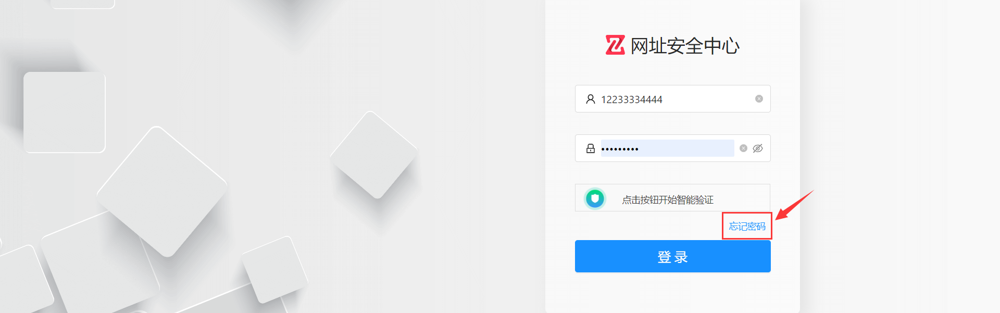
2. 输入手机号码，点击获取验证码
   
3. 弹出智能验证框，点击按钮，发送短信
   
4. 输入验证码，并输入新密码
   密码设置规则： **6-16位密码，至少包含字母、数字、特殊符号中的两种**
   
5. 点击按钮智能认证
6. 点击【确认修改】按钮，完成密码修改

# 1. 网址申诉管理

## 1.1. 申诉初审

### 1.1.1. 查看初审列表

**通过点击不同标签页，查看不同状态的申诉列表**

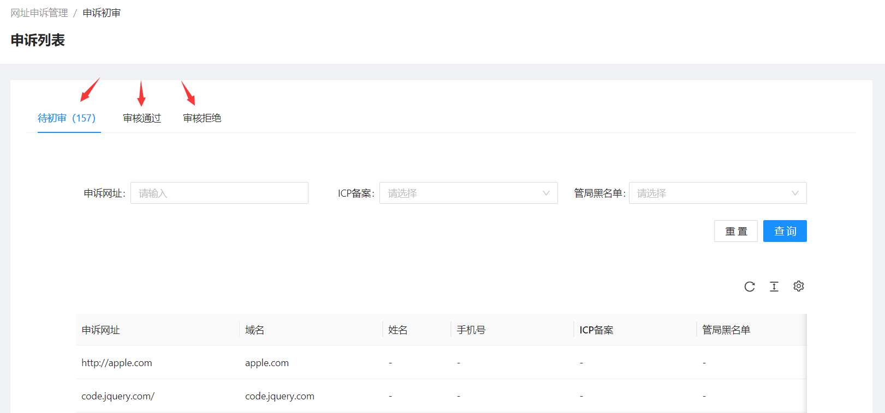

### 1.1.2. 查询初审申诉

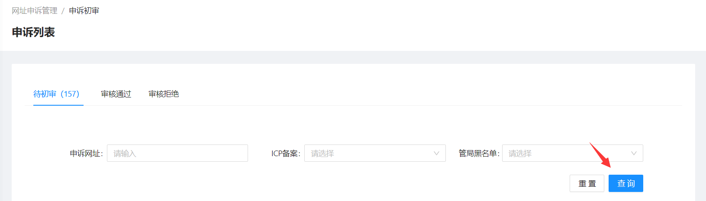

### 1.1.3. 初审申诉

1. 在**待初审**标签下，拉动待初审列表到最右边，点击【审核】按钮，跳转申诉审核页面
   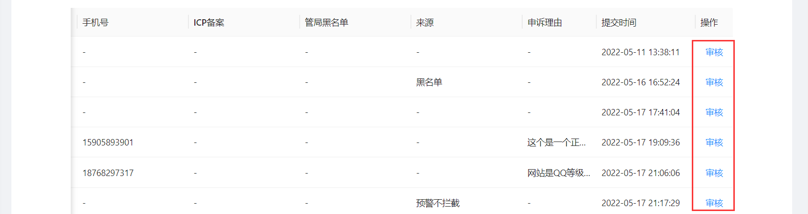
2. 查看申诉基本信息
   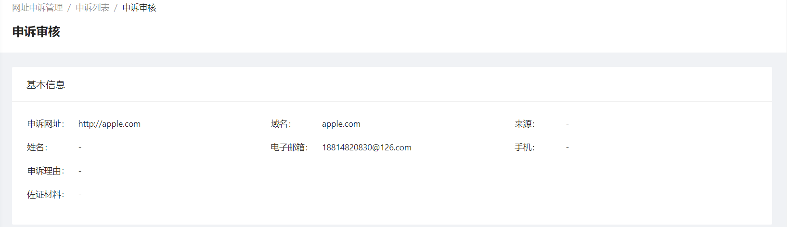
3. 查看申诉其他信息
   
4. 点击页面右下角【审核】按钮，弹出审核窗口，填写审核信息
   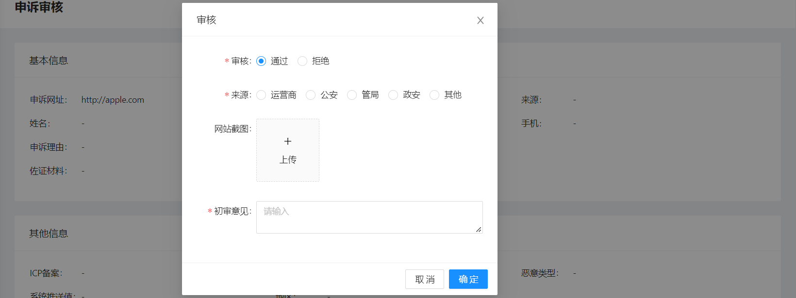

### 1.1.4. 查看申诉

在**审核通过**和**审核拒绝**标签页下，拉动列表到最右边，点击【查看】按钮，可以查看申诉详情

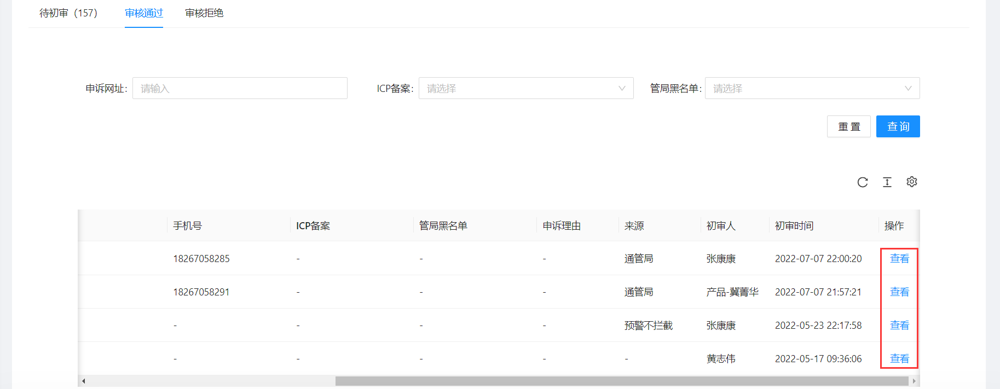
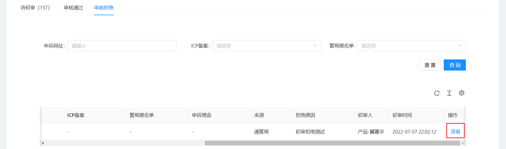

## 1.2. 申诉复审

### 1.2.1. 查看申诉列表

**通过点击不同标签页，查看不同状态的申诉列表**

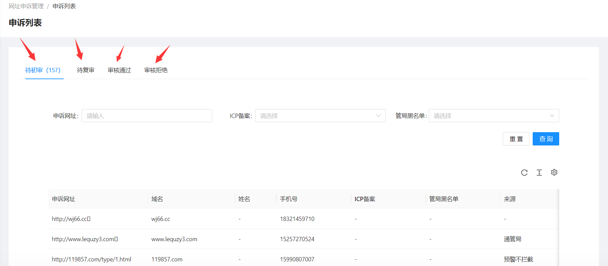

### 1.2.2. 查询申诉列表

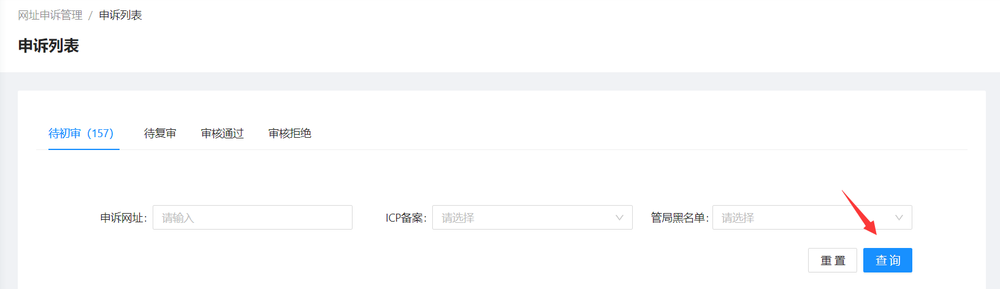

### 1.2.3. 审核申诉

1. 在**待初审**和**待复审**标签下，拉动列表到最右边，点击【审核】按钮。跳转审核页面
   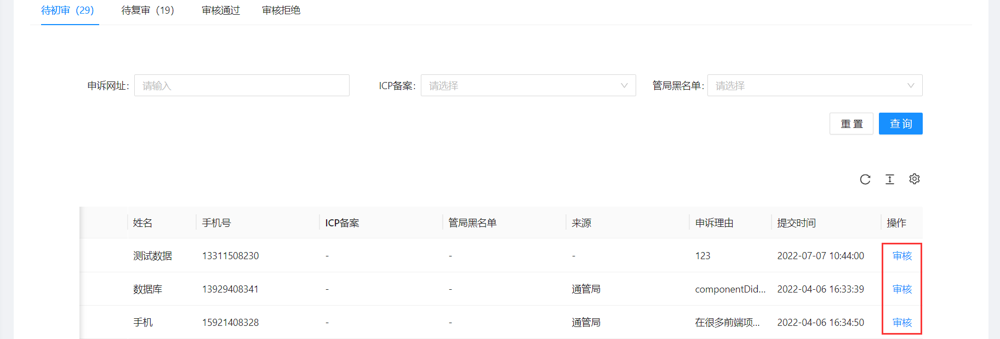
   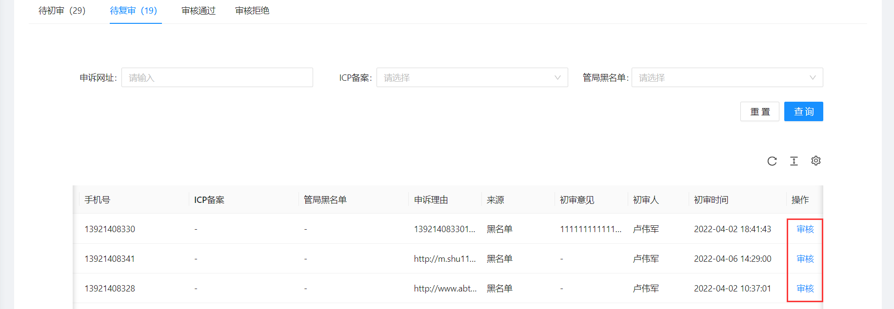
2. 查看申诉基本信息
   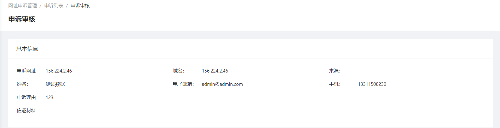
3. 查看申诉其他信息
   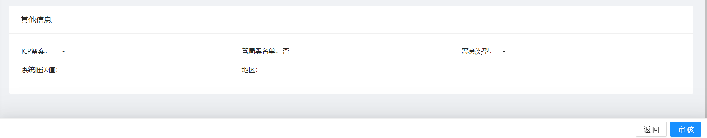
4. 如果是在**待复审**标签下，审核申诉，则会有初审信息
   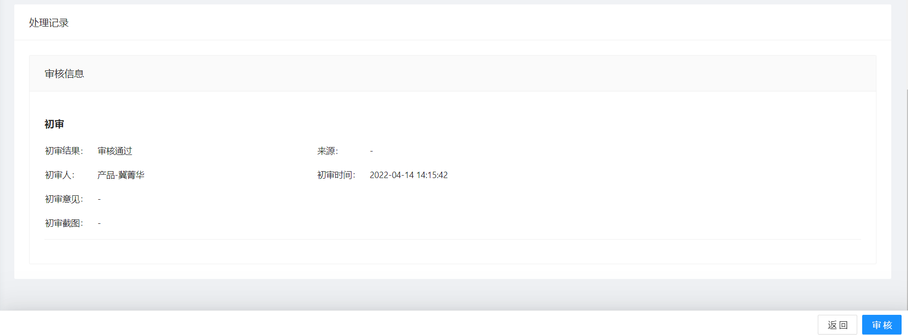
5. 点击页面右下角【审核】按钮，弹出审核窗口
   
6. 填写审核信息等

**注意：在复审下，审核待初审申诉，将直接复审通过或拒绝**

### 1.2.4. 查看申诉

在**审核通过**和**审核拒绝**标签页下，拉动列表到最右边，点击【查看】按钮，可以查看申诉详情

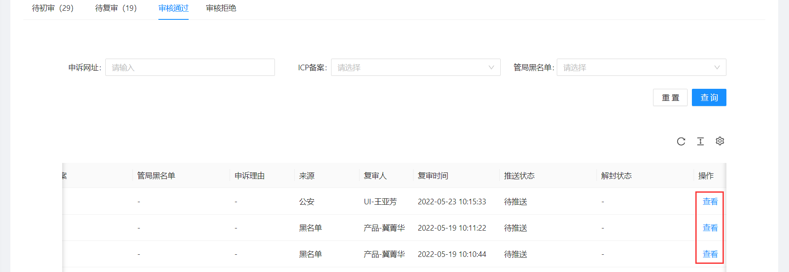
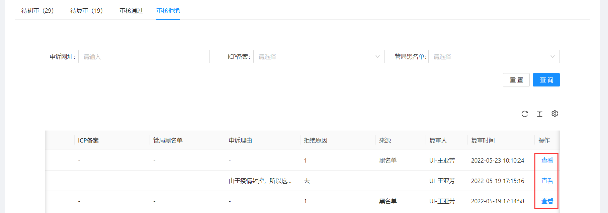

# 2. 系统管理

## 2.1. 操作员管理

### 2.1.1. 查看操作员列表

### 2.1.2. 新增操作员

1. 点击页面【新建】按钮，弹出新增窗口
   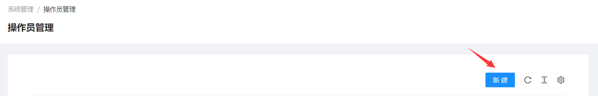
2. 在弹出的新增窗口中填写操作员信息
   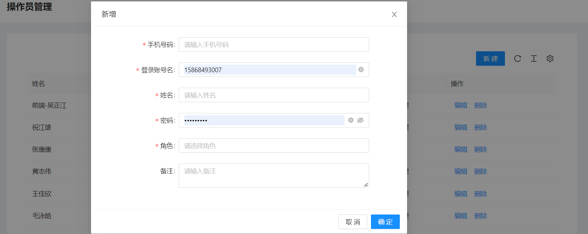
3. 选择操作员角色，并点击右下角【确定】按钮
   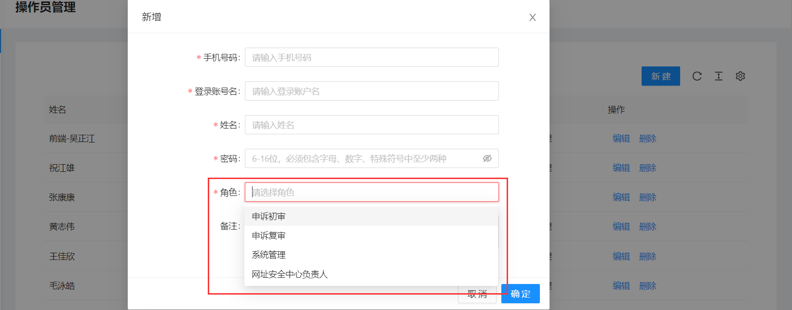

### 2.1.3. 操作员操作

* 操作员编辑
  点击操作员列表右侧【编辑】按钮，编辑操作员信息
* 操作员删除
  点击操作员列表右侧【删除】按钮，删除操作员

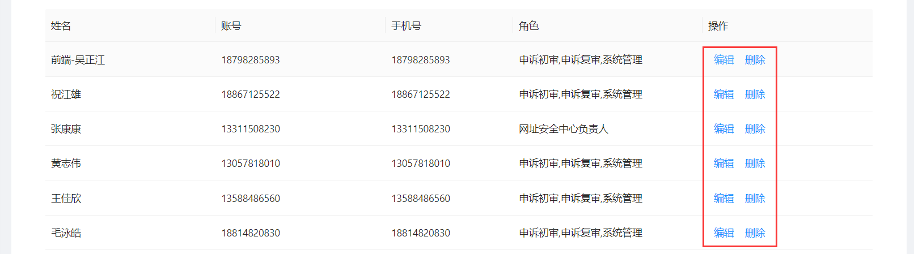

## 2.2. 角色管理

### 2.2.1. 查看角色列表

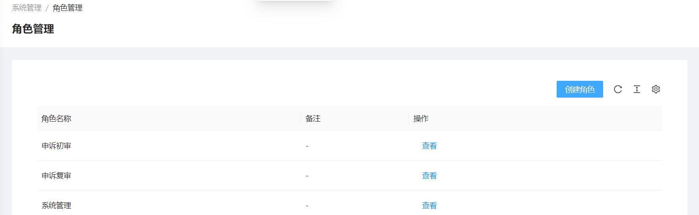

### 2.2.2. 新增角色

1. 点击页面【创建角色】按钮，弹出新增角色窗口
   
2. 在弹出的新增窗口中填写角色基础信息
   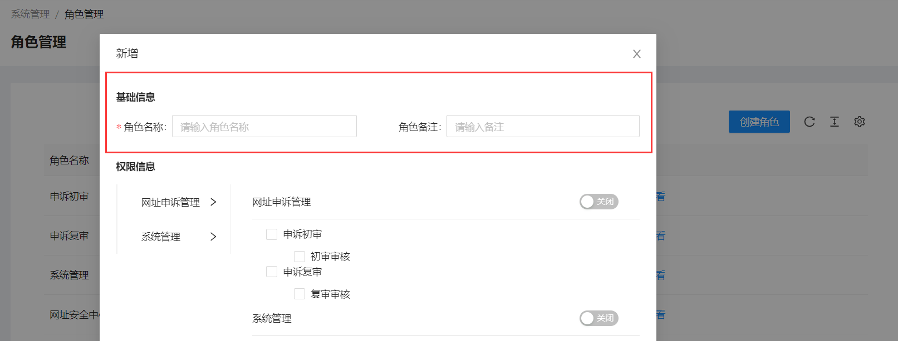
3. 在弹出的新增窗口中，勾选需要的权限
   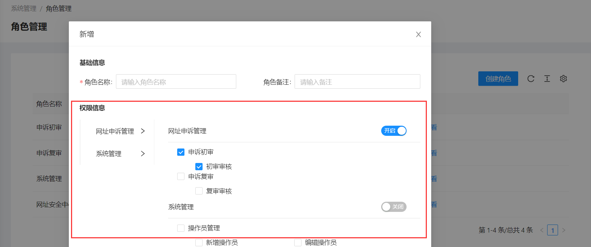
4. 在弹出的新增窗口右下角点击【确定】按钮，完成角色新增

### 2.2.3. 角色操作

* 角色查看
  点击角色列表右侧【查看】按钮，查看角色信息
* 角色删除
  点击角色列表右侧【删除】按钮，删除角色

**注意：系统默认角色只能查看，不能删除**

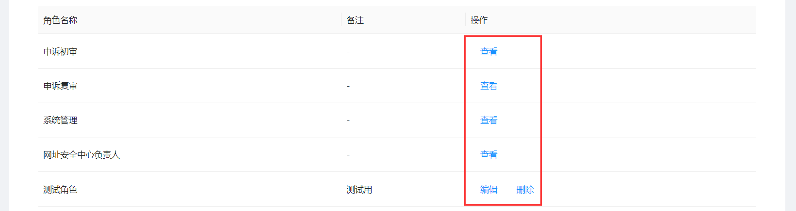
