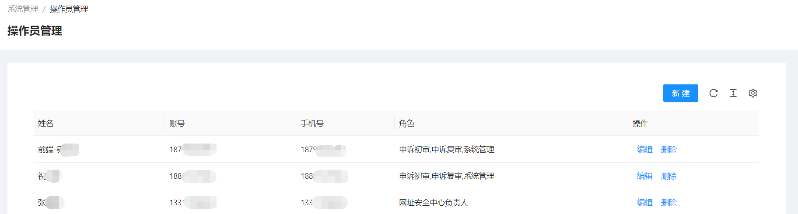

<!--第一页 start-->

<h1>网址安全中心</h1>
<h4>用户手册</h4>

                           

浙江政安信息安全研究中心
`https://www.gov-security.com/`

  

<!--第一页 end-->

<!--第二页 start-->
  

Copyright © 2020-2022 浙江政安信息安全中心有限公司及其许可者 版权所有，保留一切权利。
未经本公司书面许可，任何单位和个人不得擅自摘抄、复制本书内容的部分或全部，并不得以任何形式传播。
除政安信息安全中心有限公司的商标外，本手册中出现的其它公司的商标、产品标识及商品名称，由各自权利人拥有。
由于产品版本升级或其他原因，本手册内容有可能变更。政安保留在没有任何通知或者提示的情况下对本手册的内容进行修改的权利。本手册仅作为使用指导，政安 尽全力在本手册中提供准确的信息，但是 政安 并不确保手册内容完全没有错误，本手册中的所有陈述、信息和建议也不构成任何明示或暗示的担保。

                         
<!--第二页 end-->

<h2>目录</h2>

[toc]

# 1. 网址申诉管理

## 1.1. 申诉初审

### 1.1.1. 查看初审列表

**通过点击不同标签页，查看不同状态的申诉列表**

### 1.1.2. 查询初审申诉

### 1.1.3. 初审申诉

1. 在**待初审**标签下，拉动待初审列表到最右边，点击【审核】按钮，跳转申诉审核页面
   
2. 查看申诉基本信息
   
3. 查看申诉其他信息
   
4. 点击页面右下角【审核】按钮，弹出审核窗口，填写审核信息
   

### 1.1.4. 查看申诉

在**审核通过**和**审核拒绝**标签页下，拉动列表到最右边，点击【查看】按钮，可以查看申诉详情

## 1.2. 申诉复审

### 1.2.1. 查看申诉列表

**通过点击不同标签页，查看不同状态的申诉列表**

### 1.2.2. 查询申诉列表

### 1.2.3. 审核申诉

1. 在**待初审**和**待复审**标签下，拉动列表到最右边，点击【审核】按钮。跳转审核页面
   
   
2. 查看申诉基本信息
   
3. 查看申诉其他信息
   
4. 如果是在**待复审**标签下，审核申诉，则会有初审信息
   
5. 点击页面右下角【审核】按钮，弹出审核窗口
   
6. 填写审核信息等

### 1.2.4. 查看申诉

在**审核通过**和**审核拒绝**标签页下，拉动列表到最右边，点击【查看】按钮，可以查看申诉详情

# 2. 系统管理

## 2.1. 操作员管理

### 查看操作员列表

### 新增操作员

1. 点击页面【新建】按钮，弹出新增窗口
   
2. 在弹出的新增窗口钟填写操作员信息
   
3. 选择操作员角色，并点击右下角【确定】按钮
   

### 操作员操作

* 

## 2.2. 角色管理

